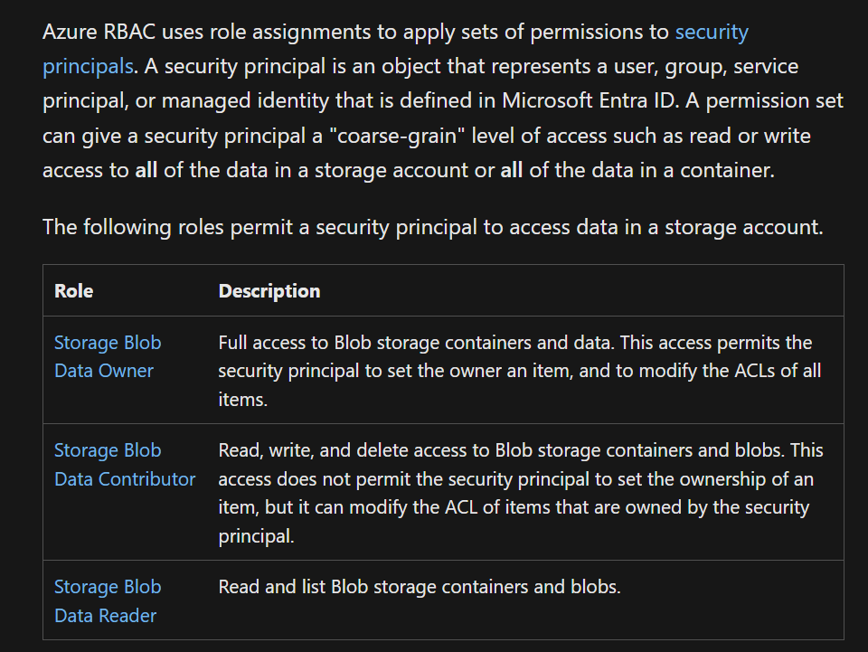

## Azure Data Lake Security Ideas

* This page details out various options we can use to organize the data in a data lake and secure it in many ways using Azure's RBAC, ABAC and ACL. 

* The highest grain of access control available for us is the Role based access control. We can create custom role names and add different permissions to it. Once that role is created, we can apply that role to the resource we want to control. 

