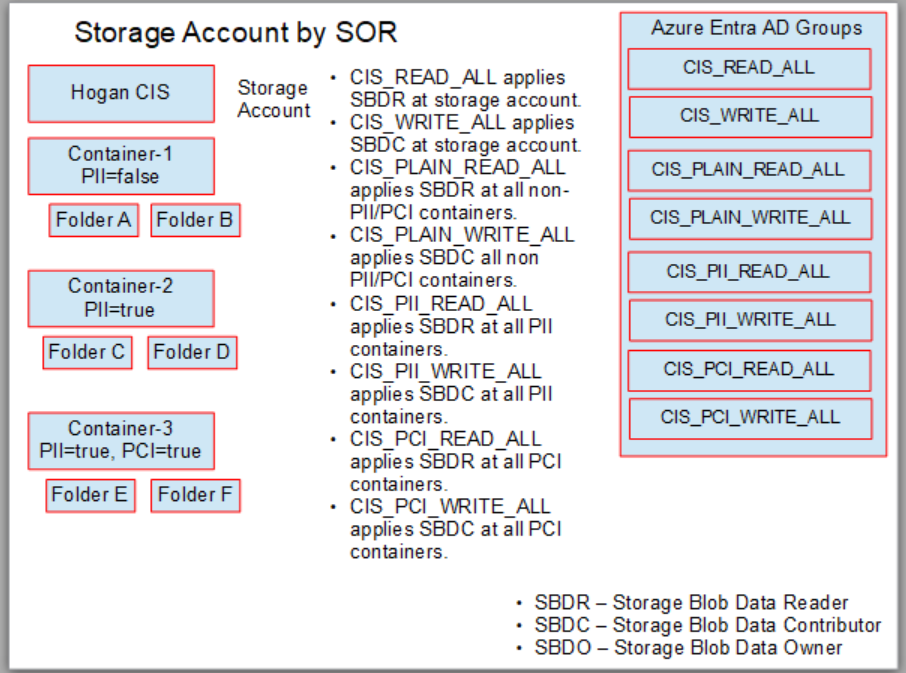
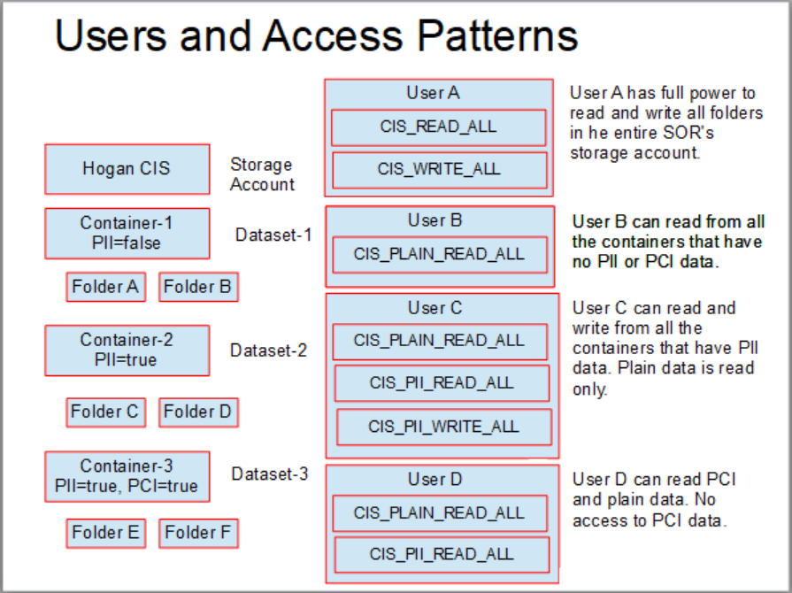

## Azure Data Lake Security Ideas

* This page details out various options we can use to organize the data in a data lake and secure it in many ways using Azure's RBAC, ABAC and ACL. 

* The highest grain of access control available for us is the Role based access control (RBAC). There are various in-built roles available in Azure and when we look at the scope of the ADLS permissions, we have two important built-in roles. Storage Blob Data Contributor (Read / Write), Storage Blob Data Reader (Read only access), and Storage blob Data Owner (Read, Write, ACL ops etc.) We can assign this role to a group we define (that represents a group of users), and scope it to the level of either a storage account or a specific container. 

##  RBAC CASE 1 - Storage account for each SOR

* The idea here is to create a separate storage account for each SOR we are trying to bring into the data lake. This might seem like an overkill at a first glance. This might be the only way to get things like:
    * Separate encryption key for each SOR. 
    * Full flexibility on where the data for the SOR can be placed. Like for instance a particular SOR might need to keep its data in the EU region. If that is the case, we need to make sure we have a storage account created at that region. 
    * Complete isolation on the roles created and managed. The SOR owner can create and maintain the groups/users needed. 

* Following points can be observed. 
    * We have a storage account created for hosting the SOR data. As we can see under the storage account, we have created containers for each dataset that we want to bring in. Under the container we can have multiple folders to hold the data based on certain partitioning strategy like date, or region etc. As we see there are also tags assigned at the container level. Container 1 has no PII/PCI, Container 2 has just PII and container 3 has both PII and PCI. 
    * Note that we have created a bunch of groups, and we can describe what the users of each group membership get. Also note the same user can get multiple groups assigned to them, and that way there is full flexibility of exactly what containers/datasets the user can have read/write access for. 

* <b> NOTE USER A, B and C are examples. Roles should be assigned to groups and it makes it easier to add and remove users to the group. This is the best practice. This document uses users to make the concept easier to visualize. </b>

* The obvious advantage with this approach is that the access control can be very granular in nature and we can give the users exactly what containers they need access to. The obvious disadvantage with this approach is that there is going to be an explosion of roles.If we have 5000 containers, then we will need to understand what containers contain non-pii and pci data, what contain pii data and what contains pci data. Every time a new container/dataset gets created, we need to go through this evaluation, and add the correct role to include it as a resource for all right groups. Maintaining this setup is not that simple or easy. 

## RBAC CASE 2 - One storage account for the entire data lake and containers for each SOR

* In this approach, a single storage account can be provisioned for the entire data lake storage. Each container can represent a unique SOR and folders under the container can host each dataset. The things to be aware of with this approach is that there are defined throughput rates for each storage account and if the traffic is very intense we might experience bottlenecks. Also the maximum storage we can have per storage account is around 5 PB. If we are dealing with more than this data size, then we might still follow this approach, but split the data across multiple storage accounts and some kind of documentation to tell us which SOR is on which storage account. 

* As we can see, one role at the storage account level can do most of the read writes to all the containers inside the data-lake. If it is acceptable, we can use this in the ETL processes and perform most of the writes using this singular role. We could still have container specific read and write roles to assign to teams similar to the approach above. As we can see the control is at the container level and so it is an all or nothing at the SOR level. <b>It is very hard to separate control at the PII/PCI/Plain data levels as we have done before. </b>

* This approach results in way lesser groups to be used. There is a read and write group needed for each SOR and that can be assigned at the container level hosting the data for the SOR. Users can however get complete access to all the folder structures under the SOR's container with this approach. This may or may not be acceptable depending on the type of data contained in the SOR. For instance, this is not an issue if every user accessing the system can see the entire dataset. This may not work in scenarios where we need to segment the data by users (for instance only access to certain folders that have PII/PCI).

## Practical Example on portal

* Note we have created a new storage account for each SOR

* Under hogan storage account, we have 3 datasets. Each dataset can have multiple folders for say date. 

* Dataset1 has no tags, Dataset2 has PII=true, and Dataset3 has PII=true and PCI=true

## ABAC with RBAC Case 1 

* Next we can look at how we can use ABAC in addition to the RBAC to make it easier to control access to datasets based on the conditions. Only when the conditions are met, the person will get the access, else the access is denied. This is a great feature to use when we have complex AND, OR and NOT conditions to apply as part of the decisioning process.

* So with this knowledge, we can propose a way to assign permissions to people based on a container name and path of the files inside the container. Let us assume that we have container for SOR as before. But now, we will create paths like /pii, /pci and /plain and put the files that have the PII, PCI and regular datasets under these main folders. If the files are organized this way we can assign an ABAC rule to allow a person become a blob reader or contributor when the container name is exactly the SOR name, and the paths are exactly /pii, /pci and /plain. 

* For a user that has complete access to the hogan cis data (both pii, pci and plain), the container name is used in the condition. 

* CIS_READ_ALL
<pre>
(
 (
  !(ActionMatches{'Microsoft.Storage/storageAccounts/blobServices/containers/blobs/read'} AND NOT SubOperationMatches{'Blob.List'})
  AND
  !(ActionMatches{'Microsoft.Storage/storageAccounts/blobServices/containers/blobs/runAsSuperUser/action'})
 )
 OR 
 (
  @Resource[Microsoft.Storage/storageAccounts/blobServices/containers:name] StringEquals 'hogancis'
 )
)
</pre>

* CIS_PLAIN_READ_ALL
<pre>
(
 (
  !(ActionMatches{'Microsoft.Storage/storageAccounts/blobServices/containers/blobs/read'} AND NOT SubOperationMatches{'Blob.List'})
  AND
  !(ActionMatches{'Microsoft.Storage/storageAccounts/blobServices/containers/blobs/runAsSuperUser/action'})
 )
 OR 
 (
  @Resource[Microsoft.Storage/storageAccounts/blobServices/containers:name] StringEquals 'hogancis'
  AND
  @Resource[Microsoft.Storage/storageAccounts/blobServices/containers/blobs:path] StringLike 'plain/*'
 )
)
</pre>

* CIS_PII_READ_ALL
<pre>
(
 (
  !(ActionMatches{'Microsoft.Storage/storageAccounts/blobServices/containers/blobs/read'} AND NOT SubOperationMatches{'Blob.List'})
  AND
  !(ActionMatches{'Microsoft.Storage/storageAccounts/blobServices/containers/blobs/runAsSuperUser/action'})
 )
 OR 
 (
  @Resource[Microsoft.Storage/storageAccounts/blobServices/containers:name] StringEquals 'hogancis'
  AND
    ( 
    @Resource[Microsoft.Storage/storageAccounts/blobServices/containers/blobs:path] StringLike 'pii/*'
    ) 
    OR 
    ( 
    @Resource[Microsoft.Storage/storageAccounts/blobServices/containers/blobs:path] StringLike 'plain/*'
    )
 )
)
</pre>

* CIS_PCI_READ_ALL

<pre>
(
 (
  !(ActionMatches{'Microsoft.Storage/storageAccounts/blobServices/containers/blobs/read'} AND NOT SubOperationMatches{'Blob.List'})
  AND
  !(ActionMatches{'Microsoft.Storage/storageAccounts/blobServices/containers/blobs/runAsSuperUser/action'})
 )
 OR 
 (
  @Resource[Microsoft.Storage/storageAccounts/blobServices/containers:name] StringEquals 'hogancis'
  AND
    ( 
    @Resource[Microsoft.Storage/storageAccounts/blobServices/containers/blobs:path] StringLike 'pci/*'
    ) 
    OR 
    ( 
    @Resource[Microsoft.Storage/storageAccounts/blobServices/containers/blobs:path] StringLike 'plain/*'
    )
 )
)
</pre>

## Theory for ABAC 

* Tags play a very big role in the conditions piece of the puzzle. The roles are applied based on the presence of certain tags and this can get pretty powerful. 

* It is important to realize that the RBAC and ABAC are evaluated BEFORE THE ACLs are evaluated. Therefore, even if ACLs block access to a specific role, they may be granted access if the RBAC or ABAC allows that. 

* There is a nice table given in this link https://learn.microsoft.com/en-us/azure/storage/blobs/data-lake-storage-access-control-model 

* It shows exactly how the ACLs can be configured and how they work when roles are present and not present. In essence, when a person does not have a role assigned to them, the ACLs get evaluated, and all the directories hosting the file need to have a X permission to allow listing, and the final file that needs to be read/written needs to have the correct bit R, W etc. enabled. The table shows is very nicely. 

* Various scenarios where ABAC can be used are documented here. https://learn.microsoft.com/en-us/azure/storage/blobs/storage-auth-abac-examples?tabs=portal-visual-editor#example-read-write-or-delete-blobs-in-named-containers

* Here is a good webpage that shows us how ABAC conditions really work. https://learn.microsoft.com/en-us/azure/role-based-access-control/conditions-format
