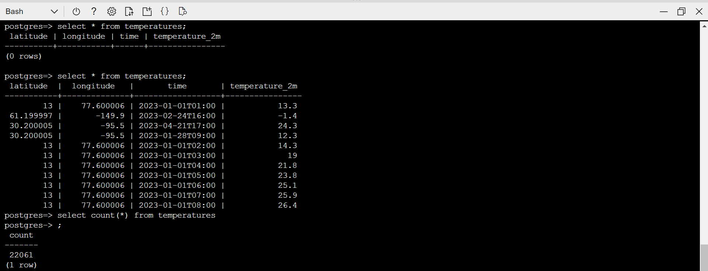

## Azure Streaming Analytics with SQL Server & Postgres integration

* We will consume the same payload via the Azure Event Hub, and push the data to a SQL Server instance/ Postgres. This will be a typical use-case in the microservices domain where events could be emitted from one domain and consumed in another. 

* Deployed a SQL Server VM to test the integration.

* Login to Azure Data Studio and connect to the database using the username and password configured when we created the database. Connecting to the master database, we need to create a new database called temperaturesdb

* Switch the scope to the new database that was created and create the required table to match the payload we are going to generate from the client side and push over to Azure Event Hub. 

* Open the Azure event hub created via the portal, and create a new SAS to allow connections to the hub. Once the SAS is created, open it, copy the primary connection string and update the Constants.java program with the new connection string as before. 

* Next create the Azure Stream analytics job. Set the streaming units to the 1/3 streaming units to save on costs. 

* Once the job is created, we need to add inputs and outputs. Add the event hub as the input and configure the sql server database we created as output. 

* <b> PROBLEM - ASA does not like the self signed certificate that comes with SQLServer hosted on the VM. I do not have power to create an Azure SQL DB. That is the reason we can't do this test. Refer to https://learn.microsoft.com/en-us/azure/stream-analytics/sql-database-output </b>

* Instead of targeting MSSQL, creating a new Postgres server as postgres is also an allowed target from ASA. After creating the database, we can connect to it and create the required table as below:

* Next test the connection to make sure ASA can connect to the destination and finds the table.

* Adjust the output to sink into the postgres DB. Start the ASA job.

* Next we will do a maven build and start the producer to push messages to the event hub. 

<pre>
set JAVA_HOME=c:\Venky\jdk-11.0.15.10-hotspot
set PATH=%PATH%;c:\Venky\spark\bin;c:\Venky\apache-maven-3.8.6\bin
set SPARK_HOME=c:\Venky\spark
SET HADOOP_HOME=C:\Venky\AzureSynapseExperiments\SparkExamples

cd C:\Venky\AzureSynapseExperiments\SparkExamples
mvn clean package

## Producer to send messages 
mvn exec:java -Dexec.mainClass="com.gssystems.azeventhub.TemperaturesProducer" -Dexec.args="C:\Venky\DP-203\AzureSynapseExperiments\datafiles\streaming\output\part-00000-dd3eed31-5521-456d-9fcd-3d66c266f6fc-c000.json C:\Venky\DP-203\AzureSynapseExperiments\datafiles\streaming\location_master\part-00000-9ce98557-48be-4823-bfb3-a0764b296729-c000.json"
</pre>

* As the producer sends events, the ASA job draws the events from the event hub and sinks it to the target. 

* The output query shows that the data is in the postgres table as expected.

* Aggregating in postgres
<pre>
postgres=> select latitude, longitude, substring(time, 1, 4) as YYYY, count(*) from temperatures group by latitude, longitude, YYYY;
 latitude  |  longitude   | yyyy | count 
-----------+--------------+------+-------
        13 |    77.600006 | 2023 |  1343
 61.199997 |       -149.9 | 2023 |  4344
  48.90001 |     2.300003 | 2023 |  4344
  41.90001 |         12.5 | 2023 |  4344
 30.200005 |        -95.5 | 2023 |  3342
      51.5 | -0.099990845 | 2023 |  4344
</pre>

