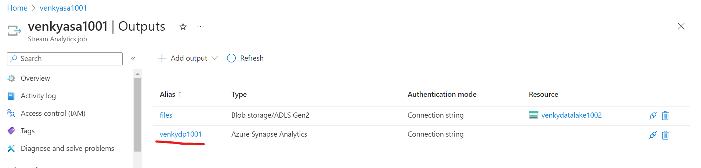

## Azure Event Hub messages to Azure Synapse Dedicated Pools via ASA

* This experiment will show how to take the events that are coming on the Azure Event Hub (AEH) and then stream that data out to a dedicated pool to create a real-time stream of data. The first step of-course is to create a synapse workspace and add a dedicated pool to it. Make sure the capacity of the dedicated pool is reduced to the minimum.

* Note that the Azure Streaming Analytics job needs to be configured with a storage account to allow us to connect it to Synapse. If we do not have a storage account, we need to create that first and then configure the ASA job to allow it to write to Synapse as a target. 

* Next we have to create an output target to point to the dedicated pool we have created. Note that the access into the dedicated pool is ONLY VIA SQL AUTHENTICATION. AD based authentication is not supported. An important factor to know if this kind of functionality is required. 

* We can use the timestamp based columns and use the TIMESTAMP BY as shown. The only limitation is that we can't go back beyond 7 days max from current time in any kind of window based functions. 

* Once the ASA job starts, we can target the event stream to write its output to both the destinations. One of them is going to push the data into the storage account and create parquet files. The other target is to the Synapse dedicated pool. <b> We need to be very careful when creating the target table in the Synapse dedicated pool. The column types seem to have a big problem when it comes to data type conversions. I had to struggle through various trial and error tests to finally make it work with the varchar(4000). Without this setting, I always came up with errors. </b> Once things resolve, we can see the data streaming in from the event hub directly into the dedicated pool! 

<pre>
### Dedicated pool, consume from the ASA stream 

DROP Table  [dbo].[temperatures_asa]
GO
CREATE TABLE [dbo].temperatures_asa
	(
	 [latitude] float,
	 [longitude] float,
	 [year] nvarchar(4000),
	 [month] nvarchar(4000),
	 [day] nvarchar(4000),
	 [hour] nvarchar(4000),
	 [temperature_c] float,
	 [temperature_f] float
	)
WITH
	(
	DISTRIBUTION = ROUND_ROBIN,
	 CLUSTERED COLUMNSTORE INDEX
	 -- HEAP
	)
GO

## ASA query 

WITH ReaderQuery AS (
	SELECT
		*
	FROM
		temperatures TIMESTAMP BY generated_time
)

SELECT * INTO [streaming-data] FROM ReaderQuery

SELECT latitude, longitude, [year], [month], [day], [hour], temperature_c, temperature_f
INTO venkydp1001 FROM ReaderQuery

</pre>

* As real time pushes happen, more and more rows are appended to the table inside the dedicated pool. 

* I also created a bulk load from the parquet files we have downloaded and created another table with the same exact schema. Comparing the counts on both the tables shows that the counts match. For the SQL see <a href="./Bulk_Load_From_Parquet.sql.txt">here</a>

