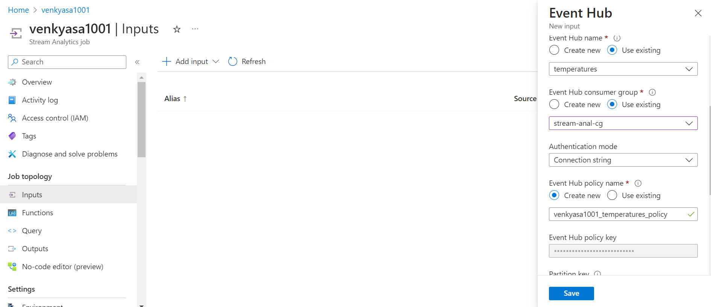
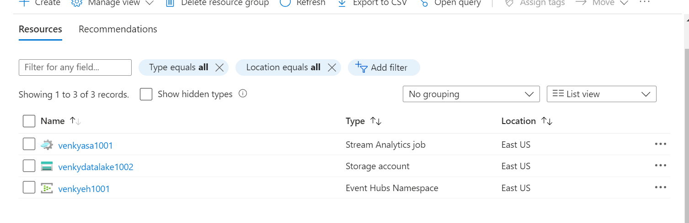
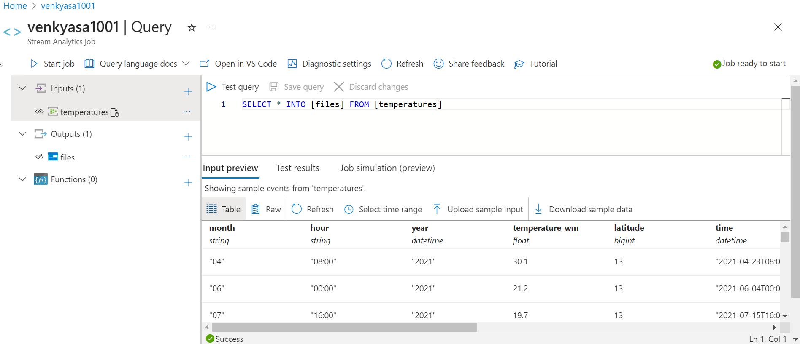
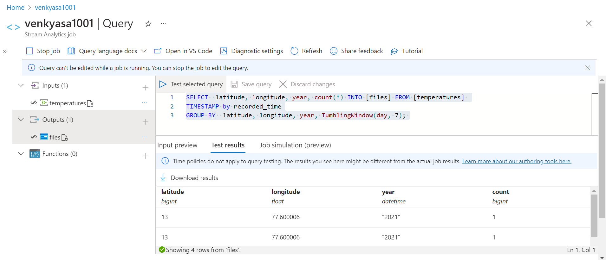
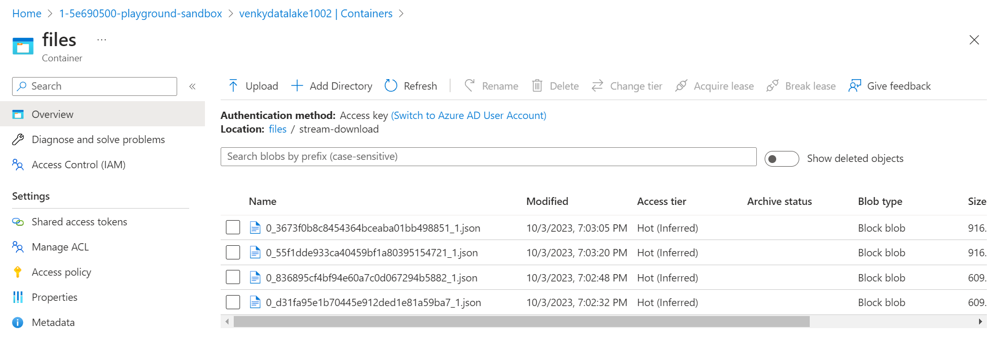
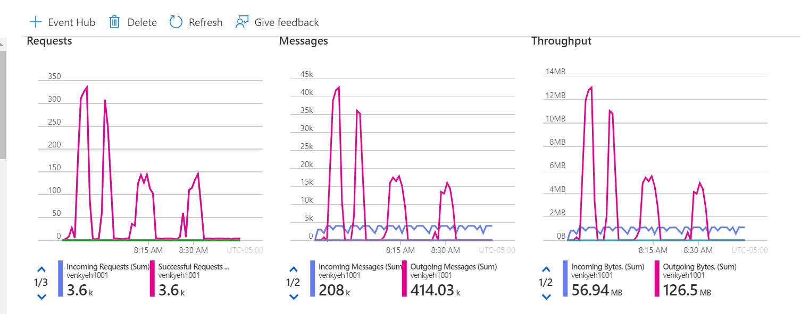

## Explore Azure Streaming Analytics Window Functions

* The base dataset we got from the weather API does not have a proper datetime field. The issue with that is that we can't really use it as is for the ASA window queries. We are now going to convert the base dataset to add a datetime field. 

<pre>
set JAVA_HOME=c:\Venky\jdk-11.0.15.10-hotspot
set PATH=%PATH%;c:\Venky\spark\bin;c:\Venky\apache-maven-3.8.4\bin
set SPARK_HOME=c:\Venky\spark
SET HADOOP_HOME=C:\Venky\DP-203\AzureSynapseExperiments\SparkExamples

cd C:\Venky\DP-203\AzureSynapseExperiments\SparkExamples
mvn clean package 

# Run the program to read from the parquet format, add a datetime field and write out.

spark-submit --master local[4] --class com.gssystems.azeventhub.ASADateTimeAdjuster target\SparkExamples-1.0-SNAPSHOT.jar file:///C:/Venky\DP-203/AzureSynapseExperiments/datafiles/spring_tx_temps_formatted/ file:///C:/Venky\DP-203/AzureSynapseExperiments/datafiles/spring_tx_dtadded/

</pre>

* This will now create a dataset with year, month, day and hour split, and also a timestamp field added that can now be used to push to the event hub, and then consumed via Azure streaming analytics. Now we can push this to the event hub using spark.

<pre>
spark-submit --master local[4] --packages com.microsoft.azure:azure-eventhubs-spark_2.12:2.3.22,com.azure:azure-messaging-eventhubs:5.15.0 --class com.gssystems.azeventhub.SparkEventHubProducer target\SparkExamples-1.0-SNAPSHOT.jar file:///C:/Venky\DP-203/AzureSynapseExperiments/datafiles/spring_tx_dtadded/

As the program runs, it will read the data from the file, and stream it into event hub.

210384
Repartitioning the dataset so that each partition can be pushed to the event hub
root
 |-- value: string (nullable = true)

Sent 1000 events
Sent 1000 events
Sent 1000 events

</pre>

* As these events keep streaming, we can create an Azure Stream Analytics job that can scan this event hub and issue queries that can use some window functions based on the recorded_time field that we created.

* Let us also create an ADLS storage account to be able to sink this dataset. 

* A simple query can read from the event hub and push to to store as we can see.

* Running this query to test the tumbling window. This dataset is not that great for temporal windows since it is historical data and the ASA does not allow us to go back more than 7 days, but if the data were to be current and streaming to us in near real time, the analytics would make way more sense. 

<pre>
SELECT  latitude, longitude, year, count(*) INTO [files] FROM [temperatures] 
TIMESTAMP by recorded_time
GROUP BY  latitude, longitude, year, TumblingWindow(day, 7); 
</pre>

* That query did not produce any outputs because the date is way older than 7 days. The simple pass through query works and it downloads the files as expected.

* The event hub metrics shows that the messages are firing.

