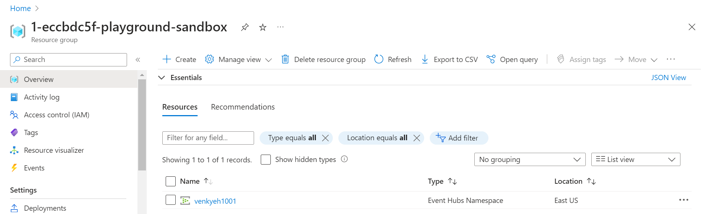
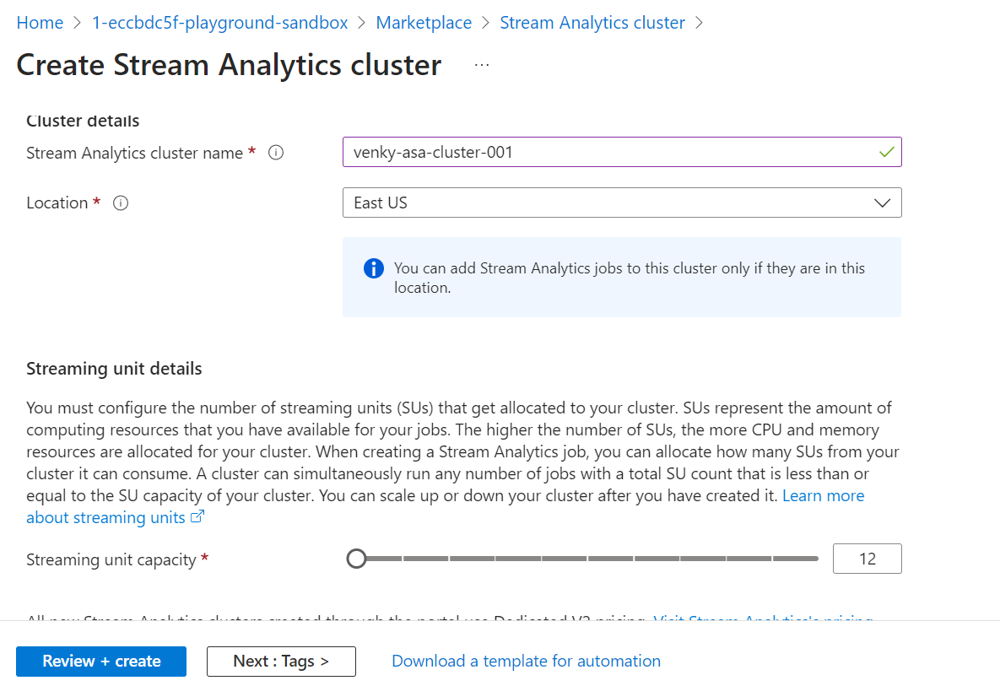
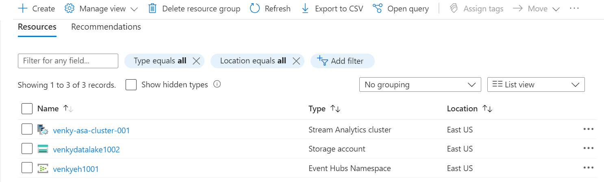
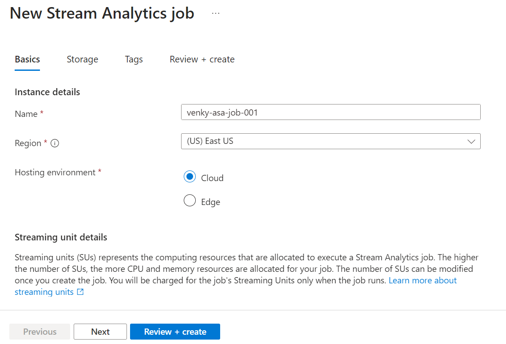
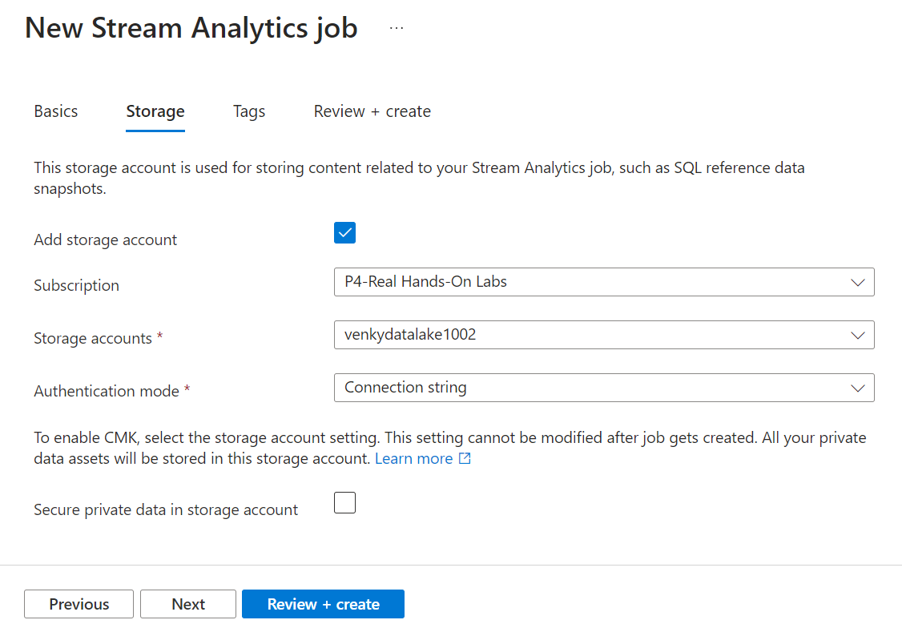
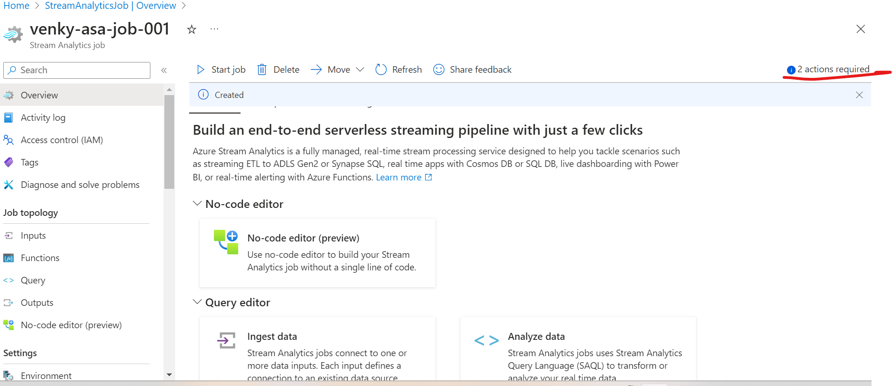
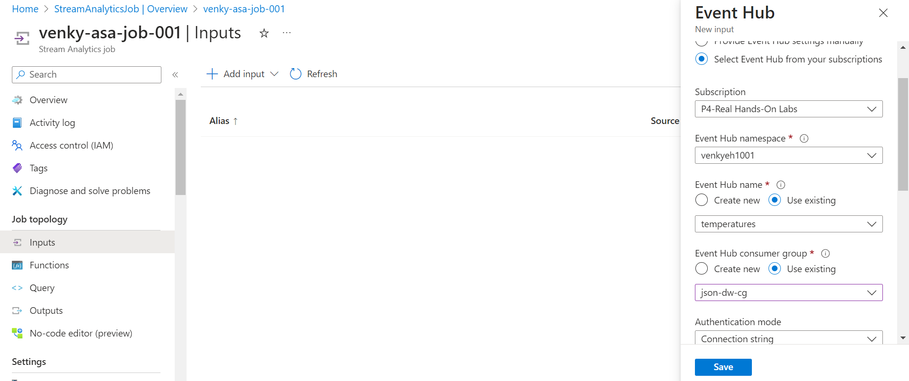
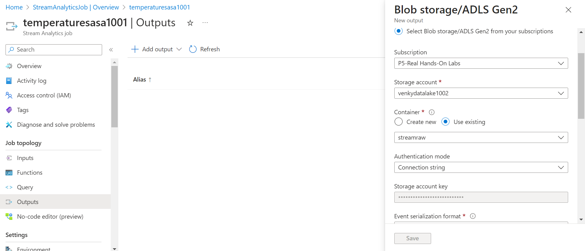

## Azure Streaming Analytics Experiments.

* First we will provision an event hub to allow us to stream data into Azure like we did before. Execute the 1002-Create-Azure-Event-Hub.ps1 script to get things going. After the event hub is provisioned, we will add a SAS policy to it and copy it to the codebase under Constants to enable streaming of data from local computer to the event hub.

* Next we will create an ASA cluster and target it to consume messages from the event hub. Note the warning on the screen. It says it can take up to an hour to deploy the ASA cluster. 

* Next we can build an ASA job to start consuming from the event hub and push that data to a storage account. We will create a simple storage account and make it ADLS compliant, create required folders and keep it ready. 

* We can start creating the ASA job while waiting for the ASA cluster to come up. 

* We can add a storage account to the job to enable us to use master/reference data lookups and join that to the data stream as needed.

* Once the job is created, we can open it up and there are various options that open up for us. We can do a no code editor, or do simpler tasks to get warmed up. It also gives us some nice warnings on the top to tell us the job does not have any inputs and outputs configured. 

* Adding the event hub as input to collect the streaming data. As soon as we add this connection ASA validates the connectivity and gives us a thumbs up if the connection via the connection string was good.

* Creating container to land streaming data.

* Next we will do a maven build and start the producer to push messages to the event hub. 

<pre>
set JAVA_HOME=c:\Venky\jdk-11.0.15.10-hotspot
set PATH=%PATH%;c:\Venky\spark\bin;c:\Venky\apache-maven-3.8.6\bin
set SPARK_HOME=c:\Venky\spark
SET HADOOP_HOME=C:\Venky\AzureSynapseExperiments\SparkExamples

cd C:\Venky\AzureSynapseExperiments\SparkExamples
mvn clean package

## Producer to send messages 
mvn exec:java -Dexec.mainClass="com.gssystems.azeventhub.TemperaturesProducer" -Dexec.args="C:\Venky\DP-203\AzureSynapseExperiments\datafiles\streaming\output\part-00000-2fa6257f-a51c-41e6-9572-630bf2a22bfd-c000.json C:\Venky\DP-203\AzureSynapseExperiments\datafiles\streaming\location_master\part-00000-9ce98557-48be-4823-bfb3-a0764b296729-c000.json"
</pre>
