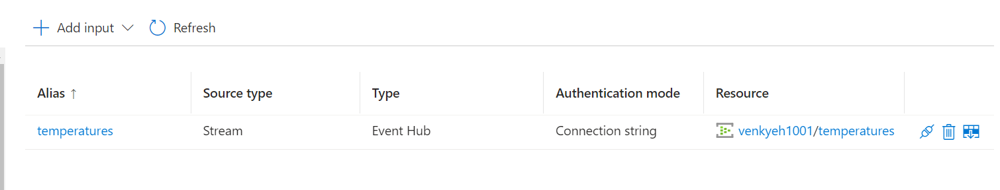
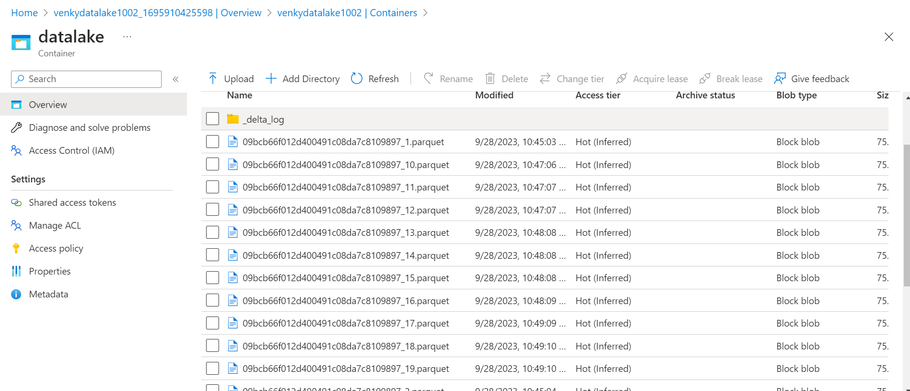

## Azure Streaming Analytics Experiments.

* First we will provision an event hub to allow us to stream data into Azure like we did before. Execute the 1002-Create-Azure-Event-Hub.ps1 script to get things going. After the event hub is provisioned, we will add a SAS policy to it and copy it to the codebase under Constants to enable streaming of data from local computer to the event hub.

* Next we will create an ASA cluster and target it to consume messages from the event hub. Note the warning on the screen. It says it can take up to an hour to deploy the ASA cluster. 

* Next we can build an ASA job to start consuming from the event hub and push that data to a storage account. We will create a simple storage account and make it ADLS compliant, create required folders and keep it ready. 

* We can start creating the ASA job while waiting for the ASA cluster to come up. 

* We can add a storage account to the job to enable us to use master/reference data lookups and join that to the data stream as needed.

* Once the job is created, we can open it up and there are various options that open up for us. We can do a no code editor, or do simpler tasks to get warmed up. It also gives us some nice warnings on the top to tell us the job does not have any inputs and outputs configured. 

* Adding the event hub as input to collect the streaming data. As soon as we add this connection ASA validates the connectivity and gives us a thumbs up if the connection via the connection string was good.

* Creating container to land streaming data.

* Next we will do a maven build and start the producer to push messages to the event hub. 

<pre>
set JAVA_HOME=c:\Venky\jdk-11.0.15.10-hotspot
set PATH=%PATH%;c:\Venky\spark\bin;c:\Venky\apache-maven-3.8.6\bin
set SPARK_HOME=c:\Venky\spark
SET HADOOP_HOME=C:\Venky\AzureSynapseExperiments\SparkExamples

cd C:\Venky\AzureSynapseExperiments\SparkExamples
mvn clean package

## Producer to send messages 
mvn exec:java -Dexec.mainClass="com.gssystems.azeventhub.TemperaturesProducer" -Dexec.args="C:\Venky\DP-203\AzureSynapseExperiments\datafiles\streaming\output\part-00000-2fa6257f-a51c-41e6-9572-630bf2a22bfd-c000.json C:\Venky\DP-203\AzureSynapseExperiments\datafiles\streaming\location_master\part-00000-9ce98557-48be-4823-bfb3-a0764b296729-c000.json"
</pre>

* Once the data gets streamed into the event hub, the Azure Streaming Analytics job scans the data to get an idea of the schema of the events. We can see that in the bottom section of the screen where it shows us a preview. 

* The traffic pattern is shown below and shows that messages are coming to the event hub from the local computer.

* Hit the start job and we can see that the icon changes to Stop job on the top of the screen. 

* The output format was set to JSON and we did not put any path patterns in the screen for the output files configuration. As we can see the files are now popped in the root of the container and are real plain text JSON files

* Once we change the output format to parquet, and set the path pattern to write files to the streaming_files directory, we can see that the output format is parquet and the directory is as shown.

## Trying out multiple paths of ingest from the same event hub stream

* Now we can experiment with seeing how we can leverage the same event stream coming over the event hub, and push the data to multiple destinations in ADLS in different formats, and possibly different aggregations done on it. Demontrates the power of ASA and the fast developer experience.

* Create multiple folders in ADLS to target various streams.

* Upload the locations_master file we had generated via spark to a new folder in the data lake. This could be used to connect with the stream and do a join. 

* Create a SAS and update the connection string in the Constants.java like before. Start producer (see commands before). Multiple queries are written in the same ASA job to target to different destinations (outputs)

* We can upload 25 records from what we are planning to stream to test this job even before we flood it with messages 

* As we can see we have been able to apply the substring transform on the time variable and split the data to YYYY, MM and DD and TT

* Job running, and producing output on the ADLS as configured. 

* We can create a simple Synapse enviorment with just serverless pools to look at the data that has landed in ADLS via this ASA streaming job and make some observations. 

* As we can see Synapse is able to see all these folders that were created as part of the ASA process. We can use the serverless pool to query each type of download.

* Counting records reveals that the counts match! Also there are NO DUPS as we can see from the order by clause given on the select.

* Now let us fire the same exact records into the job and see how it handles them in both parquet and delta formats. There are no key definitions or anything, so there is no way it would be able to do a merge operation on the delta tables.

* Here are the 2 jobs shown in the metrics of ASA 

* As expected the parquet stream shows that we have duplicate records and the records have exactly doubled from previous query.

## Testing the ASA capabilities to sink to a relational database. 

* As we saw before, it is clear that Azure Streaming Analytics only supports an append mode. There are a lot of use-cases where a streaming update to the data is required in a data-lake / database for operational type use-cases. The question is can we use a database as a staging area?

