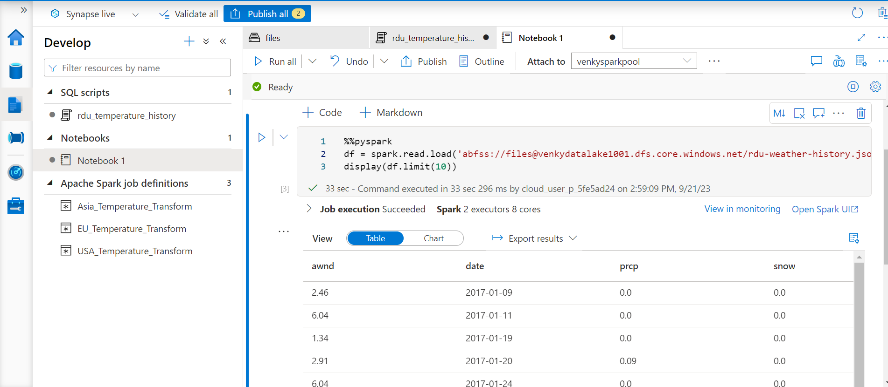
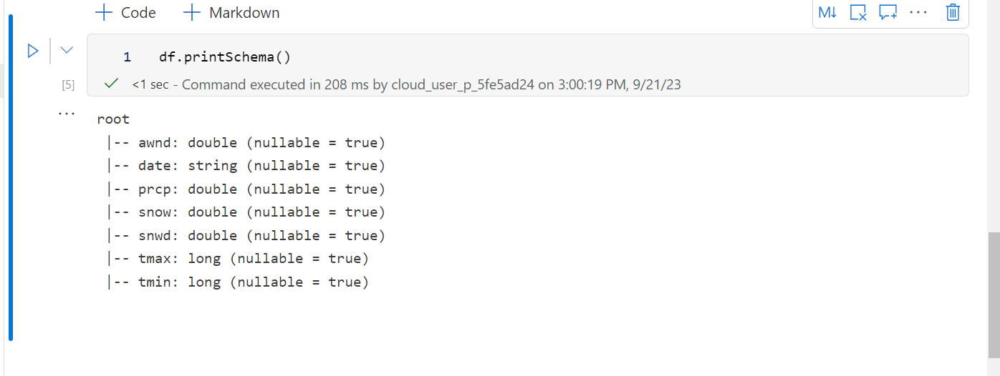

## Analyze JSON data that shows temperatures at Raleigh airport.
* Login to azure with your username and password.
* Open a command shell and execute Connect-AzAccount.
* Once logged in, run the powershell script to provision the synapse workspace and all the dependent objects (ADLS, dedicated pool, spark pool and data explorer pool.)

* Upload the json array file containing the temperature data to the attached ADLS storage of the synapse workspace. 

* We can now use the built in pool or serverless pool to do adhoc analytics directly on files present in the datalake. (<a href="./ParseWeatherData.sql">ParseWeatherData.sql</a> - Uses openrowset to read JSON Array, and use jsonp to parse and select specific fields as a table).

* Now we can execute a notebook in the created spark pool to read the json array, parse it, and store it into a new directory with a parquet format. (<a href="Write_Weather_Parquet.ipynb">Write_Weather_Parquet.ipynb</a> - Reads the raw json array dataset in spark, and writes out a new dataframe in delta format).

* Once the parquet files are created in the directory, we can now create an external table to refer to these in the serverless pool. This can act as a logical data warehouse and mininize costs since nothing is provisioned. (<a href="delta_table_create.sql">delta_table_create.sql</a> - Defines the datasource, file format and the external table pointing to the correct location on ADLS).

* Create a delta lake version of the same data set.

* Create an external table and query data from serverless pool. (<a href="External_Datasource.sql">External_Datasource.sql</a> - Creates external tables in a database and queries using serverless pools).

* Try to update data in delta lake via Serverless pool (NOT ALLOWED WILL GIVE ERROR!)

* Try updating the data (delete) via the notebook. Remove rows where prcp = 1 and rows where date is in 2017. Vaccum and see.
