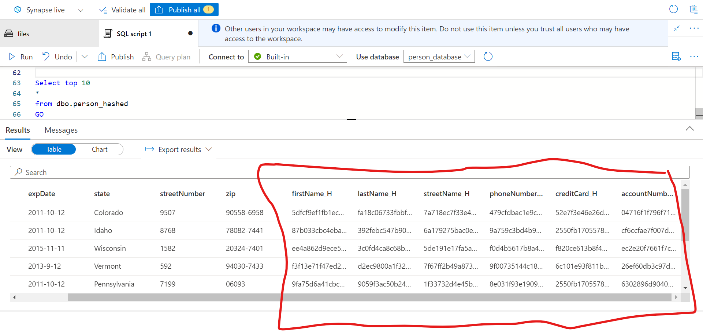
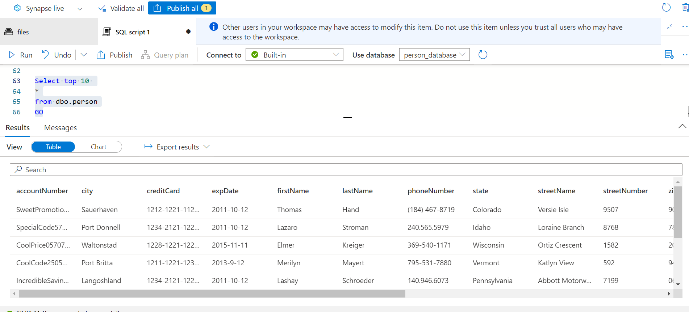
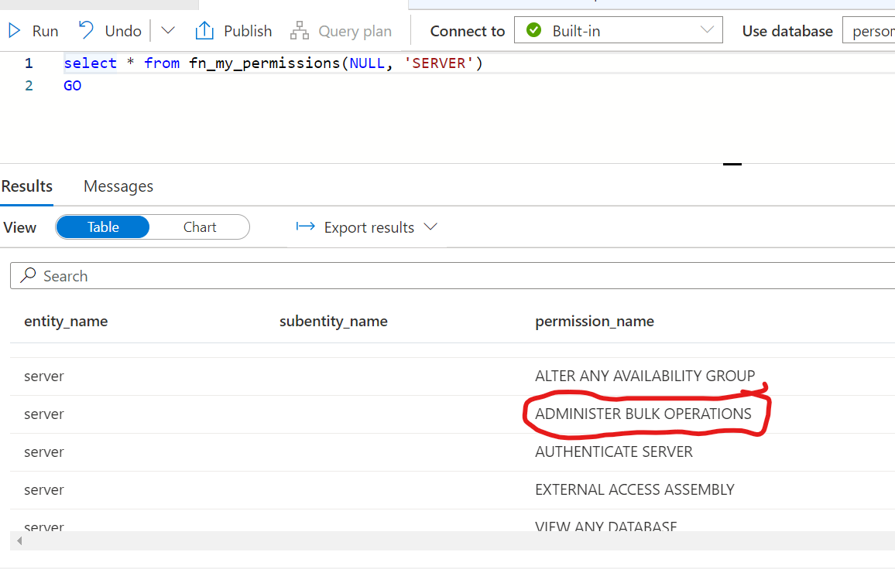
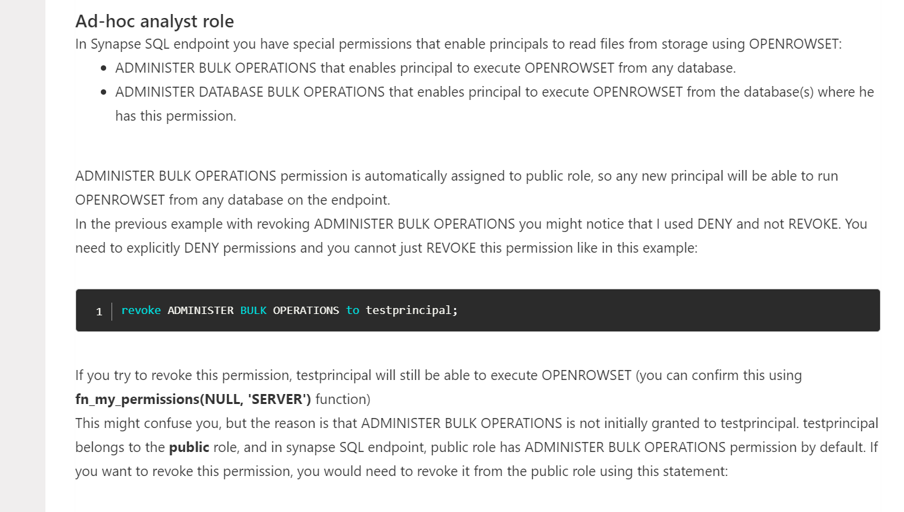

## Customer data testing. Hashing PII/PCI data and creating two versions of external tables, controlled by entitlements.

* Let us generate a ton of customers and import them to ADLS for analyzing via Synapse.
<pre>
mvn exec:java -Dexec.mainClass="com.gssystems.spark.GenerateFakeCustomers" -Dexec.args="5000 person_records.json"
</pre>

* Now we can use a generic program in spark to take the dataset and add the columns needed based on the original PII/PCI data. The columns will contain a hash of the original data and will contain the column name _HASH with the original name. The end result of this transformation is to create a set of columns with hashed data from the original columns. The idea is to allow two tables one with PII/PCI data and others with just the hashed columns. 

<pre>
spark-submit --master local[4] --class com.gssystems.spark.GenerateHashedColumns target\SparkExamples-1.0-SNAPSHOT.jar file:///C:/Venky/DP-203/AzureSynapseExperiments/datafiles/person/ file:///C:/Venky/DP-203/AzureSynapseExperiments/datafiles/person_hashed/ "firstName,lastName,streetName,phoneNumber,creditCard,accountNumber"
</pre>

* As we can see, this generic program can be used to take care of creating the hashed columns for any dataset we care about. 

* Please refer to the create_person_tables.sql file. 
* As we can see we create two tables in the database. One contains all the columns in the file as is. This table entitlement will be given to users that need to see the non hashed version of the dataset. Then we create another external table with just the hashed columns and the non-PII/PCI columns. This table entitlement will be granted to people who need to access the data with no access to read PII/PCI data. Since hashing is used, the columns consistently convert to the hashes, and can be used in join kind of operations. 

Here is the query for the person who does not have access to PII/PCI data. 

* There is a way we can disable the usage of OPENROWSET. This will not allow users to directly query the files from ADLS bypassing our external tables. This can be used in conjunction with external tables we created before to hide the PCI columns. 

* Here is more information about this setting. 
