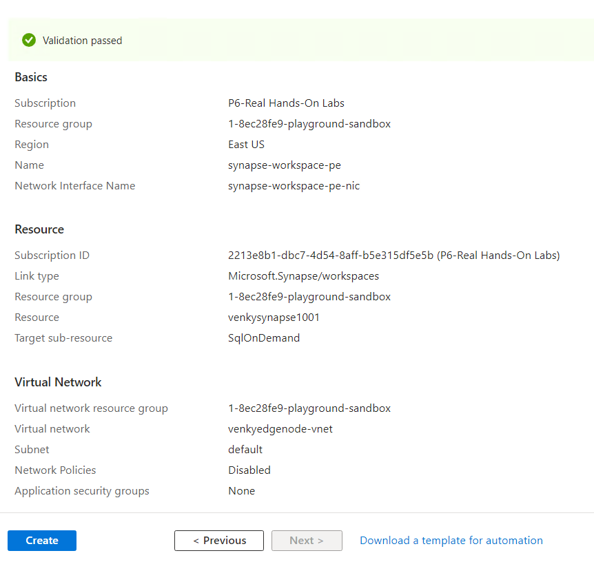

## Details weather analysis workflow

* This example deals with extracting data from the weather service, preparing the dataset using Spark and then exploring various aspects of the Synapse Serverless Pools.

## Commands to execute

set JAVA_HOME=c:\Venky\jdk-11.0.15.10-hotspot
set PATH=%PATH%;c:\Venky\spark\bin;c:\Venky\apache-maven-3.8.6\bin
set SPARK_HOME=c:\Venky\spark
SET HADOOP_HOME=C:\Venky\AzureSynapseExperiments\SparkExamples

cd C:\Venky\AzureSynapseExperiments\SparkExamples
mvn clean package

* Run these steps on your local machine or run them on the DSVM that has spark installed and pre-configured. This will download the temperatures for a specific lat and long for a time period. Once the raw data is pulled down, we do some data massaging with Spark to clean the data up and make it into a format that can be used by Synapse easily.

# Spring TX 
mvn exec:java -Dexec.mainClass="com.gssystems.spark.DownloadWeatherDataHistorical" -Dexec.args="30.188530 -95.525810 2019-01-01 2019-12-31 2019_Spring_Temps.json"

mvn exec:java -Dexec.mainClass="com.gssystems.spark.DownloadWeatherDataHistorical" -Dexec.args="30.188530 -95.525810 2020-01-01 2020-12-31 2020_Spring_Temps.json"

mvn exec:java -Dexec.mainClass="com.gssystems.spark.DownloadWeatherDataHistorical" -Dexec.args="30.188530 -95.525810 2021-01-01 2021-12-31 2021_Spring_Temps.json"

mvn exec:java -Dexec.mainClass="com.gssystems.spark.DownloadWeatherDataHistorical" -Dexec.args="30.188530 -95.525810 2022-01-01 2022-12-31 2022_Spring_Temps.json"

mvn exec:java -Dexec.mainClass="com.gssystems.spark.DownloadWeatherDataHistorical" -Dexec.args="30.188530 -95.525810 2023-01-01 2023-06-30 2023_Spring_Temps.json"

# Anchorage AK
mvn exec:java -Dexec.mainClass="com.gssystems.spark.DownloadWeatherDataHistorical" -Dexec.args="61.217381 -149.863129 2019-01-01 2019-12-31 2019_Anchorage_Temps.json"

mvn exec:java -Dexec.mainClass="com.gssystems.spark.DownloadWeatherDataHistorical" -Dexec.args="61.217381 -149.863129 2020-01-01 2020-12-31 2020_Anchorage_Temps.json"

mvn exec:java -Dexec.mainClass="com.gssystems.spark.DownloadWeatherDataHistorical" -Dexec.args="61.217381 -149.863129 2021-01-01 2021-12-31 2021_Anchorage_Temps.json"

mvn exec:java -Dexec.mainClass="com.gssystems.spark.DownloadWeatherDataHistorical" -Dexec.args="61.217381 -149.863129 2022-01-01 2022-12-31 2022_Anchorage_Temps.json"

mvn exec:java -Dexec.mainClass="com.gssystems.spark.DownloadWeatherDataHistorical" -Dexec.args="61.217381 -149.863129 2023-01-01 2023-06-30 2023_Anchorage_Temps.json"

# Bangalore 
mvn exec:java -Dexec.mainClass="com.gssystems.spark.DownloadWeatherDataHistorical" -Dexec.args="12.971599 77.594566 2019-01-01 2019-12-31 2019_Bangalore_Temps.json"

mvn exec:java -Dexec.mainClass="com.gssystems.spark.DownloadWeatherDataHistorical" -Dexec.args="12.971599 77.594566 2020-01-01 2020-12-31 2020_Bangalore_Temps.json"

mvn exec:java -Dexec.mainClass="com.gssystems.spark.DownloadWeatherDataHistorical" -Dexec.args="12.971599 77.594566 2021-01-01 2021-12-31 2021_Bangalore_Temps.json"

mvn exec:java -Dexec.mainClass="com.gssystems.spark.DownloadWeatherDataHistorical" -Dexec.args="12.971599 77.594566 2022-01-01 2022-12-31 2022_Bangalore_Temps.json"

mvn exec:java -Dexec.mainClass="com.gssystems.spark.DownloadWeatherDataHistorical" -Dexec.args="12.971599 77.594566 2023-01-01 2023-06-30 2023_Bangalore_Temps.json"

Note that there is a problem when we are using windows 10 with spark. The hadoop.dll needs to be downloaded from 
https://github.com/steveloughran/winutils/tree/master/hadoop-3.0.0/bin and put into C:\Windows\System32 folder. Then we need to have the winutils.exe in a folder and set that as HADOOP_HOME. See setting above. 

spark-submit --master local[4] --class com.gssystems.spark.TemperaturesReformatter target\SparkExamples-1.0-SNAPSHOT.jar file:///C:/Venky/AzureSynapseExperiments/datafiles/spring_tx_temps/ file:///C:/Venky/AzureSynapseExperiments/datafiles/spring_tx_temps_formatted/ file:///C:/Venky/AzureSynapseExperiments/datafiles/location_master/

* Once we run all the steps above, we will have a parquet file that contains time and temperature readings. We will also have another folder that has the location data. We need to open the container that is provisioned and create a new folders location_master and spring_tx_temps_formatted. Upload the parquet files to the ADLS directory and the folder can be queried by synapse via the linked service. 

* Testing with the storage account having public access enabled. When the ARM template created the storage account the public access is allowed. This means that the openrowset function can reach out to the storage account and get access to files to query the data. This is demonstrated in the screen shots below. 

  

  

* This technique is not very secure, and we need to tighten things up a lot more. 
* We need to create a storage account with ADLS namespace enabled. To start with we can make the firewall settings in the network settings to be Disabled. This means that the storage account access will be blocked from all networks. Private links are absolutely needed to access the storage account. 
* I also created a virtual network and a Windows VM inside it. I configured the private endpoint to the storage account to be in the same subnet as the virtual machine. Once we do this setting we can do a nslookup on the storage account with the venkydatalake1001.dfs.core.windows.net and it will resolve to a PRIVATE IP, not a public IP. 

  

  

  

* I also downloaded the Azure Storage Explorer tool and installed it on the VM. I can't hit the storage account anymore from my personal computer because the firewall blocks access to it. I opened the explorer tool, logged into the subscription and loaded the storage accounts. Once I try to load the blob containers inside the storage account, I get an authorization error. It clearly says in the error that the storage account firewall is not allowing the connection to happen for data related operations. The control operations are just fine. 

  

* To make things work, we need to click on allowing the access to the storage account from specific IP addresses or VNET. Then click on the Add existing VNET and select the vnet we created before to host the virtual machine. Once this firewall rule is enabled, things work as normal.

  

* Also note that when we are creating the private link to connect the storage account to the vnet, it will ask for the type of resource we are creating the end-point for. In our case, since we are hosting an ADLS storage account, we need to make sure we select <b>DFS</b> as the target resource for the private link. If we were to pick blob instead, then the private link for ADLS would not work, and the nslookup test before would give a PUBLIC IP, not a private IP starting with a 10.XX.XX.XX from the subnet ranage. 

## Synapse testing

* Once we have got connectivity from the VM we can check out this repository from the VM, and upload the folders needed to the files container we had created before. Once we do this we need to ensure that the ACLs for the container and each of the folders are set to execute for the Other principal. Without this setting, I was never able to get the files uploaded since the user can't list the contents of the folders. 

  

* Now we can create the synapse workspace by selecting it from the +create menu. Once we present the existing storage account to it, Synapse understands that the storage account is not available publically and sets up both a private end-point and a vnet integration to make sure the connectivity is established. Once the synapse workspace gets created, we however need to MANUALLY APPROVE the private end-point that was created. Without this, Synapse will fail to access the storage account. 

  

* Also note that Synapse was smart enough to add the workspace we created to the allow list of the storage account, under the resources area. 

  

* Once we get all this situated, we can open the Synapse workspace UI, and go to the linked storage accounts on there. Then opening the files container, we can right click on the folders and SQL to query the rows. Once we execute it, Synapse talks to the private endpoint of the storage account and executes the required queries. We can connect to synapse from both the Azure VM and the personal computer and execute queries because the Synapse workspace is not locked down and accessible publicly. We will change that and lock it down further. 

  

* First we create a private endpoint to be used to connect to Synapse once we disable public access to the workspace. We will target the private endpoint to be in the same vnet that we have hosted the virtual machine. That way the same VM can be used to connect to and test both the storage and the synapse workspace. We possibly could remove the private endpoint to the storage account, but that will make things pretty hard since it would be impossible to upload the raw files that we want to use on the ADLS storage. 

* Go to the Synapse workspace, Networking and Disable the public access to the synapse workspace.

* Go to the Synapse workspace, Networking and Disable the public access to the synapse workspace.

* If we check the private endpoints in the Synapse left menu, we see it is provisioned and approved.

* Note that nslookup to both the storage account and the synapse on demand pool are configured with private links and resolve to private IPs from inside the subnet default where the vm is running.

* Now we can't connect to synapse from the web-ui. Let us download Azure data studio and try to connect. https://azure.microsoft.com/en-us/products/data-studio

* When we authenticate using the Azure Data Studio, we need to ensure that we are authenticating with AD credentials, not SQL Server credentials. If we login with SQL Server credentials, the principal will not be able to query the ADLS dataset. For a firewall based storage, user identity with SQL login is not supported. After we login and create the database and external tables, we can query the data. 

## Synapse JDBC 
* Since we are using the serverless pool, we need to have AD authentication when using the JDBC driver. Without this, a pass through authentication will not happen and the ADLS directory can't be listed anymore...

* Please take a look at the code in SynapseJDBCTesting. Note the use of the special datasource and password based authentication in use. Once we do this and run the following command, we an see the results.

mvn exec:java -Dexec.mainClass="com.gssystems.spark.SynapseJDBCTesting" -Dexec.args="cloud_user_p_1ece36c2@realhandsonlabs.com e4HDNs^LLT5mvVvF7yQB"

## Testing with Ubuntu Server
* Spawn a Ubuntu VM using the Azure portal and it will create a vnet, subnet, nic and all that is needed to get started. 
* Execute the following commands to get the sytem ready to run the spring boot app,

sudo apt update
sudo apt install default-jdk
sudo apt install git
sudo apt install maven 
sudo apt install dnsutils

wget https://aka.ms/downloadazcopy-v10-linux
tar -xvf downloadazcopy-v10-linux
export PATH=$PATH:/home/venkyuser/azcopy_linux_amd64_10.20.1

git clone https://github.com/SowmyaVenky/AzureSynapseExperiments.git
cd AzureSynapseExperiments/SynapseRESTAPI/

* These are the steps required to be followed on an Ubuntu machine to test things out. 
cd /home/venkyuser/AzureSynapseExperiments/datafiles
azcopy login 

azcopy copy "/home/venkyuser/AzureSynapseExperiments/datafiles/spring_tx_temps_formatted" "https://venkydatalake1001.dfs.core.windows.net/files/" --recursive=true

azcopy copy "/home/venkyuser/AzureSynapseExperiments/datafiles/location_master" "https://venkydatalake1001.dfs.core.windows.net/files/" --recursive=true

azcopy list "https://venkydatalake1001.dfs.core.windows.net/files/" 

* Now create the Synapse workspace. Make sure to target the workspace to the ADLS we created. Synapse will establish the required private links and vnet integrations needed. Once this is done, we can go to the develop tab and issue the queries to create the required database and tables. See the locations_external_table.sql file.

* Make sure all the required external tables are created.
After this we can run our maven test program to make sure the ubuntu server can query the data from synapse and display.

mvn exec:java -Dexec.mainClass="com.gssystems.spark.SynapseJDBCTesting" -Dexec.args="cloud_user_p_1ece36c2@realhandsonlabs.com e4HDNs^LLT5mvVvF7yQB"

