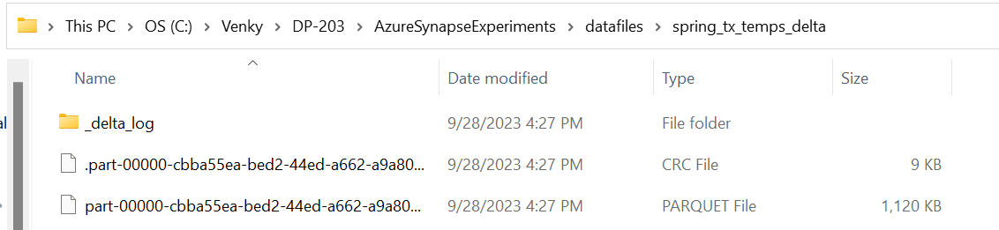
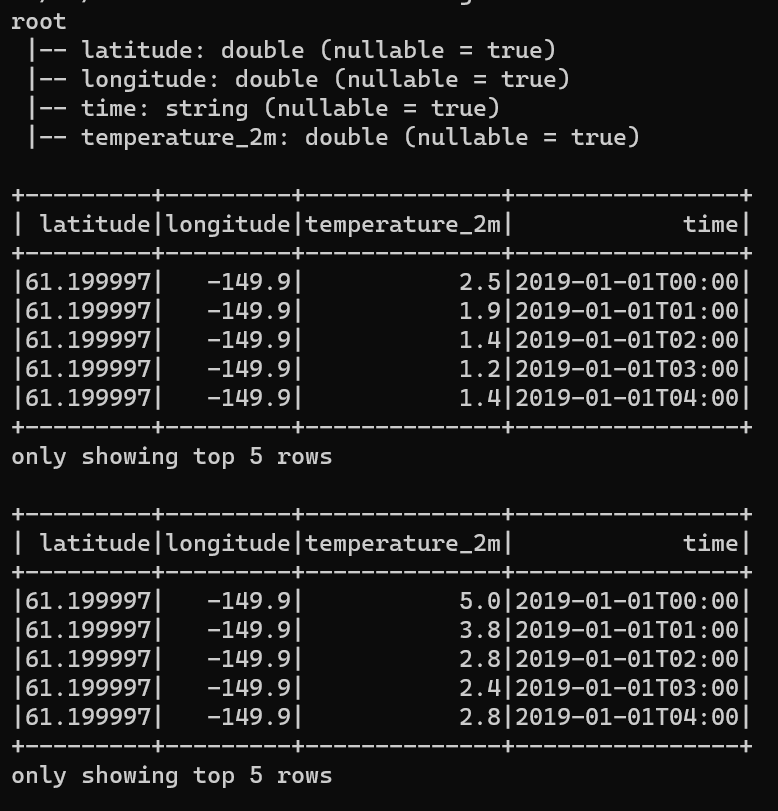
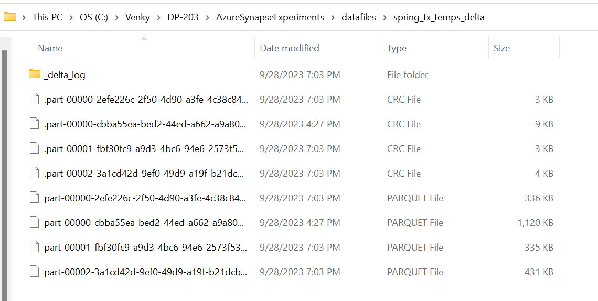

## Delta Lake Experiments. 

* We will take the parquet files that we had generated during the previous experiments and convert them to the delta format. This can be used as a base to try out various merge type scenarios where the delta format can allow for updates in place. 

<pre>
set JAVA_HOME=c:\Venky\jdk-11.0.15.10-hotspot
set PATH=%PATH%;c:\Venky\spark\bin;c:\Venky\apache-maven-3.8.4\bin
set SPARK_HOME=c:\Venky\spark
SET HADOOP_HOME=C:\Venky\DP-203\AzureSynapseExperiments\SparkExamples

cd C:\Venky\DP-203\AzureSynapseExperiments\SparkExamples
mvn clean package

## Convert from parquet to delta format. 
spark-submit --master local[4] --packages io.delta:delta-core_2.12:2.2.0 --conf "spark.sql.extensions=io.delta.sql.DeltaSparkSessionExtension" --conf "spark.sql.catalog.spark_catalog=org.apache.spark.sql.delta.catalog.DeltaCatalog" --class com.gssystems.delta.TemperaturesDeltaProcessing target\SparkExamples-1.0-SNAPSHOT.jar file:///C:/Venky/DP-203/AzureSynapseExperiments/datafiles/spring_tx_temps_formatted/ file:///C:/Venky/DP-203/AzureSynapseExperiments/datafiles/spring_tx_temps_delta/
</pre>

* The parquet files are read and the delta log is written to make it the delta format. Here are the files created 

* Now we will create a smaller JSON payload that we can use to update the data in the main delta table and see the effect. Note that this reformatter is taking just one file 2019 Anchorage temperatures and putting it in the new folder. Also we are getting it in JSON format so we can adjust a few records to our will and push the update.

<pre>
spark-submit --master local[4] --class com.gssystems.spark.TemperaturesReformatterJSON target\SparkExamples-1.0-SNAPSHOT.jar file:///C:/Venky/DP-203/AzureSynapseExperiments/datafiles/spring_tx_temps/2019_Anchorage_Temps.json file:///C:/Venky/DP-203/AzureSynapseExperiments/datafiles/delta_table_update_payload/ file:///C:/Venky/DP-203/AzureSynapseExperiments/datafiles/delta_table_location_master/
</pre>

* Now that we have the main delta table, and the rows that we want to update, we can do the merge. We are going to double the temperatures for each of the 2019 Anchorage rows! 

<pre>
spark-submit --master local[4] --packages io.delta:delta-core_2.12:2.2.0 --conf "spark.sql.extensions=io.delta.sql.DeltaSparkSessionExtension" --conf "spark.sql.catalog.spark_catalog=org.apache.spark.sql.delta.catalog.DeltaCatalog" --class com.gssystems.delta.TemperaturesDeltaMergeProcessor target\SparkExamples-1.0-SNAPSHOT.jar file:///C:/Venky/DP-203/AzureSynapseExperiments/datafiles/spring_tx_temps_delta/ file:///C:/Venky/DP-203/AzureSynapseExperiments/datafiles/delta_table_update_payload/
</pre>

* As we can see the rows in the update dataset are twice the temperatures of original.

* After the update is run, we can see the updated files in the Delta folder.

* After that we can read the new directory and issue queries to see what has happened. 

<pre>
spark-submit --master local[4] --packages io.delta:delta-core_2.12:2.2.0 --conf "spark.sql.extensions=io.delta.sql.DeltaSparkSessionExtension" --conf "spark.sql.catalog.spark_catalog=org.apache.spark.sql.delta.catalog.DeltaCatalog" --class com.gssystems.delta.TemperaturesDeltaReader target\SparkExamples-1.0-SNAPSHOT.jar file:///C:/Venky/DP-203/AzureSynapseExperiments/datafiles/spring_tx_temps_delta/ 
</pre>

* Before 
<pre>
+---------+---------+----------------+--------------+
| latitude|longitude|            time|temperature_2m|
+---------+---------+----------------+--------------+
|61.199997|   -149.9|2019-01-01T00:00|           2.5|
|61.199997|   -149.9|2019-01-01T01:00|           1.9|
|61.199997|   -149.9|2019-01-01T02:00|           1.4|
|61.199997|   -149.9|2019-01-01T03:00|           1.2|
|61.199997|   -149.9|2019-01-01T04:00|           1.4|
|61.199997|   -149.9|2019-01-01T05:00|           1.5|
|61.199997|   -149.9|2019-01-01T06:00|           2.1|
+---------+---------+----------------+--------------+
</pre>

* After
<pre>
+---------+---------+----------------+--------------+
| latitude|longitude|            time|temperature_2m|
+---------+---------+----------------+--------------+
|61.199997|   -149.9|2009-01-01T00:00|           5.0|
|61.199997|   -149.9|2009-01-01T01:00|           3.8|
|61.199997|   -149.9|2009-01-01T02:00|           2.8|
|61.199997|   -149.9|2009-01-01T03:00|           2.4|
|61.199997|   -149.9|2009-01-01T04:00|           2.8|
|61.199997|   -149.9|2009-01-01T05:00|           3.0|
|61.199997|   -149.9|2009-01-01T06:00|           4.2|
|61.199997|   -149.9|2019-01-01T00:00|           5.0|
|61.199997|   -149.9|2019-01-01T01:00|           3.8|
|61.199997|   -149.9|2019-01-01T02:00|           2.8|
|61.199997|   -149.9|2019-01-01T03:00|           2.4|
|61.199997|   -149.9|2019-01-01T04:00|           2.8|
|61.199997|   -149.9|2019-01-01T05:00|           3.0|
|61.199997|   -149.9|2019-01-01T06:00|           4.2|
+---------+---------+----------------+--------------+
</pre>

* As we can see that the 2009 rows are inserted, and the 2019 rows have doubled the temperature value as expected.