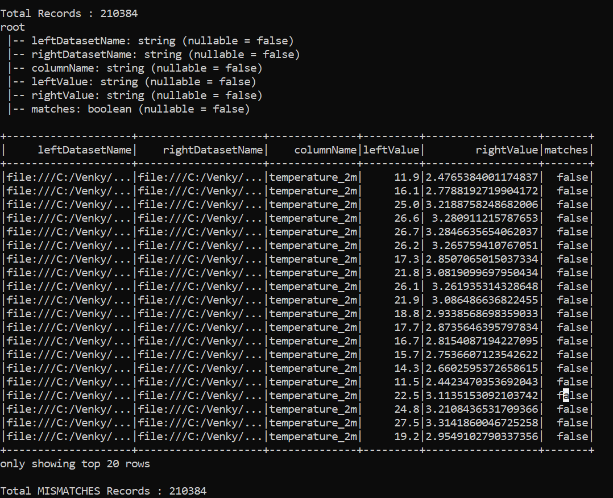

# ORC To Parquet Compare Utility 

* This is a sample utility program that can take two datasets one in ORC nd one on Parquet format and compare them after joining the two datasets based on the given key columns. Once the full outer join is performed, a custom map function takes the non key columns and compares them emitting a row for every mismatch. This makes it easy to compare the datasets no matter what their individual schemas are. 

## Commands to execute

<pre>
set JAVA_HOME=c:\Venky\jdk-11.0.15.10-hotspot
set PATH=%PATH%;c:\Venky\spark\bin;c:\Venky\apache-maven-3.8.6\bin
set SPARK_HOME=c:\Venky\spark
SET HADOOP_HOME=C:\Venky\AzureSynapseExperiments\SparkExamples

cd C:\Venky\AzureSynapseExperiments\SparkExamples
mvn clean package

Create the orc dataset. 

spark-submit --master local[4] --class com.gssystems.dataset.compare.ORCFileCreator target\SparkExamples-1.0-SNAPSHOT.jar file:///C:/Venky/AzureSynapseExperiments/datafiles/spring_tx_temps_formatted/ file:///C:/Venky/AzureSynapseExperiments/datafiles/spring_tx_temps_orc/

Create the parquet dataset.

spark-submit --master local[4] --class com.gssystems.dataset.compare.ParquetFileCreator target\SparkExamples-1.0-SNAPSHOT.jar file:///C:/Venky/AzureSynapseExperiments/datafiles/spring_tx_temps_formatted/ file:///C:/Venky/AzureSynapseExperiments/datafiles/spring_tx_temps_parquet/

# Run the compare program

spark-submit --master local[4] --class com.gssystems.dataset.compare.CompareUtil target\SparkExamples-1.0-SNAPSHOT.jar file:///C:/Venky/AzureSynapseExperiments/datafiles/spring_tx_temps_orc/ file:///C:/Venky/AzureSynapseExperiments/datafiles/spring_tx_temps_parquet/ "latitude,longitude,time" file:///C:/Venky/AzureSynapseExperiments/datafiles/spring_tx_temps_orcpqcompare/

Create the parquet dataset forcing mismatches on each row.

spark-submit --master local[4] --class com.gssystems.dataset.compare.ParquetWithDifferencesCreator target\SparkExamples-1.0-SNAPSHOT.jar file:///C:/Venky/AzureSynapseExperiments/datafiles/spring_tx_temps_formatted/ file:///C:/Venky/AzureSynapseExperiments/datafiles/spring_tx_temps_parquet_withdiff/

# Run the compare program

spark-submit --master local[4] --class com.gssystems.dataset.compare.CompareUtil target\SparkExamples-1.0-SNAPSHOT.jar file:///C:/Venky/AzureSynapseExperiments/datafiles/spring_tx_temps_orc/ file:///C:/Venky/AzureSynapseExperiments/datafiles/spring_tx_temps_parquet_withdiff/ "latitude,longitude,time" file:///C:/Venky/AzureSynapseExperiments/datafiles/spring_tx_temps_orcpqcompare_withdiff/

</pre>
