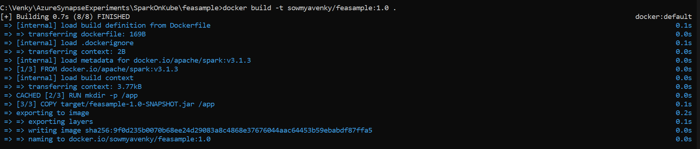
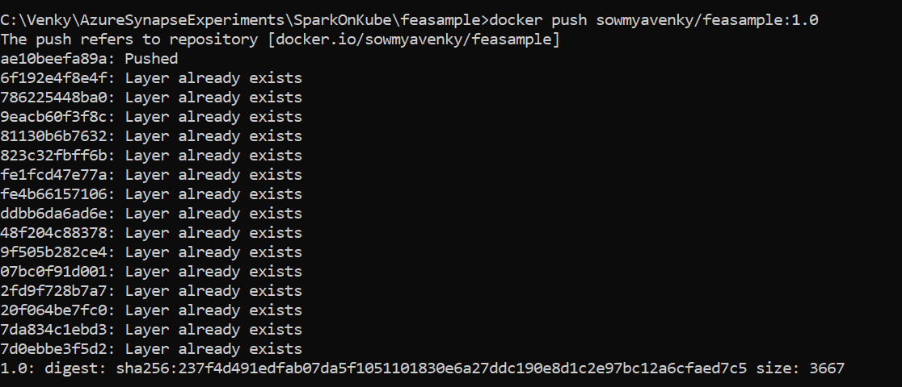
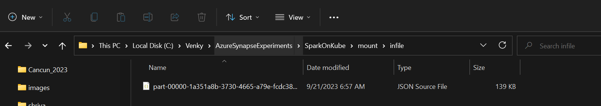
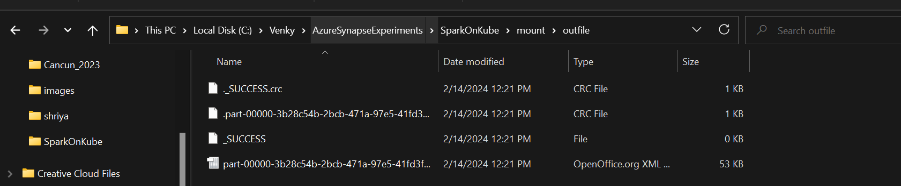
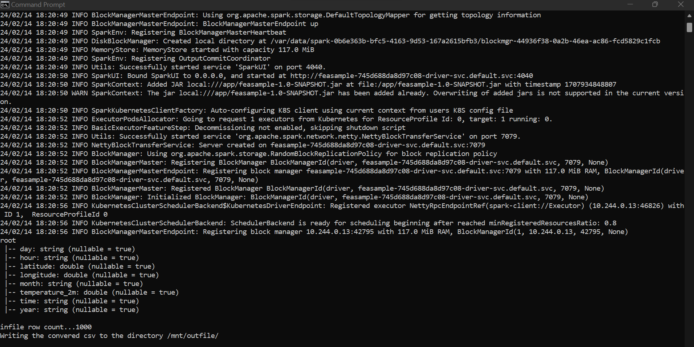

## Mounting a local windows directory to the driver and executor pods

* We will usually need to mount an external folder to both the driver and executors to do even simple tasks. For this purpose, we can use the volumemounts option to mount a directory to the pods. There is a level of indirection here to understand. Once we install the kind cluster the process goes ahead and creates a docker container. If we use the default kind create cluster command, there will be no volume mounts available. To enable a mount of a host directory on to the driver and executor pods, we need to create a kind cluster using a YAML definition file rather than just a command line.

* Please refer to the file <a href="./kind_cluster.yaml">kind_cluster.yaml</a> to understand how the local directory on the windows machine is being mounted into the kubernetes cluster as /www. This WILL ACT LIKE the host folder available to the spark application YAML files. This is very important to understand. The spark application files that we push to the spark operator will deploy that to the KIND cluster, and will refer to the /www as though it is a native path inside the kubernetes cluster. 

* We will need to remove the cluster that we had created before and create a new one using this command:
<code>
kind create cluster --config kind_cluster.yaml
</code

* This will create the cluster. Next we need to reinstall the helm charts like we did before to enable the spark operator.
* Next we need to create the service account to allow it to be used by the spark operator.
* We will now have a custom docker file created that takes the base spark image and then adds our own application jar over to the image.
<code>
cd feasample
mvn clean package
docker build -t sowmyavenky/feasample:1.0 .
docker push sowmyavenky/feasample:1.0
</code>

* We need to place a JSON file at the mounted location. Note that we have created 2 directories infile and outfile to read the JSON from and write the csv out to respectively.

* Next we will need to apply the feasample.yaml to start the spark application. 

<code>
C:\Venky\AzureSynapseExperiments\SparkOnKube>kubectl apply -f feasample.yaml
sparkapplication.sparkoperator.k8s.io/feasample created
</code>

* Once we run this again, we will see the pods getting created and destroyed.

<code>
C:\Venky\AzureSynapseExperiments\SparkOnKube>kubectl get po -w
NAME               READY   STATUS    RESTARTS   AGE
feasample-driver   1/1     Running   0          7s
readjson-b4884b8da8d99cac-exec-1   0/1     Pending   0          0s
readjson-b4884b8da8d99cac-exec-1   0/1     Pending   0          0s
readjson-b4884b8da8d99cac-exec-1   0/1     ContainerCreating   0          0s
readjson-b4884b8da8d99cac-exec-1   1/1     Running             0          2s
readjson-b4884b8da8d99cac-exec-1   1/1     Terminating         0          14s
readjson-b4884b8da8d99cac-exec-1   0/1     Terminating         0          14s
readjson-b4884b8da8d99cac-exec-1   0/1     Terminating         0          15s
feasample-driver                   0/1     Completed           0          25s
readjson-b4884b8da8d99cac-exec-1   0/1     Terminating         0          15s
readjson-b4884b8da8d99cac-exec-1   0/1     Terminating         0          15s
feasample-driver                   0/1     Completed           0          26s
feasample-driver                   0/1     Completed           0          27s
</code>

* We can see that the files were read and written out as CSV.

* The logs also show that the process ran good.

