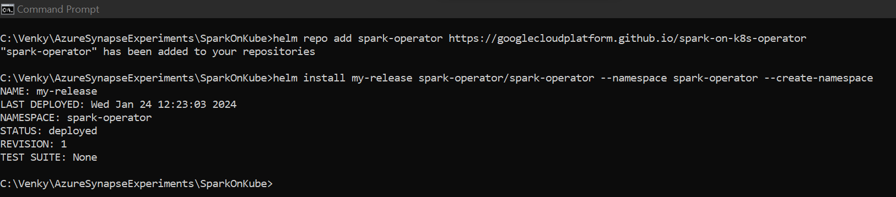

# Spark on Kubernetes 

* This experiment will setup a kubernetes cluster on docker desktop running locally. Make sure docker desktop is installed and we have no problems running the test conainer. 

* Download the kubectl.exe from this website https://kubernetes.io/docs/tasks/tools/install-kubectl-windows/

* Download the KIND exe running this command in powershell.
<code>
curl.exe -Lo kind-windows-amd64.exe https://kind.sigs.k8s.io/dl/v0.20.0/kind-windows-amd64
Move-Item .\kind-windows-amd64.exe .\kind.exe
</code>

* Download helm from the website called helm-releases.

<code>
helm repo add spark-operator https://googlecloudplatform.github.io/spark-on-k8s-operator
helm install my-release spark-operator/spark-operator --namespace spark-operator --create-namespace

C:\Venky\AzureSynapseExperiments\SparkOnKube>kubectl get po -n spark-operator
NAME                                        READY   STATUS    RESTARTS   AGE
my-release-spark-operator-85bbc7865-846k5   1/1     Running   0          7h9m

</code>

* We need to create a service account and give it power to execute the spark apps and watch the pods that are running. 

<code>
kubectl apply -f service-account.yaml
</code>

* Execute the spark application now 
<code>
kubectl apply -f spark-pi.yaml

C:\Venky\AzureSynapseExperiments\SparkOnKube>kubectl get sparkapplication
NAME       STATUS      ATTEMPTS   START                  FINISH                 AGE
spark-pi   COMPLETED   1          2024-01-25T01:29:48Z   2024-01-25T01:30:02Z   8m22s

</code>

* We can now check the pods and the logs to see whether pi was computed...

<code>
C:\Venky\AzureSynapseExperiments\SparkOnKube>kubectl get po
NAME              READY   STATUS      RESTARTS   AGE
spark-pi-driver   0/1     Completed   0          9m22s

C:\Venky\AzureSynapseExperiments\SparkOnKube>kubectl describe sparkapplication spark-pi
Name:         spark-pi
Namespace:    default
Labels:       <none>
Annotations:  <none>
API Version:  sparkoperator.k8s.io/v1beta2
Kind:         SparkApplication
Metadata:
  Creation Timestamp:  2024-01-25T01:29:45Z
  Generation:          1
  Resource Version:    42964
  UID:                 5b91ce88-eb08-485f-a42a-c7812d43e3f4
Spec:
  Driver:
    Core Limit:  1200m
    Cores:       1
    Labels:
      Version:        3.1.1
    Memory:           512m
    Service Account:  spark
    Volume Mounts:
      Mount Path:  /tmp
      Name:        test-volume
  Executor:
    Cores:      1
    Instances:  1
    Labels:
      Version:  3.1.1
    Memory:     512m
    Volume Mounts:
      Mount Path:         /tmp
      Name:               test-volume
  Image:                  apache/spark:v3.1.3
  Image Pull Policy:      Always
  Main Application File:  local:///opt/spark/examples/jars/spark-examples_2.12-3.1.3.jar
  Main Class:             org.apache.spark.examples.SparkPi
  Mode:                   cluster
  Restart Policy:
    Type:         Never
  Spark Version:  3.1.1
  Type:           Scala
  Volumes:
    Host Path:
      Path:  /tmp
      Type:  Directory
    Name:    test-volume
Status:
  Application State:
    State:  COMPLETED
  Driver Info:
    Pod Name:             spark-pi-driver
    Web UI Address:       10.96.11.63:0
    Web UI Port:          4040
    Web UI Service Name:  spark-pi-ui-svc
  Execution Attempts:     1
  Executor State:
    spark-pi-2cfc858d3e3ce43d-exec-1:  COMPLETED
  Last Submission Attempt Time:        2024-01-25T01:29:48Z
  Spark Application Id:                spark-597638d88ba34f3e8ae2699733068e88
  Submission Attempts:                 1
  Submission ID:                       4a721489-9d35-44b4-a47c-2c000c8e2da0
  Termination Time:                    2024-01-25T01:30:02Z
Events:
  Type    Reason                     Age    From            Message
  ----    ------                     ----   ----            -------
  Normal  SparkApplicationAdded      10m    spark-operator  SparkApplication spark-pi was added, enqueuing it for submission
  Normal  SparkApplicationSubmitted  9m59s  spark-operator  SparkApplication spark-pi was submitted successfully
  Normal  SparkDriverRunning         9m57s  spark-operator  Driver spark-pi-driver is running
  Normal  SparkExecutorPending       9m51s  spark-operator  Executor [spark-pi-2cfc858d3e3ce43d-exec-1] is pending
  Normal  SparkExecutorRunning       9m49s  spark-operator  Executor [spark-pi-2cfc858d3e3ce43d-exec-1] is running
  Normal  SparkExecutorCompleted     9m45s  spark-operator  Executor [spark-pi-2cfc858d3e3ce43d-exec-1] completed
  Normal  SparkDriverCompleted       9m45s  spark-operator  Driver spark-pi-driver completed
  Normal  SparkApplicationCompleted  9m45s  spark-operator  SparkApplication spark-pi completed

kubectl logs spark-driver-pod 

We will see this in the logs

Pi is roughly 3.1385756928784643
</code>