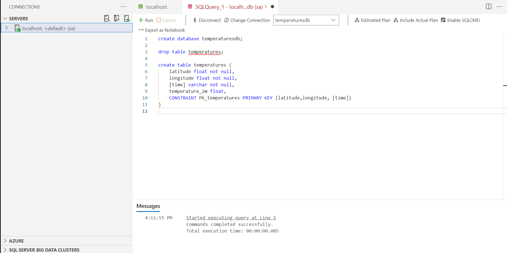
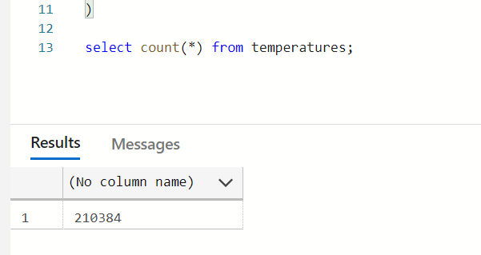

## SQL Server Spark Testing

* This experiment will use Spark to push records to a SQL Server instance running in Docker.

<pre>
 docker run -e "ACCEPT_EULA=Y" -e "MSSQL_SA_PASSWORD=Ganesh20022002" -p 1433:1433 -d mcr.microsoft.com/mssql/server:2022-latest

Once the docker container starts, we can see that it is in running status.
C:\Venky\DP-203\AzureSynapseExperiments\SparkExamples>docker ps
CONTAINER ID   IMAGE                                        COMMAND                  CREATED          STATUS          PORTS                    NAMES
e582d76cbf87   mcr.microsoft.com/mssql/server:2022-latest   "/opt/mssql/bin/perm…"   12 seconds ago   Up 11 seconds   0.0.0.0:1433->1433/tcp   strange_swartz

</pre>

* We will connect to the database via Azure Data Studio and execute the commands needed to create a database and the tables under that database. 
<pre>
drop table temperatures;

create table temperatures ( 
    latitude float not null, 
    longitude float not null, 
    [time] varchar not null, 
    temperature_2m float,
    CONSTRAINT PK_temperatures PRIMARY KEY (latitude,longitude, [time])
)
</pre>

<pre>
set JAVA_HOME=c:\Venky\jdk-11.0.15.10-hotspot
set PATH=%PATH%;c:\Venky\spark\bin;c:\Venky\apache-maven-3.8.4\bin
set SPARK_HOME=c:\Venky\spark
SET HADOOP_HOME=C:\Venky\DP-203\AzureSynapseExperiments\SparkExamples

cd C:\Venky\DP-203\AzureSynapseExperiments\SparkExamples
mvn clean package 

## Test SQL Server connection
mvn exec:java -Dexec.mainClass="com.gssystems.sqlserver.SQLServerJDBCTest" 

# Run the program to read from the delta format and push it to sql server.
#
spark-submit --master local[4] --jars file:///C:/Venky/DP-203/AzureSynapseExperiments/SqlServerSpark/mssql-jdbc-12.4.1.jre11.jar --driver-class-path file:///C:/Venky/DP-203/AzureSynapseExperiments/SqlServerSpark/mssql-jdbc-12.4.1.jre11.jar --packages io.delta:delta-core_2.12:2.2.0 --conf "spark.sql.extensions=io.delta.sql.DeltaSparkSessionExtension" --conf "spark.sql.catalog.spark_catalog=org.apache.spark.sql.delta.catalog.DeltaCatalog" --class com.gssystems.sqlserver.TemperaturesLoader target\SparkExamples-1.0-SNAPSHOT.jar file:///C:/Venky/spring_tx_temps_delta/

</pre>

* After the code runs, we can see that the data is loaded into SQLServer. 

