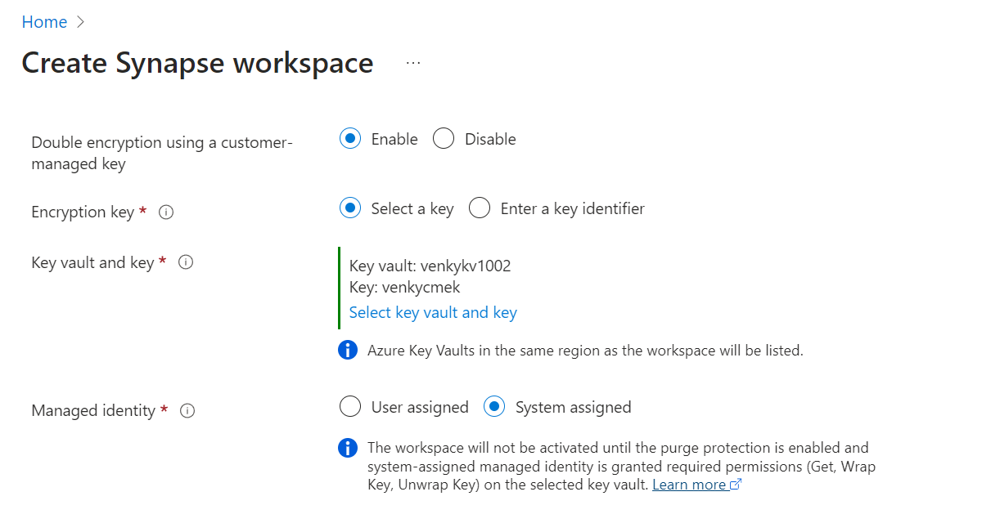

## CMEK setup with Synapse

* First we need to create a VNET and a subnet to enable us to create private endpoints to both ADLS storage and the Azure Key Vault that holds the keys to encrypt the workspace.

* Create a key-vault with the vault access policies enabled. Create it making sure that the public access is diabled and the private endpoints are enabled from the VNET to the key-vault. The process warns us that the service endpoints to the key-vault are not enabled inside the selected vnet, and it could take 15 mins to complete, but it usually finishes pretty fast.

* Note that the key-vault has been given access from our vnet, and an end-point connection to the vault has also been created and is in the approved state.

* Note resources created with the key-vault in place.

* Create 2 keys to use for the CMEK with ADLS and Synapse. 

* Create a UMI to use for talking to the KV and get the keys to encrypt/decrypt.

* Create a vault access policy to connect to this KV and get keys. UMI will now have power to talk to the KV and get the keys.

* Create a new storage account with the ADLS namespace enabled. Then make sure the network access is set to private and add a private link to the storage account to ensure nothing can talk to it other than the private connections we allow from the vnet. Note also that we have set the ADLS gen 2 to be encrypted with a CMEK and it is using the venky-umi to get to the KV.

* I ran into an error here because Acloud guru does not allow us to create a KV with the purge protection enabled via a policy. Without that the KV will not be allowed to be used for CMEK. Will have to revert back to Microsoft managed keys for testing. 

* Let us create a container in the storage account we just created so that it can be used for Synapse as a primary ADLS container. 

* Next we will create the Synapse workspace and try to use the KV with a system managed identity to access the KV and do double encryption.

* Note we have checked the box to allow the system managed identity of the Synapse we are creating to get access to the ADLS. We can validate what this setting does on the storage account access tab once the deployment is complete.

* Note that when I select the User managed identity and the key-vault, I get 2 errors. The KV is not purge protection enabled, and the UMI can't access the keyvault since it is restricted access from specific networks. This CONFIRMS THAT UMI NEEDS a publically accessible KV to use in CMEK.

* Now when I switch back from User managed to System Managed, we can see both errors are gone, and we can push forward to go to the next step. 

* The deployment takes off...

* Note that the deployment takes a bunch of steps here, and one of them is the update storage account step as we can see in the top of the list. This is essentially creating a private endpoint on the storage account and as we will see in the next screen will be on the Pending state and will need approval from us to continue.

* Note the pending state of the PRIVATE ENDPOINT THAT WAS CREATED to allow the synapse service to talk to the ADLS storage. 

* Once we approve the private link by clicking the approve button, the private link will be established and will allow the Synapse service to talk to the ADLS via the private endpoint connection. 

* Now if we open the freshly deployed service, we can see that the Synapse workspace is created BUT NOT ACTIVATED!!!! This is because we need to take the managed identity that was created during the process and give it explicit power to talk to the KV to fetch the key and do double encryption. 

* Capturing the UUID of the system managed identity that was created to give it power to go to the KV. 

* Creating a vault access policy to ensure that the managed identity can get to the KV.

* Note that once saved, both the venky-umi and the newly created system managed identity of the workspace are given power to do the operations on the KV. This is probably way more power than what we should give it in real life, but this is just for testing. 

* I run into the same problem I ran into before with the ADLS CMEK. It enforces that the KV be in HA configuration and the acloud guru policy does not allow is to go ahead and create one. This proves that we are good to create the entire stack and it should work given that the KV can be setup with purge protection enabled (HA).

