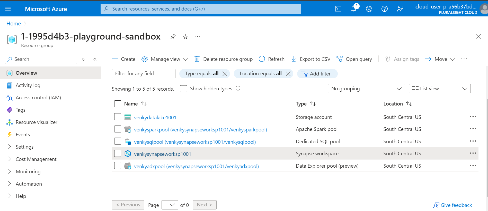
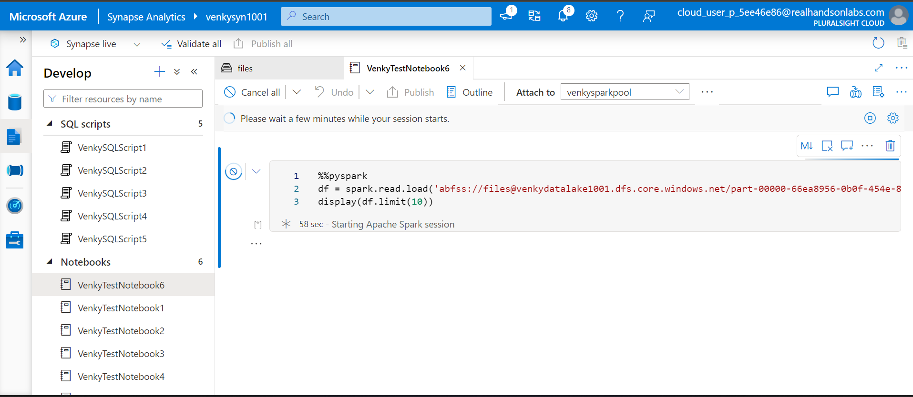
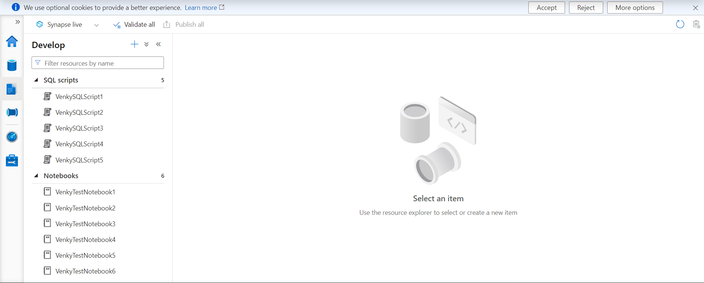
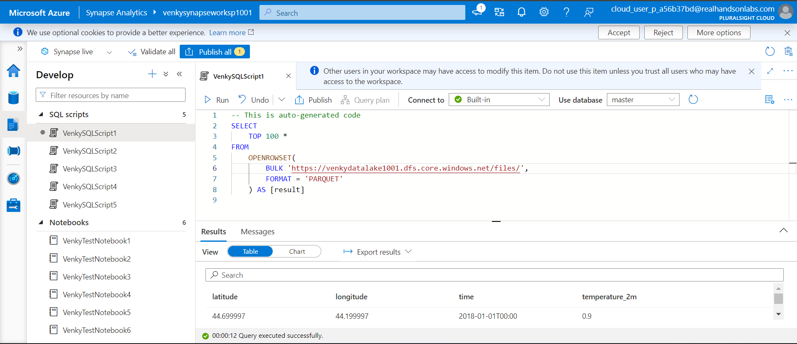
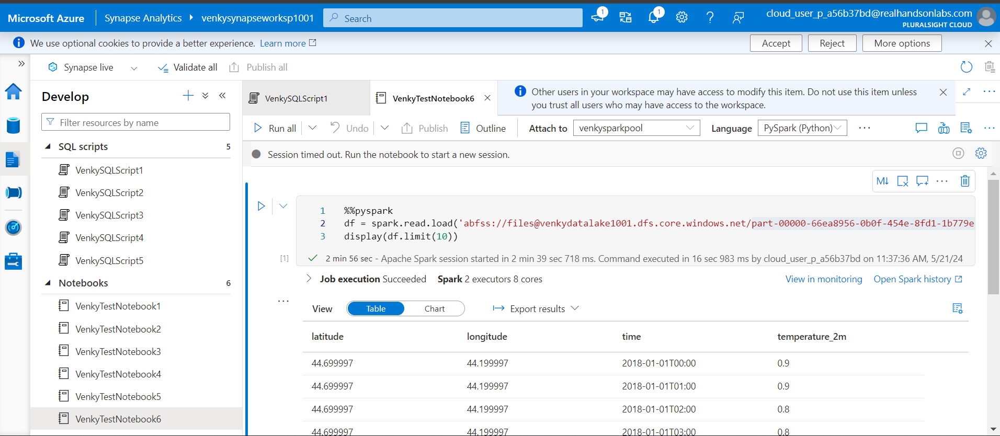

## Synapse artifact export process

* We are going to try to export the datasets, linked services, pipelines, notebooks and SQL Scripts from one Synapse region and transport the same into another Synapse region. We are going to do this via both the powershell process and the AZ CLI.

### Azure CLI based process

* We can do the same process via Azure CLI. We need to authenticate our AZ CLI shell to our subscription to allow us to do the export/import. 

<code>
az login
</code>

* This will open a browser window where we need to add the credentials and login. Once logged in we can execute the following commands to export the notebooks and SQL scripts into a target folder.

<code>
az login
az synapse notebook list --workspace-name venkysyn1001 --query "[*].name"

C:\Venky\AzureSynapseExperiments>az synapse notebook list --workspace-name venkysyn1001 --query "[*].name"
Command group 'synapse' is in preview and under development. Reference and support levels: https://aka.ms/CLI_refstatus
[
  "VenkyTestNotebook1",
  "VenkyTestNotebook2",
  "VenkyTestNotebook3",
  "VenkyTestNotebook4",
  "VenkyTestNotebook5",
  "VenkyTestNotebook6"
]

# Export all notebooks.
az synapse notebook export --output-folder C:\Venky\AzureSynapseExperiments\SynapseGitIntegration\venkysyn1001-exported-notebooks_cli --workspace-name venkysyn1001

# Export all sql scripts
az synapse sql-script export --output-folder C:\Venky\AzureSynapseExperiments\SynapseGitIntegration\venkysyn1001-exported-sqls_cli --workspace-name venkysyn1001

</code>

* Now we are creating a new Synapse workspace that is clean to serve as a target to import the artifacts from the other source workspace. 

* If we run the 1005-Create-Synapse-workspace.ps1 script, it is going to provision a brand new workspace for us to test the imports. Here is a brand new workspace that is created for us to test the import process.

* We can now import the notebooks and SQL Scripts one by one into the new workspace. 

## Import the notebooks that we exported before. 

<code>
# IMPORT notebooks.
az synapse notebook import --file @"C:\Venky\AzureSynapseExperiments\SynapseGitIntegration\venkysyn1001-exported-notebooks_cli\VenkyTestNotebook1.ipynb" --name VenkyTestNotebook1 --workspace-name venkysynapseworksp1001
az synapse notebook import --file @"C:\Venky\AzureSynapseExperiments\SynapseGitIntegration\venkysyn1001-exported-notebooks_cli\VenkyTestNotebook2.ipynb" --name VenkyTestNotebook2 --workspace-name venkysynapseworksp1001
az synapse notebook import --file @"C:\Venky\AzureSynapseExperiments\SynapseGitIntegration\venkysyn1001-exported-notebooks_cli\VenkyTestNotebook3.ipynb" --name VenkyTestNotebook3 --workspace-name venkysynapseworksp1001
az synapse notebook import --file @"C:\Venky\AzureSynapseExperiments\SynapseGitIntegration\venkysyn1001-exported-notebooks_cli\VenkyTestNotebook4.ipynb" --name VenkyTestNotebook4 --workspace-name venkysynapseworksp1001
az synapse notebook import --file @"C:\Venky\AzureSynapseExperiments\SynapseGitIntegration\venkysyn1001-exported-notebooks_cli\VenkyTestNotebook5.ipynb" --name VenkyTestNotebook5 --workspace-name venkysynapseworksp1001
az synapse notebook import --file @"C:\Venky\AzureSynapseExperiments\SynapseGitIntegration\venkysyn1001-exported-notebooks_cli\VenkyTestNotebook6.ipynb" --name VenkyTestNotebook6 --workspace-name venkysynapseworksp1001

az synapse notebook list --workspace-name venkysynapseworksp1001 --query "[*].name"

Command group 'synapse' is in preview and under development. Reference and support levels: https://aka.ms/CLI_refstatus
[
  "VenkyTestNotebook1",
  "VenkyTestNotebook2",
  "VenkyTestNotebook3",
  "VenkyTestNotebook4",
  "VenkyTestNotebook5",
  "VenkyTestNotebook6"
]

# Import all sql scripts we exported before.
az synapse sql-script import --file C:\Venky\AzureSynapseExperiments\SynapseGitIntegration\venkysyn1001-exported-sqls_cli\VenkySQLScript1.sql --name VenkySQLScript1 --workspace-name venkysynapseworksp1001
az synapse sql-script import --file C:\Venky\AzureSynapseExperiments\SynapseGitIntegration\venkysyn1001-exported-sqls_cli\VenkySQLScript2.sql --name VenkySQLScript2 --workspace-name venkysynapseworksp1001
az synapse sql-script import --file C:\Venky\AzureSynapseExperiments\SynapseGitIntegration\venkysyn1001-exported-sqls_cli\VenkySQLScript3.sql --name VenkySQLScript3 --workspace-name venkysynapseworksp1001
az synapse sql-script import --file C:\Venky\AzureSynapseExperiments\SynapseGitIntegration\venkysyn1001-exported-sqls_cli\VenkySQLScript4.sql --name VenkySQLScript4 --workspace-name venkysynapseworksp1001
az synapse sql-script import --file C:\Venky\AzureSynapseExperiments\SynapseGitIntegration\venkysyn1001-exported-sqls_cli\VenkySQLScript5.sql --name VenkySQLScript5 --workspace-name venkysynapseworksp1001

az synapse sql-script list --workspace-name venkysynapseworksp1001 --query "[*].name"

Command group 'synapse' is in preview and under development. Reference and support levels: https://aka.ms/CLI_refstatus
[
  "VenkySQLScript1",
  "VenkySQLScript2",
  "VenkySQLScript3",
  "VenkySQLScript4",
  "VenkySQLScript5"
]
</code>

* Now we can test out the functionality of the sql scripts and notebooks in the new destination synapse workspace to prove out that it works in the new environment.

* Here is the notebook running in the old source Synapse workspace 

* After the import scripts have run fine, we can actually see the notebooks and SQL scripts very similar to what they looked like on the source workspace. 

* Now we can test the SQL script and the notebook in the new workspace and ensure they run properly.

* If we want to do the same thing with Azure Powershell instead please refer to <a href="./AZ_Powershell.md">here</a>