## Synapse artifact export process

* We are going to try to export the datasets, linked services, pipelines, notebooks and SQL Scripts from one Synapse region and transport the same into another Synapse region. We are going to do this via both the powershell process and the AZ CLI.

### Azure CLI based process

* We can do the same process via Azure CLI. We need to authenticate our AZ CLI shell to our subscription to allow us to do the export/import. 

<code>
az login
</code>

* This will open a browser window where we need to add the credentials and login. Once logged in we can execute the following commands to export the notebooks and SQL scripts into a target folder.

# Export the notebooks from the workspace.

<code>
az login
az synapse notebook list --workspace-name venkysyn1001 --query "[*].name"

C:\Venky\AzureSynapseExperiments>az synapse notebook list --workspace-name venkysyn1001 --query "[*].name"
Command group 'synapse' is in preview and under development. Reference and support levels: https://aka.ms/CLI_refstatus
[
  "VenkyTestNotebook1",
  "VenkyTestNotebook2",
  "VenkyTestNotebook3",
  "VenkyTestNotebook4",
  "VenkyTestNotebook5",
  "VenkyTestNotebook6"
]

az synapse notebook export --output-folder C:\Venky\AzureSynapseExperiments\SynapseGitIntegration\venkysyn1001-exported-notebooks_cli --workspace-name venkysyn1001
</code>

# Export all sql scripts

<code>
az synapse sql-script list --workspace-name venkysyn1001 --query "[*].name"

az synapse sql-script export --output-folder C:\Venky\AzureSynapseExperiments\SynapseGitIntegration\venkysyn1001-exported-sqls_cli --workspace-name venkysyn1001
</code>

* We need to export the link to ADLS alone. The other 2 are created new for each workspace. 

<code>
az synapse linked-service list --workspace-name venkysyn1001 --query "[*].name"
Command group 'synapse' is in preview and under development. Reference and support levels: https://aka.ms/CLI_refstatus
[
  "venkysynapseworksp1001-WorkspaceDefaultSqlServer",
  "venkysynapseworksp1001-WorkspaceDefaultStorage",
  "VenkyADLSLinkedService"
]

az synapse linked-service show --workspace-name venkysyn1001 --name "VenkyADLSLinkedService" > "C:\Venky\AzureSynapseExperiments\SynapseGitIntegration\venkysyn1001-exported-linked-services_cli\VenkyADLSLinkedService.json"
</code>

# Export all the datasets that we need to make the pipeline work. 

<code>
C:\Venky\AzureSynapseExperiments>az synapse dataset list --workspace-name venkysyn1001 --query "[*].name"
Command group 'synapse' is in preview and under development. Reference and support levels: https://aka.ms/CLI_refstatus
[
  "TemperaturesParquetDS",
  "TemperaturesJSONDS"
]

az synapse dataset show --workspace-name venkysyn1001 --name "TemperaturesParquetDS" > "C:\Venky\AzureSynapseExperiments\SynapseGitIntegration\venkysyn1001-exported-datasets_cli\TemperaturesParquetDS.json"

az synapse dataset show --workspace-name venkysyn1001 --name "TemperaturesJSONDS" > "C:\Venky\AzureSynapseExperiments\SynapseGitIntegration\venkysyn1001-exported-datasets_cli\TemperaturesJSONDS.json"
</code>

# Export all the pipelines now 

<code>
C:\Venky\AzureSynapseExperiments>az synapse pipeline list --workspace-name venkysyn1001 --query "[*].name"
Command group 'synapse' is in preview and under development. Reference and support levels: https://aka.ms/CLI_refstatus
[
  "TemperaturesParquetToJSON"
]

az synapse pipeline show --workspace-name venkysyn1001 --name "TemperaturesParquetToJSON" > "C:\Venky\AzureSynapseExperiments\SynapseGitIntegration\venkysyn1001-exported-pipeline_cli\TemperaturesParquetToJSON.json"
</code>

* Now we are creating a new Synapse workspace that is clean to serve as a target to import the artifacts from the other source workspace. 

* If we run the 1005-Create-Synapse-workspace.ps1 script, it is going to provision a brand new workspace for us to test the imports. Here is a brand new workspace that is created for us to test the import process.

* We can now import the notebooks and SQL Scripts one by one into the new workspace. 

## Import the notebooks that we exported before. 

<code>
# IMPORT notebooks.
az synapse notebook import --file @"C:\Venky\AzureSynapseExperiments\SynapseGitIntegration\venkysyn1001-exported-notebooks_cli\VenkyTestNotebook1.ipynb" --name VenkyTestNotebook1 --workspace-name venkysynapseworksp1001
az synapse notebook import --file @"C:\Venky\AzureSynapseExperiments\SynapseGitIntegration\venkysyn1001-exported-notebooks_cli\VenkyTestNotebook2.ipynb" --name VenkyTestNotebook2 --workspace-name venkysynapseworksp1001
az synapse notebook import --file @"C:\Venky\AzureSynapseExperiments\SynapseGitIntegration\venkysyn1001-exported-notebooks_cli\VenkyTestNotebook3.ipynb" --name VenkyTestNotebook3 --workspace-name venkysynapseworksp1001
az synapse notebook import --file @"C:\Venky\AzureSynapseExperiments\SynapseGitIntegration\venkysyn1001-exported-notebooks_cli\VenkyTestNotebook4.ipynb" --name VenkyTestNotebook4 --workspace-name venkysynapseworksp1001
az synapse notebook import --file @"C:\Venky\AzureSynapseExperiments\SynapseGitIntegration\venkysyn1001-exported-notebooks_cli\VenkyTestNotebook5.ipynb" --name VenkyTestNotebook5 --workspace-name venkysynapseworksp1001
az synapse notebook import --file @"C:\Venky\AzureSynapseExperiments\SynapseGitIntegration\venkysyn1001-exported-notebooks_cli\VenkyTestNotebook6.ipynb" --name VenkyTestNotebook6 --workspace-name venkysynapseworksp1001

This is a notebook we have created locally outside of Synapse and trying to import that 

az synapse notebook import --file @"C:\Venky\AzureSynapseExperiments\SynapseRemoteTesting\VenkyRemoteNotebook1.ipynb" --name VenkyRemoteNotebook1 --workspace-name venkysynapseworksp1001

az synapse notebook list --workspace-name venkysynapseworksp1001 --query "[*].name"

Command group 'synapse' is in preview and under development. Reference and support levels: https://aka.ms/CLI_refstatus
[
  "VenkyTestNotebook1",
  "VenkyTestNotebook2",
  "VenkyTestNotebook3",
  "VenkyTestNotebook4",
  "VenkyTestNotebook5",
  "VenkyTestNotebook6"
]

Import all sql scripts we exported before.

az synapse sql-script import --file C:\Venky\AzureSynapseExperiments\SynapseGitIntegration\venkysyn1001-exported-sqls_cli\VenkySQLScript1.sql --name VenkySQLScript1 --workspace-name venkysynapseworksp1001
az synapse sql-script import --file C:\Venky\AzureSynapseExperiments\SynapseGitIntegration\venkysyn1001-exported-sqls_cli\VenkySQLScript2.sql --name VenkySQLScript2 --workspace-name venkysynapseworksp1001
az synapse sql-script import --file C:\Venky\AzureSynapseExperiments\SynapseGitIntegration\venkysyn1001-exported-sqls_cli\VenkySQLScript3.sql --name VenkySQLScript3 --workspace-name venkysynapseworksp1001
az synapse sql-script import --file C:\Venky\AzureSynapseExperiments\SynapseGitIntegration\venkysyn1001-exported-sqls_cli\VenkySQLScript4.sql --name VenkySQLScript4 --workspace-name venkysynapseworksp1001
az synapse sql-script import --file C:\Venky\AzureSynapseExperiments\SynapseGitIntegration\venkysyn1001-exported-sqls_cli\VenkySQLScript5.sql --name VenkySQLScript5 --workspace-name venkysynapseworksp1001

az synapse sql-script list --workspace-name venkysynapseworksp1001 --query "[*].name"

Command group 'synapse' is in preview and under development. Reference and support levels: https://aka.ms/CLI_refstatus
[
  "VenkySQLScript1",
  "VenkySQLScript2",
  "VenkySQLScript3",
  "VenkySQLScript4",
  "VenkySQLScript5"
]
</code>

* Now we can test out the functionality of the sql scripts and notebooks in the new destination synapse workspace to prove out that it works in the new environment.

* Here is the notebook running in the old source Synapse workspace 

* After the import scripts have run fine, we can actually see the notebooks and SQL scripts very similar to what they looked like on the source workspace. 

* Now we can test the SQL script and the notebook in the new workspace and ensure they run properly.

* For the data pipelines to work, we need to start importing the various artifacts in the correct order since one artifacts depends on the other via reference. The order in which we need to import artifacts for a pipeline is Linked Services, Integration Datasets, and Data Pipelines. 

* Importing the linked services looks like this 

<code>
az synapse linked-service create --workspace-name venkysynapseworksp1001 --name "VenkyADLSLinkedService" --file @"C:\Venky\AzureSynapseExperiments\SynapseGitIntegration\venkysyn1001-exported-linked-services_cli\VenkyADLSLinkedService.json"
</code>

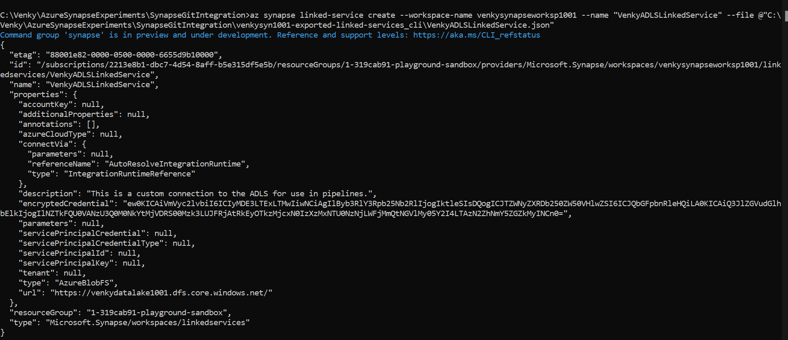

* Next we have to import the integration dataset.
<code>
az synapse dataset create --workspace-name venkysynapseworksp1001 --name "TemperaturesParquetDS" --file @"C:\Venky\AzureSynapseExperiments\SynapseGitIntegration\venkysyn1001-exported-datasets_cli\TemperaturesParquetDS.json"

az synapse dataset create --workspace-name venkysynapseworksp1001 --name "TemperaturesJSONDS" --file @"C:\Venky\AzureSynapseExperiments\SynapseGitIntegration\venkysyn1001-exported-datasets_cli\TemperaturesJSONDS.json"
</code>

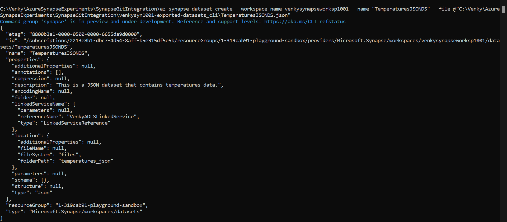

* Next we have to import the pipeline itself. 
<code>
az synapse pipeline create --workspace-name venkysynapseworksp1001 --name "TemperaturesParquetToJSON" --file @"C:\Venky\AzureSynapseExperiments\SynapseGitIntegration\venkysyn1001-exported-pipeline_cli\TemperaturesParquetToJSON.json"
</code>

* LOOKS LIKE THERE IS A BUG AZ CLI. The json that gets created in the process of exporting does not have this key called properties and the import fails. 

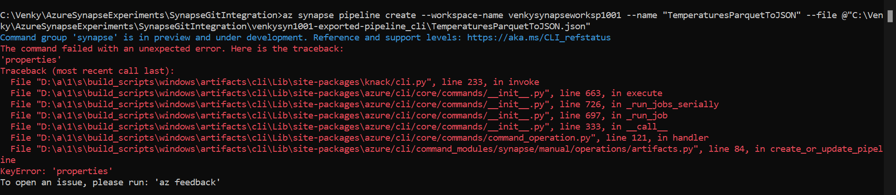

* If we add a section in the JSON manually and try to import, it works. There are some required fields inside this property section that need to be there to import. 

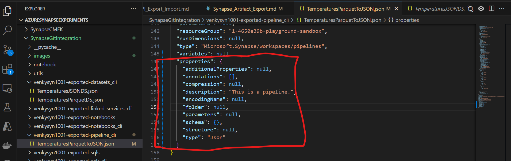

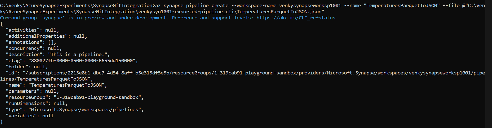

* As we can see, the datasets and linked service have been imported correctly, but since the encryption keys are not valid the connection to the ADLS account fails. We need to find a way to allow us to get this key from the JSON, and replace it with an encrypted version of the ADLS access key for the new Synapse workspace. 

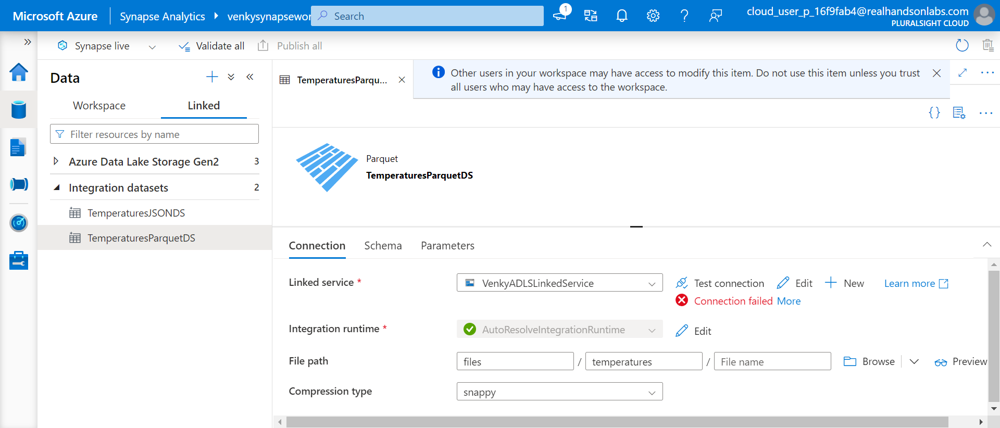

* We will click on the edit button to edit the linked service. As we can see the storage account key that was imported is invalid and we need to correct it by picking it from the current subscription as opposed to enter manually. 

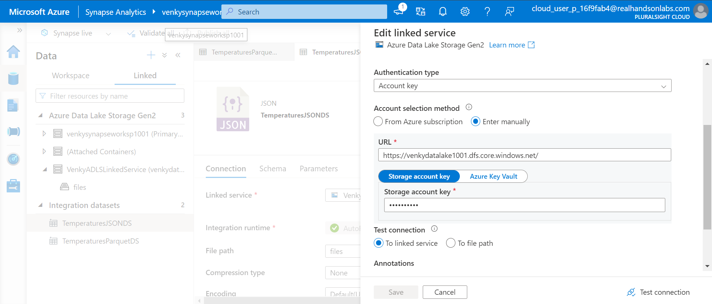

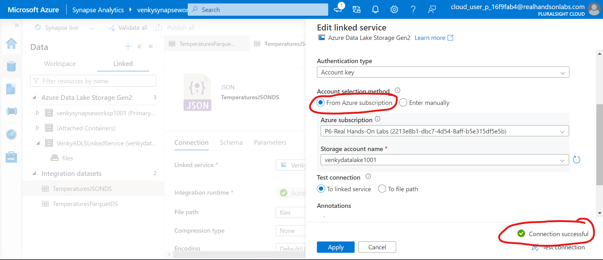

* Note that when we created this new ADLS account and the Synapse workspace, the folders referenced inside these datasets do not exist. We need to create these manually and put the source files in the right place for going ahead. Note the folder for the output temperatures_json, and the folder for the input temperatures. 

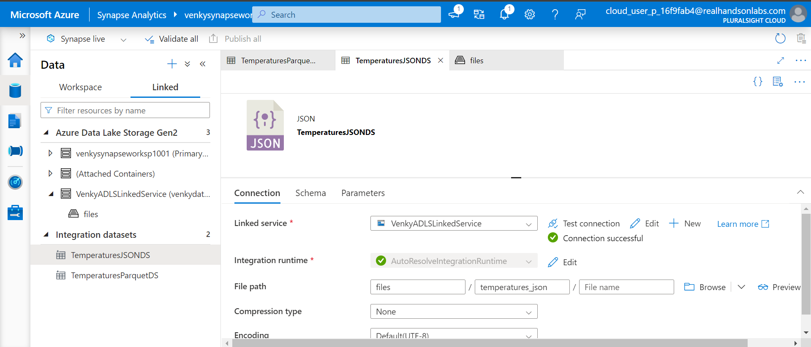

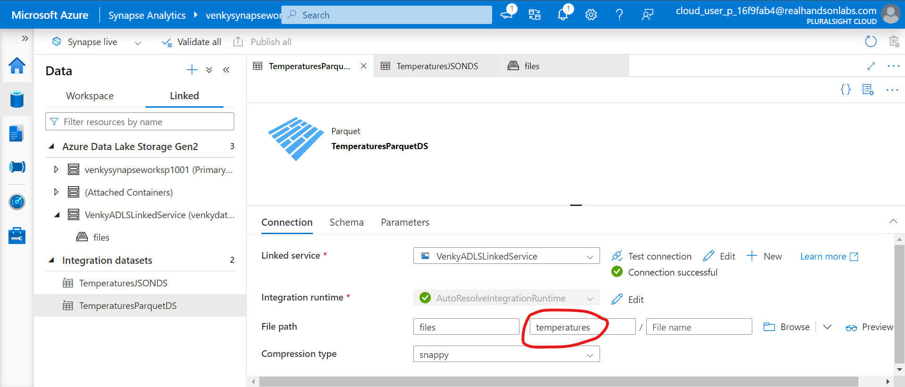

* Creating the folders and placing the files now.

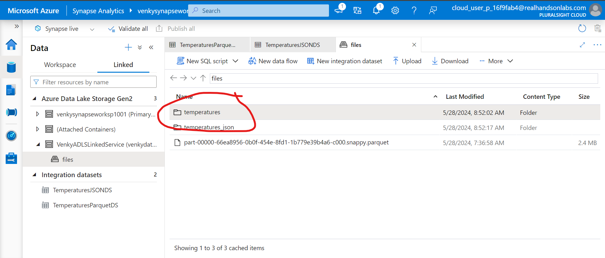

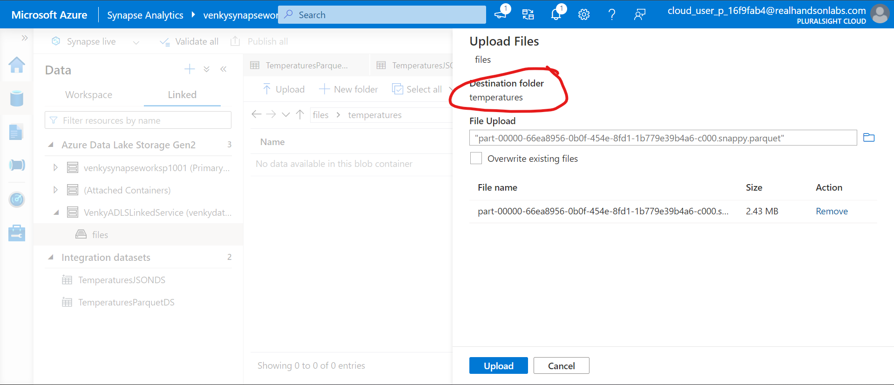

* Now we will open the pipeline to see what happens. Oops, it does not understand the JSON we snt it before!

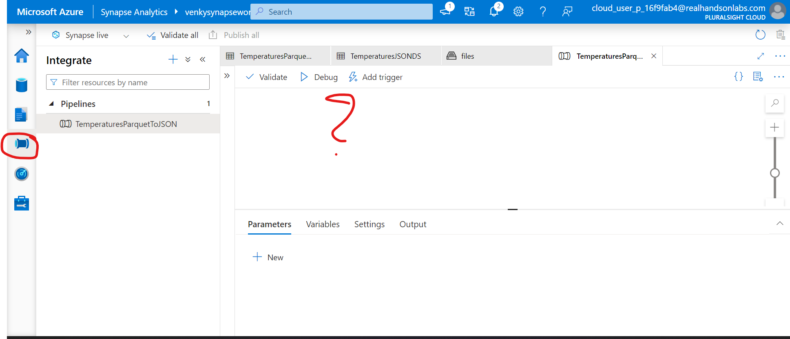

* Let us see what edits we need to do to the JSON to make it work and issue the update command later to fix it. I have created the pipeline manually to see what the final JSON would look like.

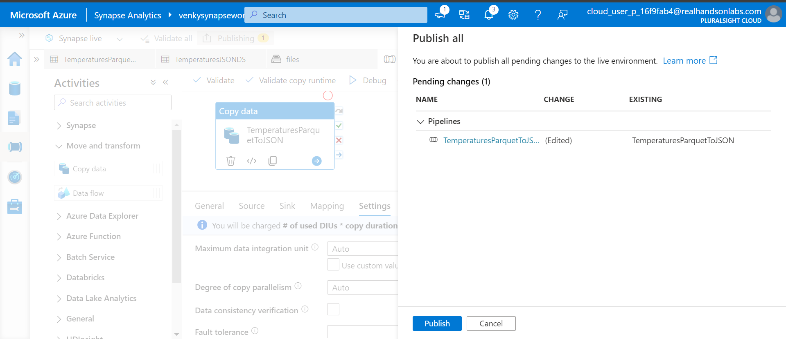

* Notice how the JSON got created! It looks like the export process forgot to add the properties block to encompass the entire JSON! That is the reason it does not understand the formats. Let us try to update the source JSON we had exported before and try to update this pipeline after we make the changes. I moved the entire last section to the top and added the properties tag to encompass the entire activities section. 

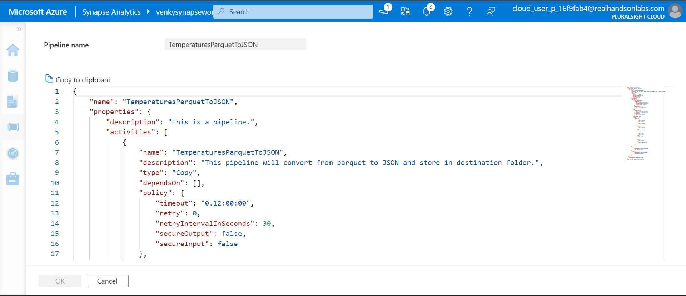

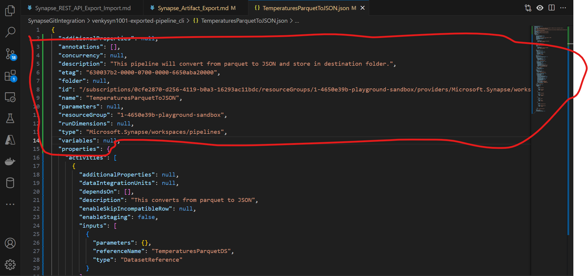

* After we edit this JSON and redo the create command, it imports and posts a bigger JSON showing the activities etc. 

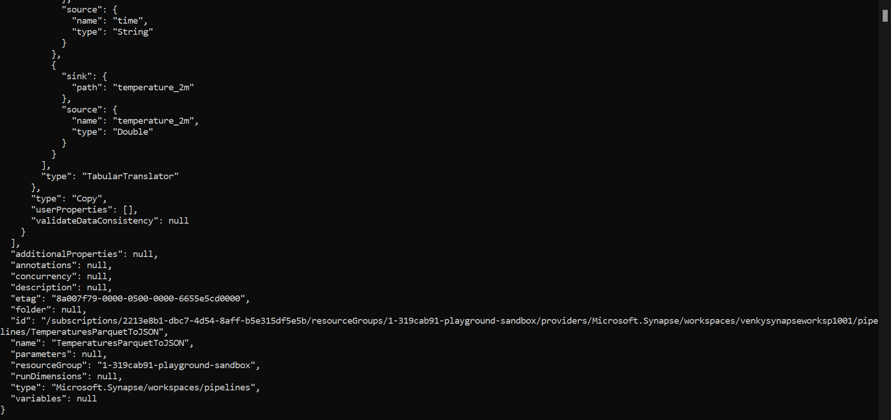

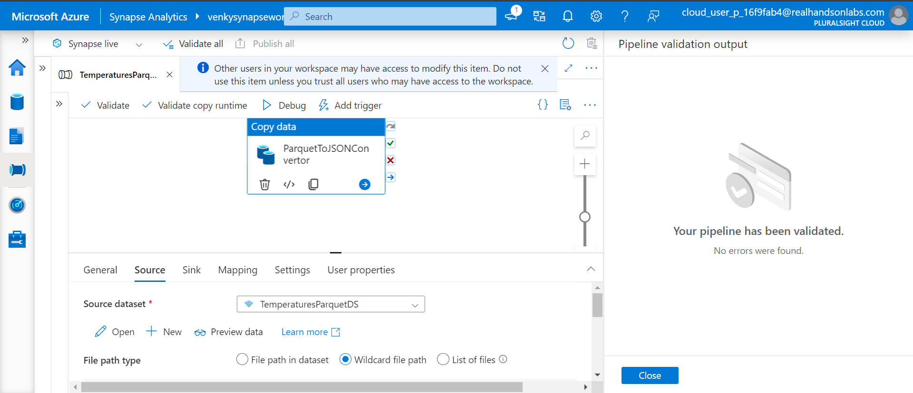

* Now the moment of truth, does it really work with all those subscriptions and resource groups hard-coded inside the JSON. 

* Oh No!!!

* Looks like the exported JSON has problems, let is try making it 0

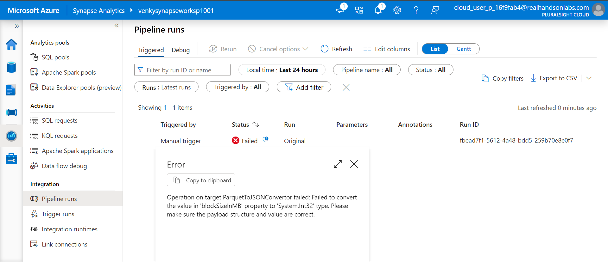

* Looks like we can't issue the create CLI again. We need to push this as an update. 

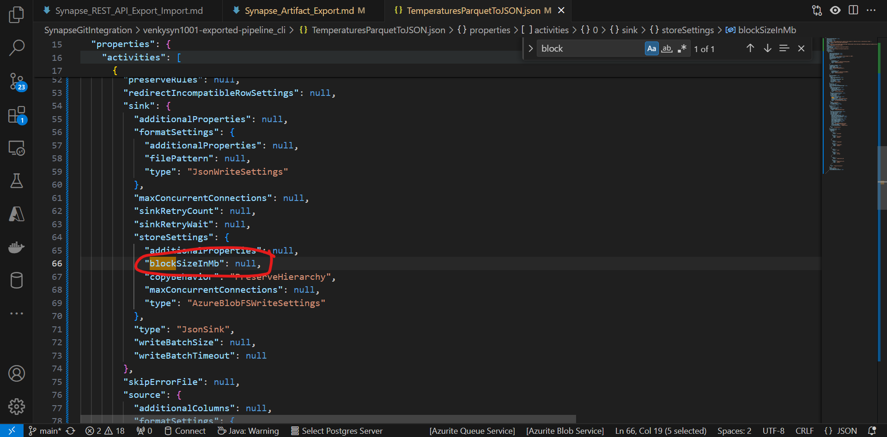

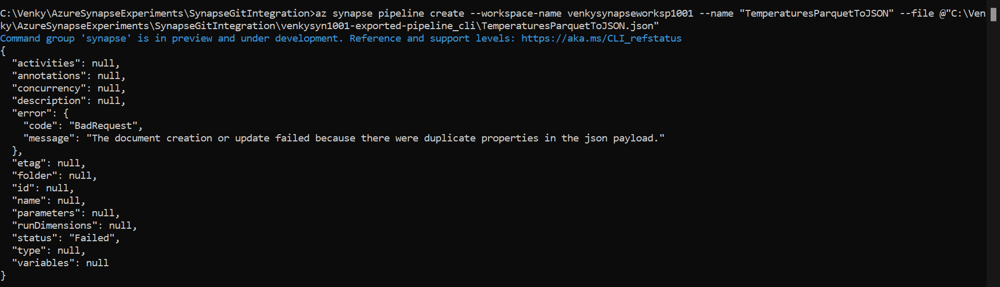

<code>
az synapse pipeline update --workspace-name venkysynapseworksp1001 --name "TemperaturesParquetToJSON" --file @"C:\Venky\AzureSynapseExperiments\SynapseGitIntegration\venkysyn1001-exported-pipeline_cli\TemperaturesParquetToJSON.json"
</code>

* For some reason when we change the null to a number it fails with the duplicate properties error. When we do the same updates on the web interface it seems to work just fine. Very weird indeed.

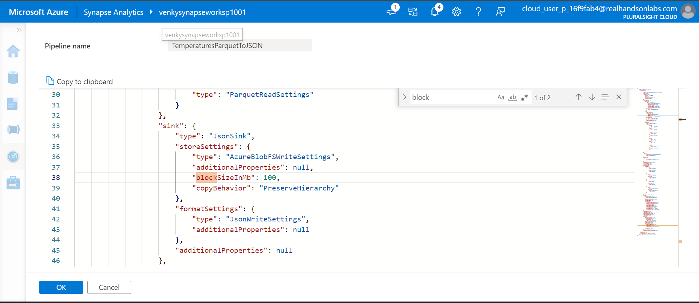

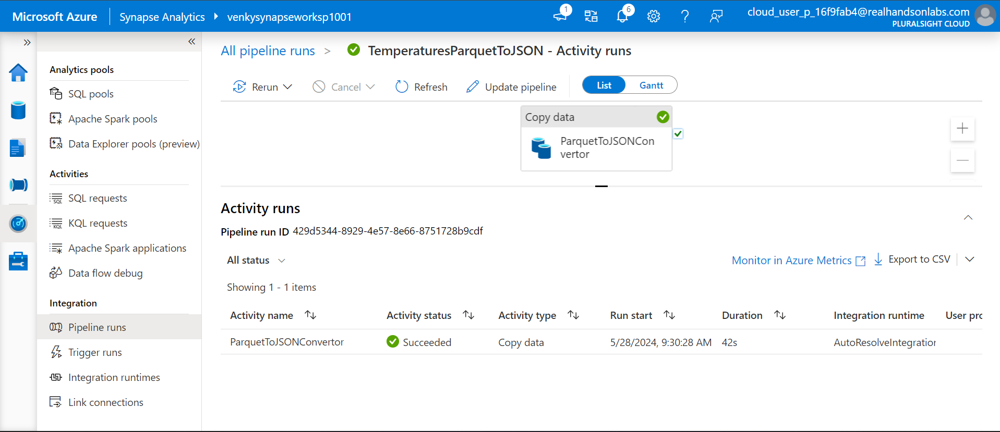

* Let us try to delete and recreate instead.

<code>
az synapse pipeline delete --workspace-name venkysynapseworksp1001 --name "TemperaturesParquetToJSON" 

az synapse pipeline create --workspace-name venkysynapseworksp1001 --name "TemperaturesParquetToJSON" --file @"C:\Venky\AzureSynapseExperiments\SynapseGitIntegration\venkysyn1001-exported-pipeline_cli\TemperaturesParquetToJSON.json"
</code>

* Even this fails with an error. Looks like we can't change the blockSizeInMb parameter to anything other than null. Once we push the JSON, we need to edit that inside the UI and publish it to make it understand the change and it works after that. Need to raise this bug to MSFT for resolution. The good news however is that these commands ignore the subscription and other hardcodes inside the JSON and use the target workspace values after the import!!! That is great.

* If we want to do the same thing with Azure Powershell instead please refer to <a href="./AZ_Powershell.md">here</a>