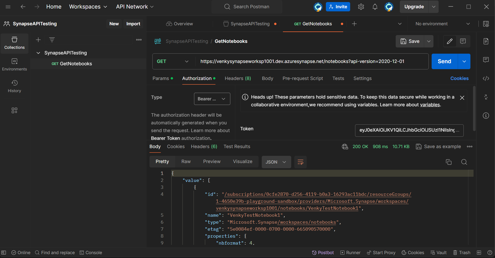
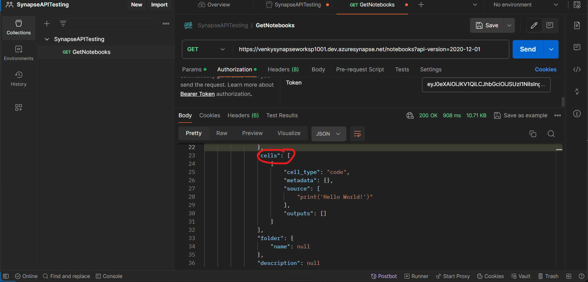
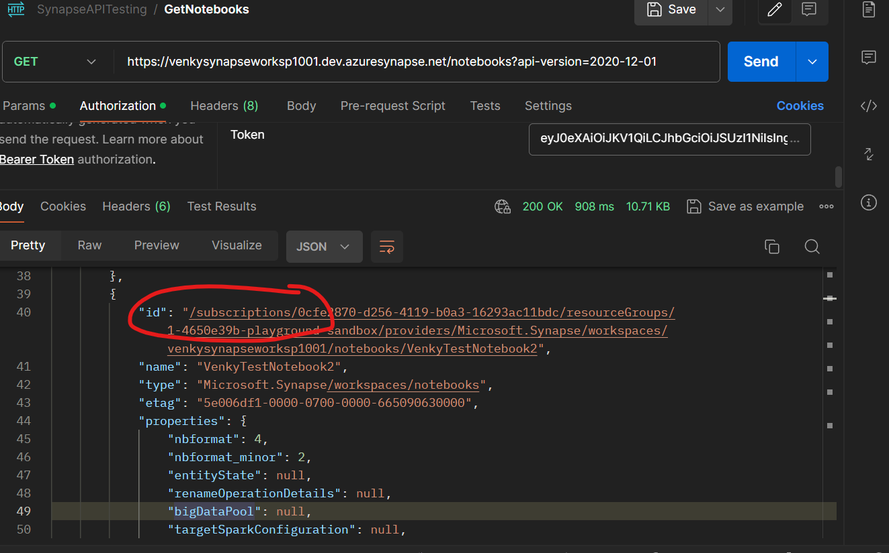

## REST API based Export/Import testing

* If we want to use a programming language like python to export and import the various artifacts from Synapse, it is possible for us to get a bearer token for the synapse scope and do the REST API based testing. 

* First we need to open a command prompt and login to Azure CLI 
<code>
az login
</code>

* After we login, we need to get a bearer token that we can use in the headers to make the required API calls to Synapse via the REST endpoint. 

<code>
az account get-access-token --resource=https://dev.azuresynapse.net/ --query accessToken --output tsv
</code>

* Note that the resource URL provided for access is the synapse endpoint. It is NOT THE ENDPOINT THAT WE USE for our synapse workspace. It is an endpoint from the access management perspective. 

* Once we get the bearer token we can actually call the REST API via Postman as seen below. 

* The notebooks are exported as JSON and these have each cell listed out as array of strings inside the JSON as can be seen.

* The subscriptions and resource groups are hardcoded inside the ID as can be seen. 

