## Testing Synapse development via a remote IDE

* Synapse comes with its own full fledged IDE and we can develop the SQL scripts and notebooks directly inside the Synapse IDE that is web based. However there are scenarios where we want to do most of the development in a familiar IDE like VSCODE and test things locally before we can do our final testing inside Synapse. This has the advantage that we can save some money and not have to spawn a large spark pool inside Synapse to cater to the needs of a lot of developers in parallel. As advertised by MSFT, the Synapse Spark pool is not really conducive for usage by many developers in parallel unless we spawn a massive cluster. 

* To test things out locally, we need to first install SPARK from the website. Tutorials are present that walk us through the process of installing SPARK on both windows and Ubuntu and we can follow those to get the java, spark etc. installed. We can run the spark pi starter sampleto test and make sure the local install of spark is working fine. 

* Then we can install VSCODE and the python / Jyupiter plugins to test local development of spark notebooks, and then try to connect them to the remote spark cluster for final testing. We might have to build the notebooks in such a way that when we do local testing, we reference the input and output datasets as local folders and then replace them when we test against spark which reads and writes to ADLS.

* Please take a look at <a href="./VenkyRemoteNotebook1.ipynb">this</a> notebook to get started with local spark development. 

* Once we are done with the testing of the notebook locally, we can create a Synapse workspace with a spark pool and then import the notebook into the workspace by using the following set of commands. 

<code>
az login

## This is a notebook we have created locally outside of Synapse and trying to import that 

az synapse notebook import --file @"C:\Venky\AzureSynapseExperiments\SynapseRemoteTesting\VenkyRemoteNotebook1.ipynb" --name VenkyRemoteNotebook1 --workspace-name venkysynapseworksp1001

</code>

* Once the command finishes, we can see that the notebook has been imported into the Synapse workspace. Now we need to target this notebook to use the spark pool inside the Synapse workspace as opposed to using the local spark install we did when we tested with local development. 

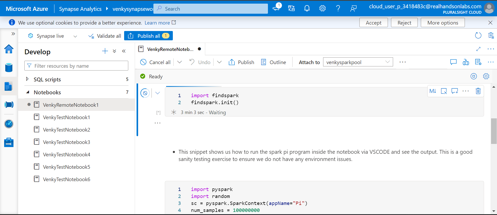

* Running the first 2 cells where we do a pip install needs to have an (!) in the beginning. As we can see the findspark got installed and the pyspark dependency is already given to us via the Synapse workspace spark configurations. 

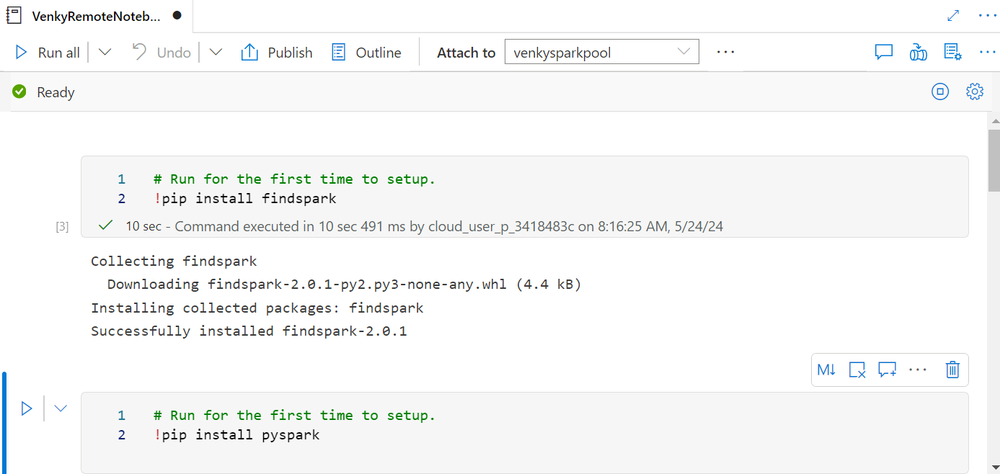

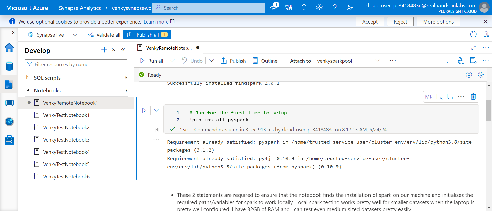

* After the pip commands are done, we can see that the findspark() works fine although it is not really needed since Synapse configures all this for us in the background. 

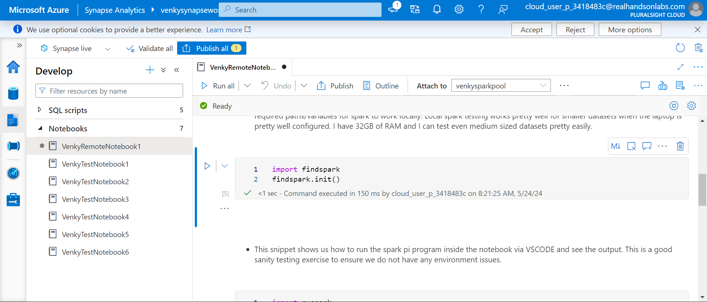

* Note that when we run the notebook inside Synapse IDE, we can't create a separate spark context. It already gives us a variable sc when it configures the notebook for us. If we try to create this sc variable, we will get a security violation error. It is best to comment out that line when running inside Synapse, and not have it commented when testing locally. As we can see the test spark pi runs perfectly fine.

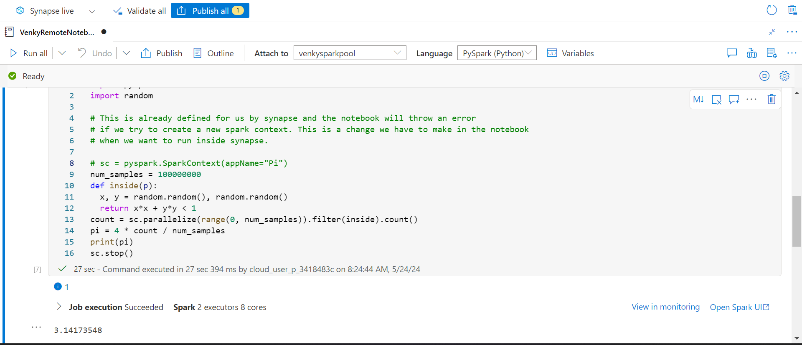

* Now we can see that the local paths we had on our machine will not work. The files will now be sourced from ADLS and we need to change the path to the correct file system and path. Once we do this minimal change, we can test it out inside Synapse.

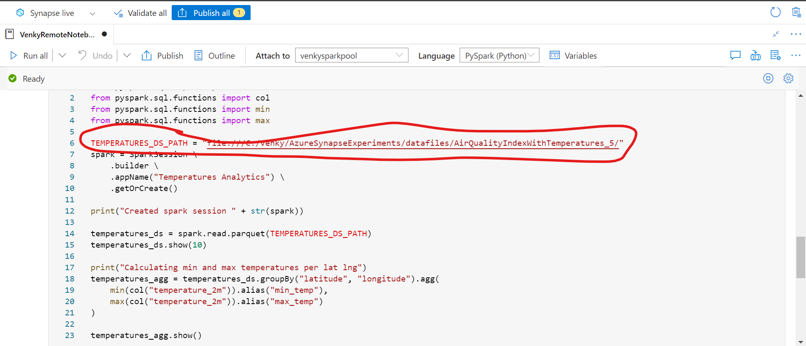

* We now can upload the same test file we used in local testing to the ADLS container. We have a files container that is present in the ADLS storage account. 

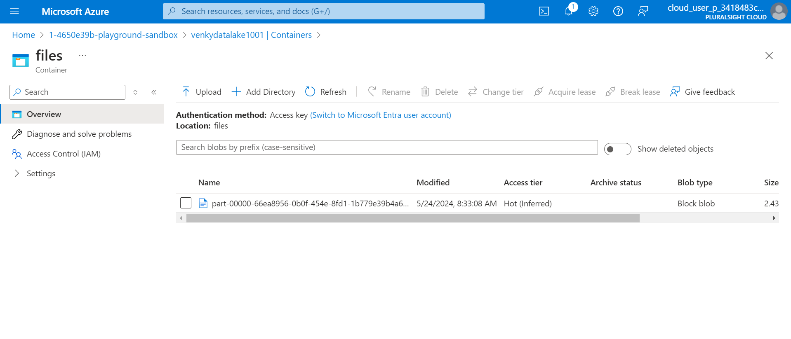

* When we try to run this however, we will run into a problem. Synapse does not like it when we try to mess with the spark context in any way since it is shared across sessions it looks like. This is the error we get. 

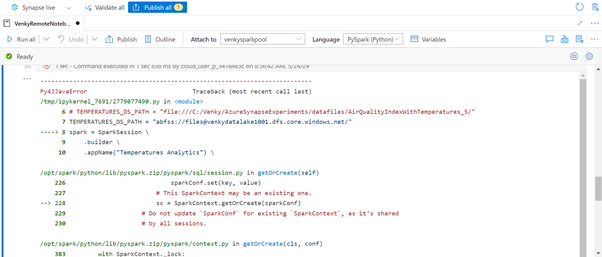

* The best approach is to therefore comment out the spark session creating also since it is given to us by Synapse. 

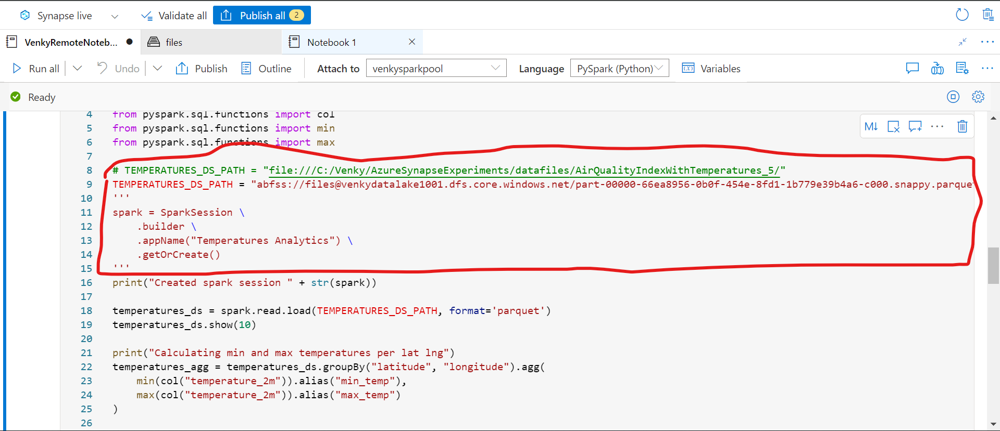

* After we fix the path and comment out the spark session create we will be able to run this cell and we get the expected outputs as shown.

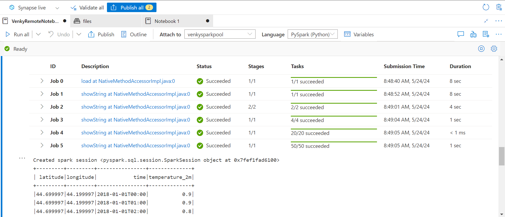

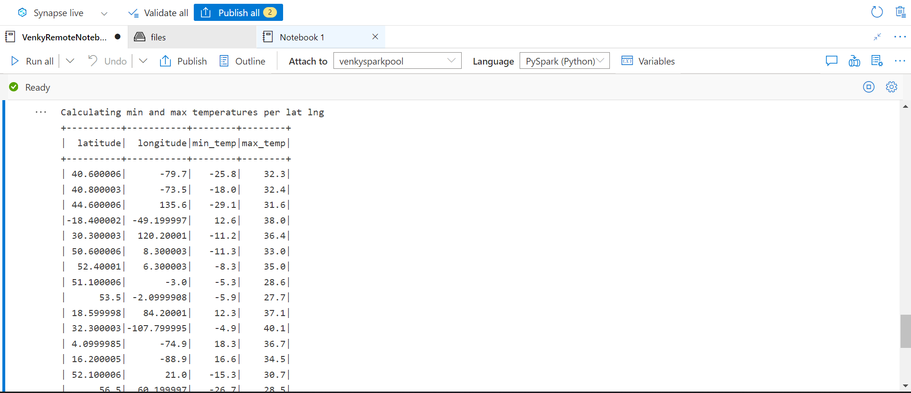

* Now we can add more files to create a bigger volume and try to run the cell again. 

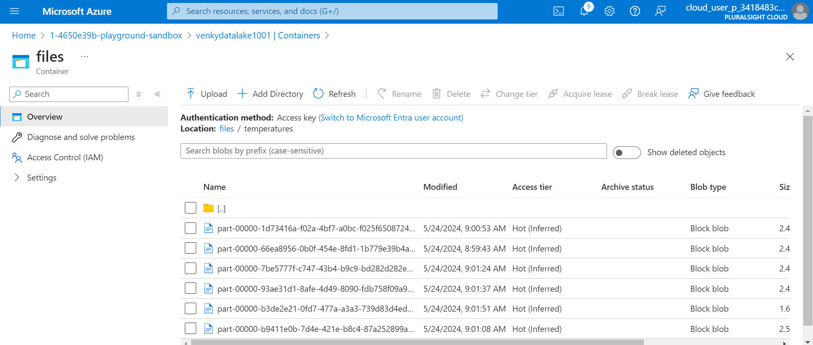

* Here is the final code and the run output. 

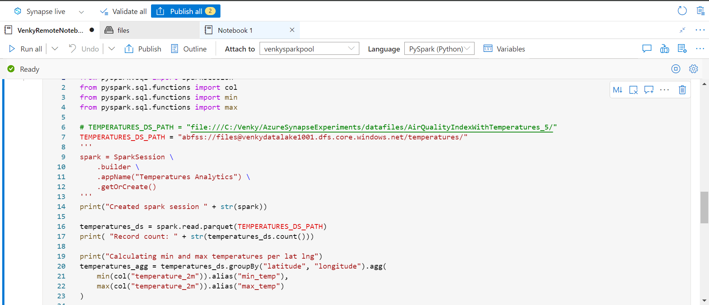

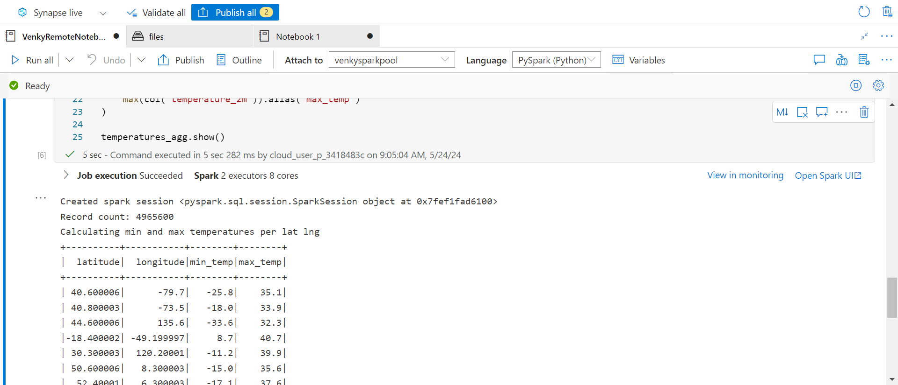

