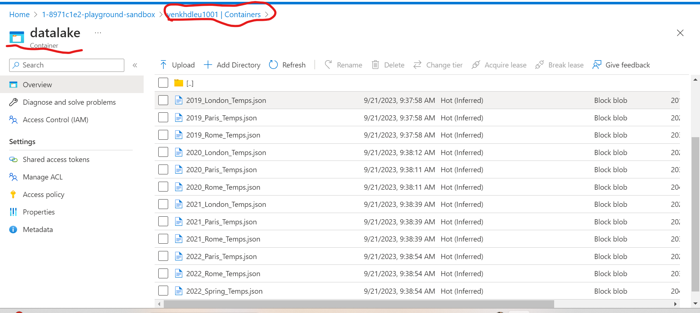
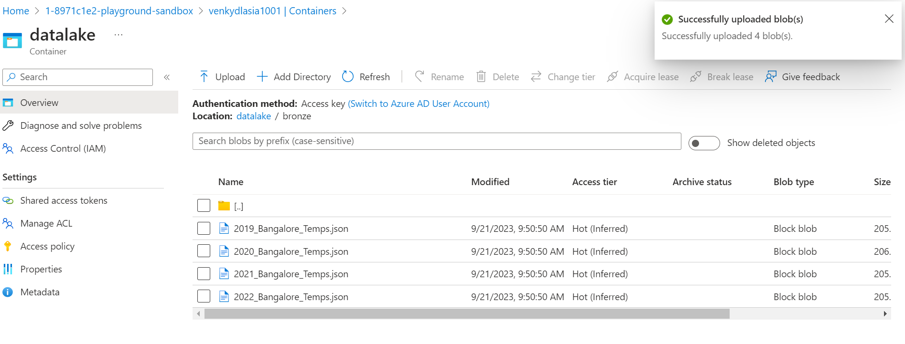
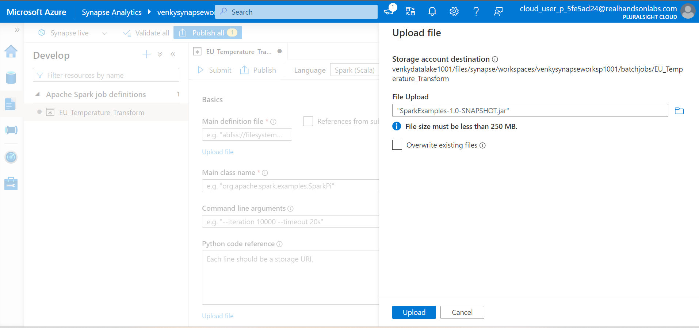
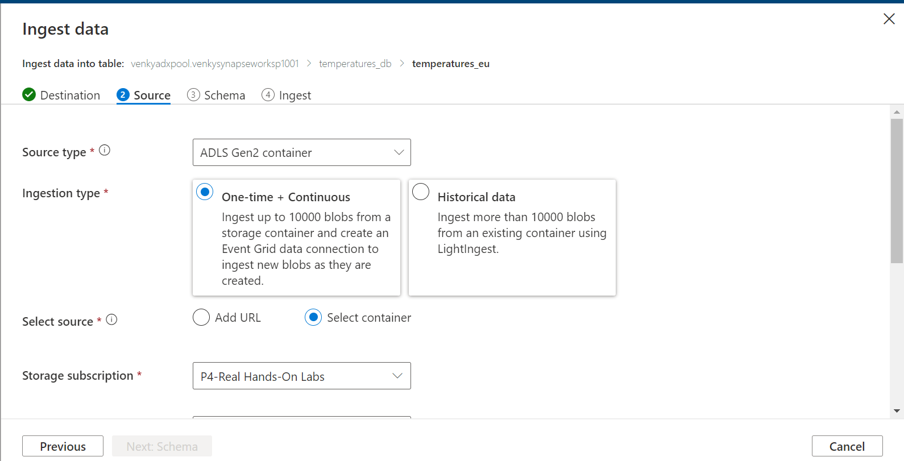
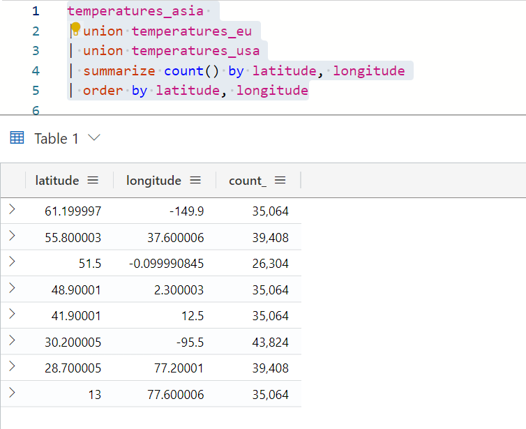

## ADLS continuous ingest into ADX demonstration

* Now we will create the Synapse workspace with all the required elements via the ARM template. Execute 1005-Create-Synapse-workspace.ps1. After this runs, it will create an ADX pool that we can use to analyze data present in our data lake via a continous ingest.

* Note that this will leverage on the files that were generated and reformatted from the previous sessions. We will also download new files for other locations and date ranges, process them and put that into the spot where ADX expects to see the files. Once this happens, the ADX system automatically ingests these newly added files into its database and it is available for analytics. Let us see how much the latency plays in once the files are dropped, and the queries reflect the aggregations based on the newly added data. 

* Once the synapse workspace is spawned and ready to go, let us go to the ADLS linked to the workspace and put in some new directories, and files that we have downloaded from the weather API service. This will be the first set of files we load. 

* We have weather data for the following cities (Spring, Anchorage, Delhi, London, Paris, Rome) from 2019 to 2023. It is daily hour by hour data. We can pretend that we have multiple orgs and each of these have a data lake stored in a separate storage account because of data localization requirements. Let us add these 3 storage accounts and link them to Synapse ( venkydlusa1001, venkydleu1001, venkydlasia1001). I am keeping all these in East US, but in theory they can be in multiple regions. 

* We will now pretend these are data lakes and create folders to store data. Each storage account has one container called datalake and has 3 folders under it bronze, silver, and gold as shown below. Showing it for just one storage account, but it is created for all the 3 data lake accounts. 

* Upload the relevant files that were downloaded from the API service to the correct folders. Like for instance London, Paris and Rome go into the EU data lake etc.

* Next we need to prep the spark pool. For this we will open a notebook, print(spark) and execute it to warm the spark pool. Else, Livy will throw errors.It takes a while for the spark pool to start, but it will show a green circle once it starts. Next we need to stop the session to do other jobs since we have a small pool. 

* Upload the jar file we have generated on the SparkExamples folder after running mvn clean package. We are trying to create a new spark definition from scratch here, but the entire definition can be imported from the JSON files provided. 

* We need to add these parameters to the job definition on the screen. Here are the parameters. 
<pre>
Class
com.gssystems.spark.TemperaturesReformatter

Parameters
abfss://datalake@venkhdleu1001.dfs.core.windows.net/bronze/ abfss://datalake@venkhdleu1001.dfs.core.windows.net/silver/temperatures_formatted abfss://datalake@venkhdleu1001.dfs.core.windows.net/silver/location_master 
</pre>

* Hit the publish and let the spark job definition save. Then we can submit the job and switch to monitoring. 

* After the jobs is finished, we can see the files created in ADLS as expected. 

* Run the job two times more to get the usa and asia datalakes also populated.

* Create the required database.

* Ingest the data.

* Follow screens

* Sanity check queries to see what is ingested 

* One of the COOLEST FEATURES in ADX is that it can ingest the data from all these 3 data lakes and query them with a union operator! 

<pre>
# Example of how we can union the data from all the 3 data lakes and query! 

temperatures_asia 
| union temperatures_eu
| union temperatures_usa
| count 

</pre>

* Let us now download the moscow and delhi temperatures down, transform it, and put that in the same folder as what we have and see if ADX can auto ingest it via the trigger to the event grid.

<pre>
set JAVA_HOME=c:\Venky\jdk-11.0.15.10-hotspot
set PATH=%PATH%;c:\Venky\spark\bin;c:\Venky\apache-maven-3.8.4\bin
set SPARK_HOME=c:\Venky\spark
SET HADOOP_HOME=C:\Venky\DP-203\AzureSynapseExperiments\SparkExamples

cd C:\Venky\DP-203\AzureSynapseExperiments\SparkExamples
mvn clean package

# Delhi 
mvn exec:java -Dexec.mainClass="com.gssystems.spark.DownloadWeatherDataHistorical" -Dexec.args="28.679079 77.216721 2019-01-01 2019-12-31 2019_Delhi_Temps.json"

mvn exec:java -Dexec.mainClass="com.gssystems.spark.DownloadWeatherDataHistorical" -Dexec.args="28.679079 77.216721 2020-01-01 2020-12-31 2020_Delhi_Temps.json"

mvn exec:java -Dexec.mainClass="com.gssystems.spark.DownloadWeatherDataHistorical" -Dexec.args="28.679079 77.216721 2021-01-01 2021-12-31 2021_Delhi_Temps.json"

mvn exec:java -Dexec.mainClass="com.gssystems.spark.DownloadWeatherDataHistorical" -Dexec.args="28.679079 77.216721 2022-01-01 2022-12-31 2022_Delhi_Temps.json"

mvn exec:java -Dexec.mainClass="com.gssystems.spark.DownloadWeatherDataHistorical" -Dexec.args="28.679079 77.216721 2023-01-01 2023-06-30 2023_Delhi_Temps.json"

#Moscow
mvn exec:java -Dexec.mainClass="com.gssystems.spark.DownloadWeatherDataHistorical" -Dexec.args="55.751244 37.618423 2019-01-01 2019-12-31 2019_Moscow_Temps.json"

mvn exec:java -Dexec.mainClass="com.gssystems.spark.DownloadWeatherDataHistorical" -Dexec.args="55.751244 37.618423 2020-01-01 2020-12-31 2020_Moscow_Temps.json"

mvn exec:java -Dexec.mainClass="com.gssystems.spark.DownloadWeatherDataHistorical" -Dexec.args="55.751244 37.618423 2021-01-01 2021-12-31 2021_Moscow_Temps.json"

mvn exec:java -Dexec.mainClass="com.gssystems.spark.DownloadWeatherDataHistorical" -Dexec.args="55.751244 37.618423 2022-01-01 2022-12-31 2022_Moscow_Temps.json"

mvn exec:java -Dexec.mainClass="com.gssystems.spark.DownloadWeatherDataHistorical" -Dexec.args="55.751244 37.618423 2023-01-01 2023-06-30 2023_Moscow_Temps.json"

spark-submit --master local[4] --class com.gssystems.spark.TemperaturesReformatter target\SparkExamples-1.0-SNAPSHOT.jar file:///C:/Venky/DP-203/AzureSynapseExperiments/datafiles/asia_temps/ file:///C:/Venky/DP-203/AzureSynapseExperiments/datafiles/asia_temps_formatted/ file:///C:/Venky/DP-203/AzureSynapseExperiments/datafiles/asia_location_master/

</pre>

* After this job stream has run, we will have a parquet file transformed to have the same schema as the other files. We can try to drop this at the same location and see whether ADX picks it up...

* As we see the data for the new file is loaded into ADLS 

* The first time ingest does not setup the required event hubs to detect the creating of new files in ADLS and auto ingest it into the tables. The following steps show that in detail.

* This is the before picture before the automatic ingest happens. We can also see the event grid that is configured got a message when the blob was added manually. 

* There is a event grid topic and event grid provisioned to detect files being placed, and ingestion starts.

* After the data is ingested, the count changes and includes the data from the new file we put in.

* Breaking down by lat/long we can see that the data for Moscow and Delhi are added to the data from Bangalore! 

* Here is the summary from all the 3 lakes after data is ingested and processed in ADX. Imagine having event triggers for datasets landing on these containers and allowing this automated ingest. Very cool feature.

