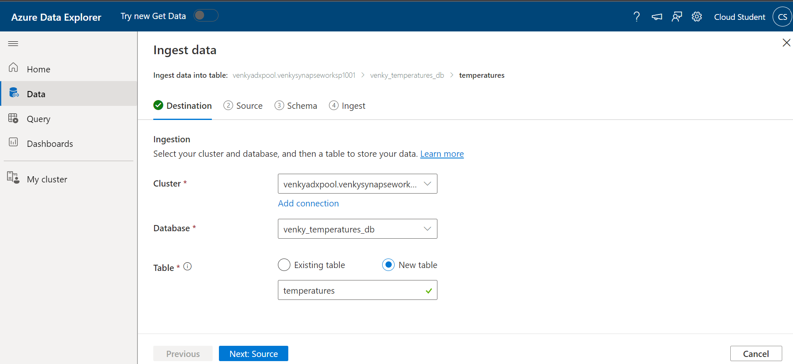
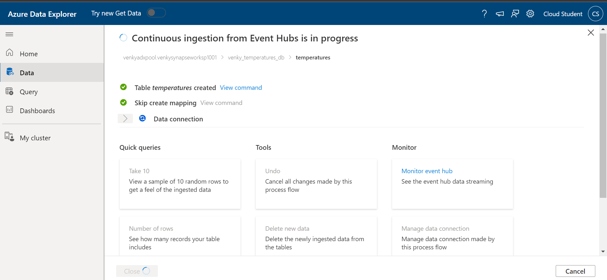

## Azure Data Explorer and Azure Event Hub Integration

* This experiment will setup an Azure Event Hub, and a Synapse Analytics workspace with the Azure Data Explorer pool provisioned. We will connect the Azure data explorer (ADX) pool to ingest data from the azure event hub and once we start the streaming producer to push events to the Azure Data Explorer, we can analyze the data using the KQL (Kusto Query Language)
* Once we provision the Azure event hub, we can run the Synapse provisioning ARM template 1005-Create-Synapse-workspace.ps1 and it will provision the required ADX pool as shown below.

* The first step in using the ADX pool is to provision a database. There is a guided step-by-step wizard that helps us with each step. 

* Creating the database inside the ADX pool. I reduced the retention policy to about 7 days instead of the high default retention period. 

* Once the database is created, we can ingest data into the pool from various sources and analyze the data via KQL. We can hit continue here and connect the ADX pool to the Azure Event Hub. 

* Once we setup the ingest data wizard, we can fill in the required source type, and select the required event hub namespace, event hub topic and also the consumer group to use to consume data. Remember that if we have a BASIC Azure event hub, there is only one $Default consumer group, and if many consumers try to pull using the same group, we get messed up offsets, and subsequently errors. So, it is better to get setup with standard SKU and create the required consumer groups. 

* Once we move to the next step, we can see that it is trying to infer the schema of the records that are going to come on this topic. As we can see it is waiting since we never streamed any data to this topic. After a few seconds, it aborts the poll and gives a button to retry. We need to start the streaming producer as we did before and that will start pushing events to the topic after reading from a reformatted JSON file we have created. 

* Once the data gets streaming in, the ADX can scan the event hub to get a few sample records and infer the schema. It is the same temperature JSON we used before. 

* Once we hit next, it waits to create the connection and shows that the ingest is in progress. I had mixed results here. It took a long time for me and that spinning circle stayed, but once I re-tried it, the red error we see on the previous screen is gone, and it says the conenction is established. I did see some lag in the data coming from the event hub into the database/table we have created to ingest the data. The second time I started to stream the same data to create some duplicate events, the data was indeed refreshing in the ADX table, and the counts of records kept increasing. The screen shows the producer and the ingest together. 

* Now we can run a bunch of KQL queries and do some experiments on the records that were ingested into the ADX pool. 

* Now we can see that a lot of events were ingested into the ADX pool. There was definitely some lag in the data coming into ADX. So it is by no means a near real time analytical system, but not too bad either. 

* We can even generate graphs directly from within the UI and see how it looks. 

* We can pin these directly into the dashboard and use it to share to others. 

