## Data streaming with Azure Event Hubs. 

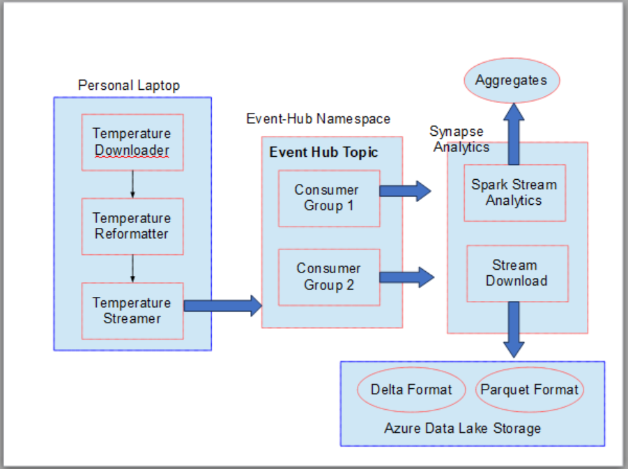

* This series of experiments deal with creating an Azure event hub in Azure and integrating with it from both a consumer and producer perspective. Azure Event Hubs give us seamless integrations from other services that can be leveraged to do various types of streaming and batch based analytics

* First we create the required event hub 
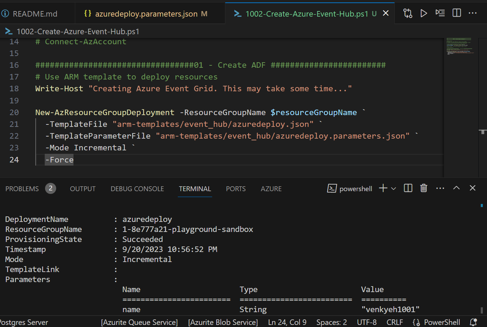

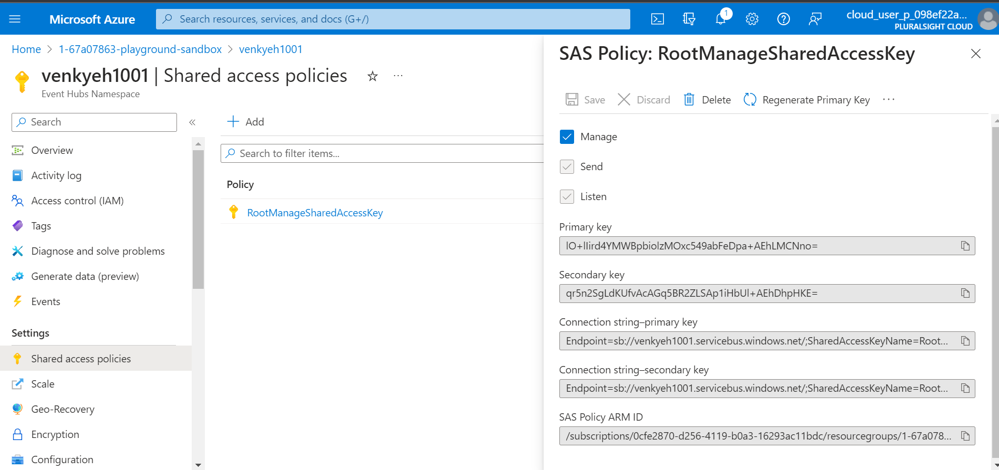

* The we setup our developer env and try to produce the same temperature JSON data to the Azure Event Hub. We did the same thing previously with KAFKA running locally as well as inside the Azure VM. 

<pre>
set JAVA_HOME=c:\Venky\jdk-11.0.15.10-hotspot
set PATH=%PATH%;c:\Venky\spark\bin;c:\Venky\apache-maven-3.8.6\bin
set SPARK_HOME=c:\Venky\spark
SET HADOOP_HOME=C:\Venky\AzureSynapseExperiments\SparkExamples

cd C:\Venky\AzureSynapseExperiments\SparkExamples
mvn clean package

## Producer to send messages 

mvn exec:java -Dexec.mainClass="com.gssystems.azeventhub.TemperaturesProducer" -Dexec.args="C:\Venky\DP-203\AzureSynapseExperiments\datafiles\streaming\output\part-00000-2fa6257f-a51c-41e6-9572-630bf2a22bfd-c000.json C:\Venky\DP-203\AzureSynapseExperiments\datafiles\streaming\location_master\part-00000-9ce98557-48be-4823-bfb3-a0764b296729-c000.json"

## Consumer to download in json format.
spark-submit --packages com.microsoft.azure:azure-eventhubs-spark_2.12:2.3.22 --conf spark.sql.streaming.checkpointLocation=file:///C:\Venky\spark_checkpoints\ --master local[4] --class com.gssystems.azeventhub.AEHStreamToJSONDownloader target/SparkExamples-1.0-SNAPSHOT.jar file:///C:/Venky/DP-203/AzureSynapseExperiments/datafiles/aeh_temps_json

## Streaming analytics 
spark-submit --packages com.microsoft.azure:azure-eventhubs-spark_2.12:2.3.22  --master local[4] --class com.gssystems.azeventhub.WeatherSparkStreaming target/SparkExamples-1.0-SNAPSHOT.jar
</pre>

* The screen below shows the programs running in parallel. The left side of the image shows the streaming producer reading the data that is reformatted and pushes to the Azure Event Hub. The right side of the screen shows a spark streaming consumer aggregates on the stream and prints out the summaries.

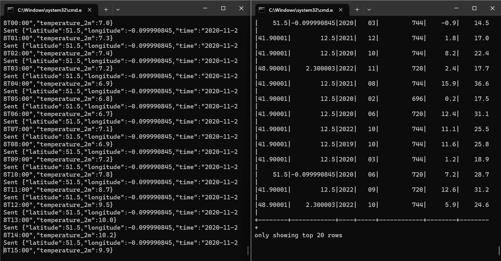

* This screen shows the monitoring going on the Azure portal. The data is coming in and out The producer is pushing JSON, and there are multiple consumers running and consuming the data. The problem I ran into was that when I used multiple consumers from the same consumer group, I get some weird offset errors. That is the reason we have to use the STANDARD SKU, and we need to create multiple consumer groups one for the streaming analytics consumer and the downloading consumer. 

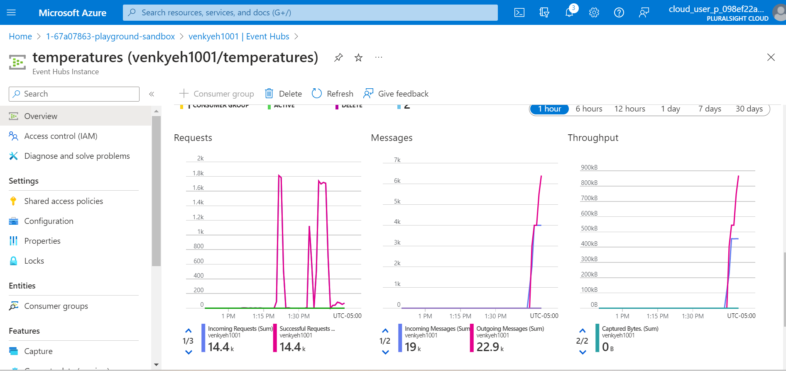

* The following screen shows that the + Consumer group will enable as soon as we create the event hub namespace in the standard SKU. The required consumer groups should match the consumer group that we use in the Java code. See the json-dw-cg. That is the name of the consumer group we have to create.

<pre>
        EventHubsConf ehconf = new EventHubsConf(connectionString);
        ehconf.setStartingPosition(EventPosition.fromStartOfStream());
                ehconf.setConsumerGroup("json-dw-cg");
        ehconf.setMaxEventsPerTrigger(10000);
        ehconf.setReceiverTimeout(Duration.ofSeconds(30));
  
		spark.sparkContext().setLogLevel("ERROR");
        Dataset<Row> df = spark
            .readStream()
            .format("eventhubs")
            .options(ehconf.toMap())
            .load();
</pre>

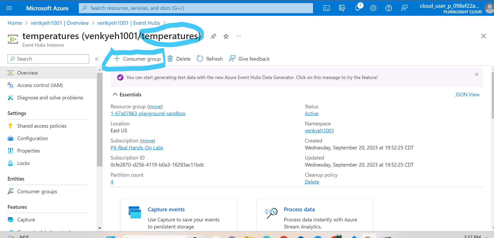

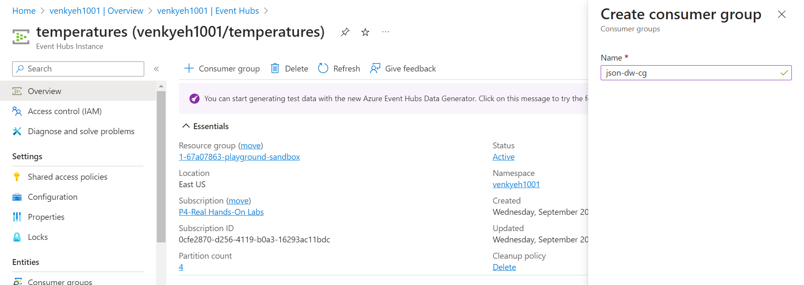

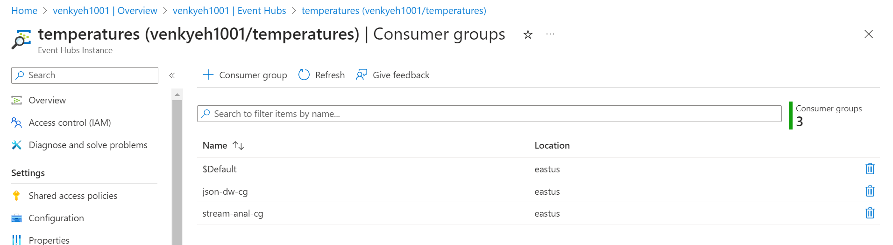

* We need to create a  SAS policy to use at the event hub level. As we can see we are giving read and write power to the consumer. We can further segment this access to exactly what we need. Once we create the SAS policy, we can copy the endpoint in the portal to use in the programs.

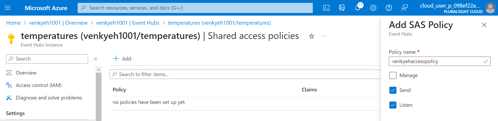

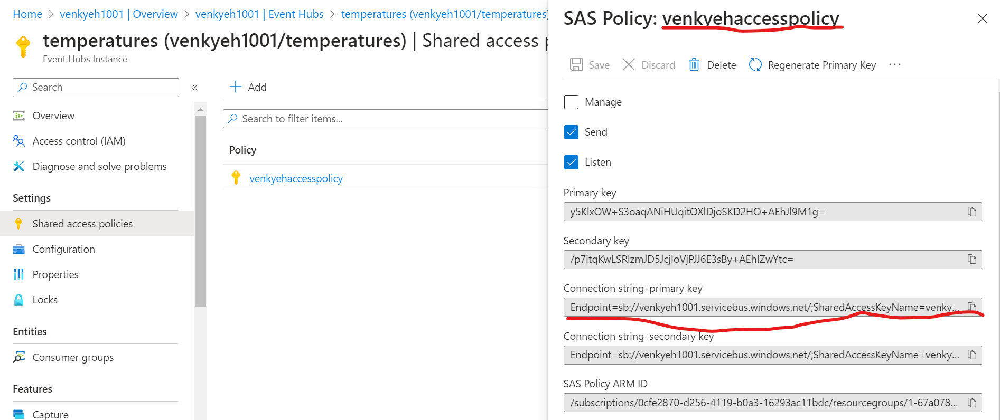

* This screen shows the entire thing in action. The aggregation program that reads the stream and aggregates data is running in the top left. The right side runs the program that reads from the stream and flushes to the disk. I have used JSON to make things easier to debug, but we can switch to a parquet or delta format very similar to what we had done with KAFKA. The right side bottom window shows how the files are getting accumulated based on the flush settings we have in the code.

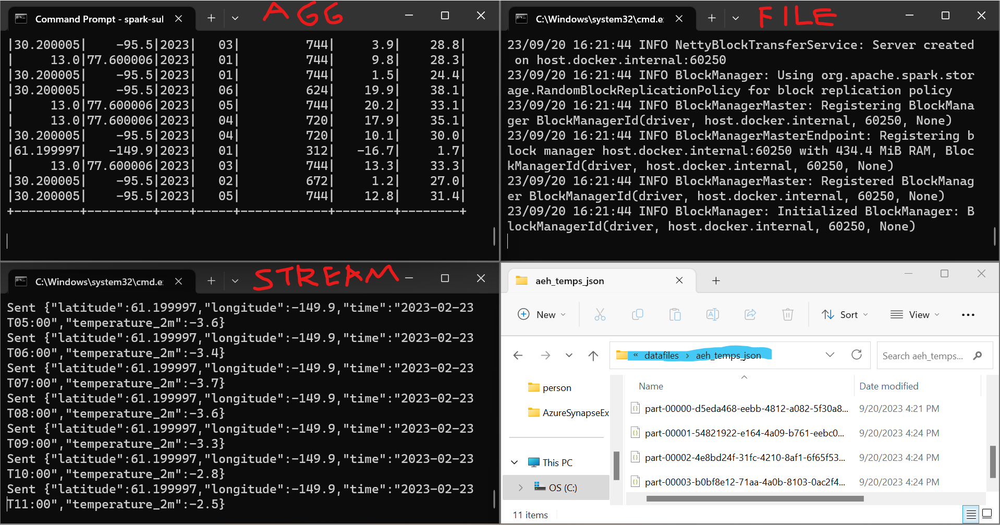

<pre>
        //Flush every 2 mins
        Trigger tr = Trigger.ProcessingTime(120000);
</pre>

* Final image shows the entire dataset downloaded after the producer is done sending the entire 2023 dataset over for all the cities. 

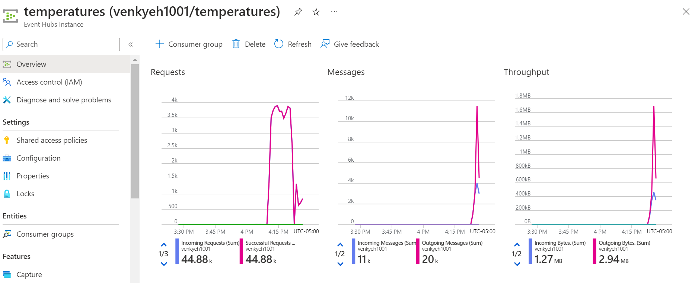