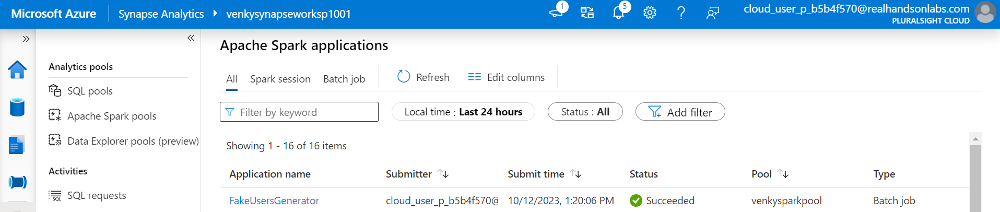

## Dynamic Data Masking inside Azure Synapse Dedicated Pool

* We will now do the same movies ETL we used to do locally on the Azure Synapse Spark pool. We will demonstrate how to submit a job to the spark pool from our local computer and make use of the spark inside Synapse rather than using the local install. 

* We will run the 1005- command like before, and it creates the synapse workspace with the required spark pool, serverless pool and a dedicated pool. The infrastructure provisioned will be as follows.

* Azure spark pool wants the jar to be compiled with JDK 1.8. If we do not use this JDK, we will get an error saying the class version is not supported. 

* Next we go into the ADLS account that is setup with the Synapse workspace, and create the required folders like a typical data lake. 

* Next we can upload the raw files over to the ADLS raw folder. 

* We need to create a notebook and start the print(spark) so that the pool starts up and is ready to accept our jobs that we want to submit remotely.

* Next we can build the code making sure we use the right JDK (1.8) and setting the maven source level to 1.8 and do a mvn clean package to build the jar file needed. After that we can upload that to the right ADLS folder. We have created a new folder called jobjars to put our code. 

* We can submit the following commands one by one and make sure that they run by looking at the monitoring tab under the synapse workspace. 

<pre>
set JAVA_HOME=C:\Venky\jdk-8.0.342.07-hotspot 
set PATH=C:\Venky\jdk-8.0.342.07-hotspot\bin;c:\Venky\spark\bin;c:\Venky\apache-maven-3.8.4\bin;%PATH% 
set SPARK_HOME=c:\Venky\spark 
SET HADOOP_HOME=C:\Venky\DP-203\Azure-DP-203\SparkExamples
cd C:\Venky\DP-203\Azure-DP-203\SparkExamples

# Confirm that we are using the JDK 1.8 not JDK 11

C:\Venky\DP-203\Azure-DP-203\SparkExamples>java -version
openjdk version "1.8.0_342-342"
OpenJDK Runtime Environment (build 1.8.0_342-342-b07)
OpenJDK 64-Bit Server VM (build 25.342-b07, mixed mode)

mvn clean package 

## Movie processing stage 1
Submit-AzSynapseSparkJob -WorkspaceName venkysynapseworksp1001 -SparkPoolName venkysparkpool -Language Spark -Name MovieLensProcessing -MainDefinitionFile abfss://files@venkydatalake1001.dfs.core.windows.net/jobjars/MovieLens-1.0-SNAPSHOT.jar -MainClassName com.gssystems.movies.MovieDataProcessor2 -CommandLineArgument abfss://files@venkydatalake1001.dfs.core.windows.net/bronze/movies_metadata.csv.gz,abfss://files@venkydatalake1001.dfs.core.windows.net/bronze/ratings.csv.gz,abfss://files@venkydatalake1001.dfs.core.windows.net/silver -ExecutorCount 2 -ExecutorSize Small

## Movie processing stage 2 
Submit-AzSynapseSparkJob -WorkspaceName venkysynapseworksp1001 -SparkPoolName venkysparkpool -Language Spark -Name MovieLensProcessing -MainDefinitionFile abfss://files@venkydatalake1001.dfs.core.windows.net/jobjars/MovieLens-1.0-SNAPSHOT.jar -MainClassName com.gssystems.movies.MovieDataProcessor -CommandLineArgument abfss://files@venkydatalake1001.dfs.core.windows.net/bronze/movies_metadata.csv.gz,abfss://files@venkydatalake1001.dfs.core.windows.net/silver -ExecutorCount 2 -ExecutorSize Small

## Credits processing
Submit-AzSynapseSparkJob -WorkspaceName venkysynapseworksp1001 -SparkPoolName venkysparkpool -Language Spark -Name CreditsProcessor -MainDefinitionFile abfss://files@venkydatalake1001.dfs.core.windows.net/jobjars/MovieLens-1.0-SNAPSHOT.jar -MainClassName com.gssystems.movies.CreditsProcessor -CommandLineArgument abfss://files@venkydatalake1001.dfs.core.windows.net/bronze/credits.csv.gz,abfss://files@venkydatalake1001.dfs.core.windows.net/silver -ExecutorCount 2 -ExecutorSize Small

## process keywords

Submit-AzSynapseSparkJob -WorkspaceName venkysynapseworksp1001 -SparkPoolName venkysparkpool -Language Spark -Name KeywordsProcessor -MainDefinitionFile abfss://files@venkydatalake1001.dfs.core.windows.net/jobjars/MovieLens-1.0-SNAPSHOT.jar -MainClassName com.gssystems.movies.KeywordsProcessor -CommandLineArgument abfss://files@venkydatalake1001.dfs.core.windows.net/bronze/keywords.csv.gz,abfss://files@venkydatalake1001.dfs.core.windows.net/silver -ExecutorCount 2 -ExecutorSize Small
</pre>

* Make sure we stop the spark notebook that was running to allow the new job to get into the queue and eventually running. 

* This shows the problem with the higher version of JDK/source setting. It will clearly say that the JDK version numbers do not match as needed. 

* I created a new maven project and set the source level to 1.8 and removed other classes / sql server JDBC driver since they are not compatible with the JDK 1.8 version and created a new jar file MovieLens-1.0-SNAPSHOT.jar. I have deleted the old version of the jar and put this new one in as we can see. The commands also now reference the new jar in place. 

* This shows that the jobs run fine and create the required ETL we have in Spark. Note that there are 17 new folders created one for each DW entity as shown before directly in ADLS. So, there is no need to upload any data - the raw data is uploaded and the ETL is happening on the spark pool itself. We are submitting jobs remotely to the Livy server from our local! 

* It is not very easy to pass the --packages parameter like how we passed in our regular spark submit. It is little more complex in this case. First we need to go to the workspace packages and upload the jar for the faker service. Once we do that we need to go to the spark pool's configuration and add this jar to the workspace for it to be available to the code running in the cluster. Once we add the jar to the spark pool and hit the save button, a job kicks off behind the scenes and it will register the jar to the workspace and gets loaded for every job. 

* Once the job runs fine, we can see that the faker jar is recognized and used in the fake customer generate process. 

* This is the library management job that runs when we add the jar we wanted into the spark pool's packages. This was tricky and I never saw any good documentation that explains this...

<pre>
## Fake users generator 

Submit-AzSynapseSparkJob -WorkspaceName venkysynapseworksp1001 -SparkPoolName venkysparkpool -Language Spark -Name FakeUsersGenerator -MainDefinitionFile abfss://files@venkydatalake1001.dfs.core.windows.net/jobjars/MovieLens-1.0-SNAPSHOT.jar -MainClassName com.gssystems.movies.FakeUsersGenerator -CommandLineArgument abfss://files@venkydatalake1001.dfs.core.windows.net/bronze/ratings.csv.gz,abfss://files@venkydatalake1001.dfs.core.windows.net/silver -ExecutorCount 2 -ExecutorSize Small

</pre>

* See that the users are generated 

## Load the users into the dedicated pool first by creating the table required, and issuing the load command. 

* Issue the following commands inside the dedicated pool after the entire ETL is done. 

<pre>

IF NOT EXISTS (SELECT * FROM sys.objects O JOIN sys.schemas S ON O.schema_id = S.schema_id WHERE O.NAME = 'users' AND O.TYPE = 'U' AND S.NAME = 'dbo')
CREATE TABLE [dbo].[users]
	(
	 [user_id] int,
	 [firstName] nvarchar(4000),
	 [lastName] nvarchar(4000),
	 [streetName] nvarchar(4000),
	 [number] nvarchar(4000),
	 [city] nvarchar(4000),
	 [state] nvarchar(4000),
	 [zip] nvarchar(4000),
	 [phone] nvarchar(4000),
	 [creditCard] nvarchar(4000),
	 [expDate] nvarchar(4000),
	 [accountNumber] nvarchar(4000),
	 [emailAddr] nvarchar(4000)
	)
WITH
	(
	DISTRIBUTION = ROUND_ROBIN,
	 CLUSTERED COLUMNSTORE INDEX
	 -- HEAP
	)
GO

COPY INTO [dbo].[users]
(user_id 1, firstName 2, lastName 3, streetName 4, number 5, city 6, state 7, zip 8, phone 9, creditCard 10, expDate 11, accountNumber 12, emailAddr 13)
FROM 'https://venkydatalake1001.blob.core.windows.net/files/silver/users'
WITH
(
	FILE_TYPE = 'PARQUET'
	,MAXERRORS = 0
    ,CREDENTIAL=(IDENTITY= 'Storage Account Key', SECRET='<Your_Account_Key>')
)
GO
</pre>

* Note that the containers are not setup for public access, and we need to authenticate with some kind of credentials. I have just opted to use the access key ignoring the fact that it is the most insecure way of doing things...

* After the load is done, we can see that the user records are in the table. 

* It is time to test and demonstrate the power of Dynamic data masking. Depending on the user who has logged in, we can control whether to show the data in the raw format, or mask it so that it is protected. Admin users always see the raw data and the masks applied do not make a difference for them.

* Follow the script under the file <a href="./ddm/Create_DDM_Rules.sql">Create_DDM_Rules.sql</a>

* As we can see this applies a bunch of masking rules to the columns on that table. Once we apply the masking rules and query the table as the regular user we can see the columns are masked. As soon as we execute REVERT, and do the same select we see the data is unmasked as we are an admin user! 

* We can actually change the masking pattern on the columns as needed, and that will allow us to control how the masked data looks like.

