## Movie Lens dataset processing with Spark and Synapse

* In this experiment we are going to use the kaggle movie dataset and ETL it to fit into a more relational model. That data is then put into Azure Synapse and analyzed. 

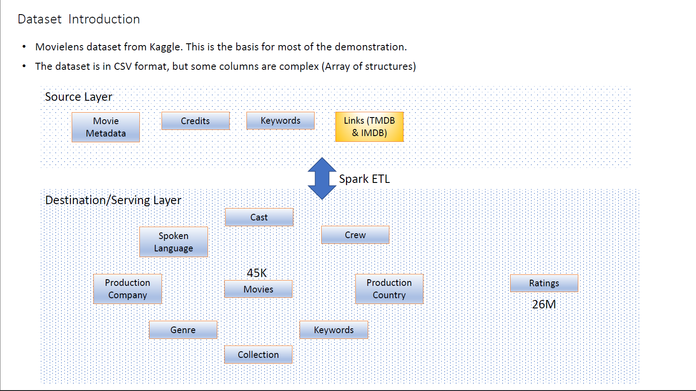

<pre>
set JAVA_HOME=c:\Venky\jdk-11.0.15.10-hotspot
set PATH=%PATH%;c:\Venky\spark\bin;c:\Venky\apache-maven-3.8.6\bin
set SPARK_HOME=c:\Venky\spark
SET HADOOP_HOME=C:\Venky\AzureSynapseExperiments\SparkExamples

cd C:\Venky\AzureSynapseExperiments\SparkExamples
mvn clean package

# Process the main movies and ratings files. 
spark-submit --master local[4] --class com.gssystems.movies.MovieDataProcessor2 target\SparkExamples-1.0-SNAPSHOT.jar file:///C:/Venky/AzureSynapseExperiments/datafiles/movielens/movies_metadata.csv.gz file:///C:/Venky/AzureSynapseExperiments/datafiles/movielens/ratings.csv.gz

# Process related files for movies.
spark-submit --master local[4] --class com.gssystems.movies.MovieDataProcessor target\SparkExamples-1.0-SNAPSHOT.jar file:///C:/Venky/AzureSynapseExperiments/datafiles/movielens/movies_metadata.csv.gz

# Process credits
spark-submit --master local[4] --class com.gssystems.movies.CreditsProcessor target\SparkExamples-1.0-SNAPSHOT.jar file:///C:/Venky/AzureSynapseExperiments/datafiles/movielens/credits.csv.gz

# Process keywords
spark-submit --master local[4] --class com.gssystems.movies.KeywordsProcessor target\SparkExamples-1.0-SNAPSHOT.jar file:///C:/Venky/AzureSynapseExperiments/datafiles/movielens/keywords.csv.gz

# generate fake users
spark-submit --master local[4] --packages com.github.javafaker:javafaker:1.0.2 --class com.gssystems.movies.FakeUsersGenerator target\SparkExamples-1.0-SNAPSHOT.jar file:///C:/Venky/AzureSynapseExperiments/datafiles/movielens/ratings.csv.gz

</pre>

* This will read the movie metadata file that is in JSON format (complicated nested arrays), and shreds the data to a more relational friendly format. There are various entities at play here and the processing will take care of the shredding process. As we can see there are parquet files created with specific schemas that will resemble a normalized data model in a relational database.

* We will also generate a lot of fake users with the IDs that gave the ratings from the de-duped ratings file so that it can be used to test various dynamic data masking inside Synapse. This process took a pretty long time to run on my computer. 

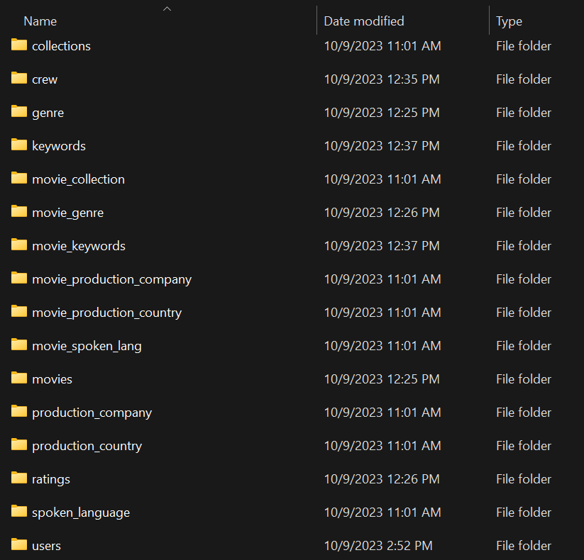

* We can upload all the files to ADLS using Azure storage explorer. This allows us to just copy entire directories without having to do much. If we do not want to install this, we can do the azcopy command and copy all the folders to ADLS.

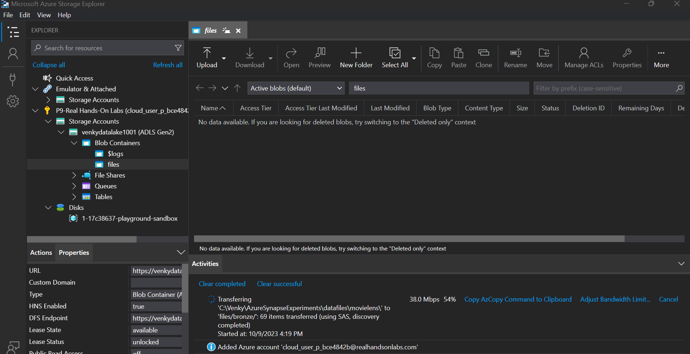

* We can see the data from inside the linked ADLS account in Synapse. 

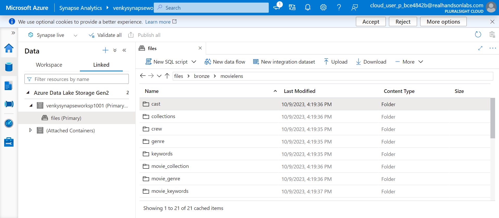

* We can start creating tables inside the dedicated pool we have and bulk load the datasets to create a data warehouse kind of setup inside the dedicated pool. We can create a pipeline after defining the required stored procs.

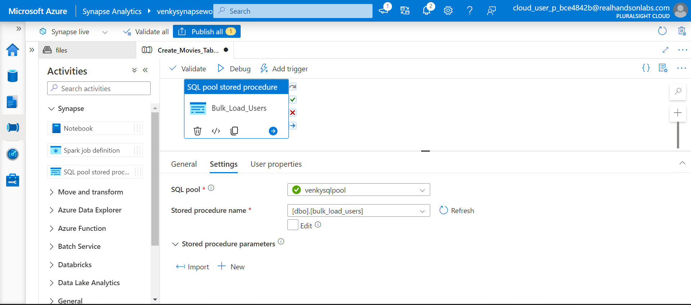

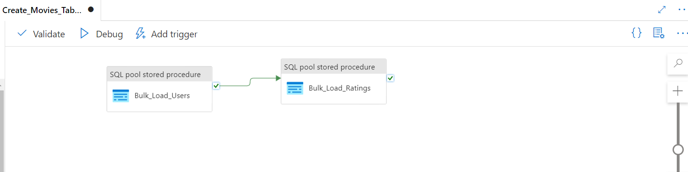

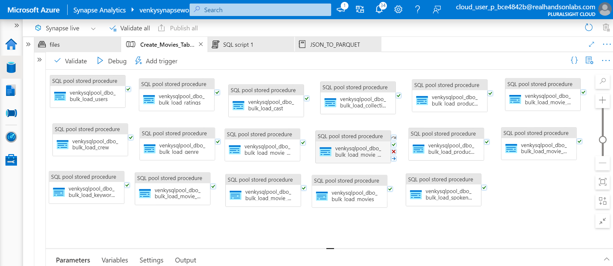

* We need to make sure that the managed identity being used for running the pipeline has proper priviledges to run stored procedures inside the synapse dedicated pool. Otherwise we are going to see errors saying that the stored procedure was not able be loaded. I think the reason behind this is that the files are being referenced via https and that means that the containers need to be publically accessible. I am taking this short cut for now, otherwise we need to create a database credential to point to the SAS of the container and then use that. 

* I ran the stored procedures manually in SQL and counted the data in each of the tables. There were some tables that did not work when I tried to generate the SQL script because it was not able to detect the schema. I had to create them manually. 

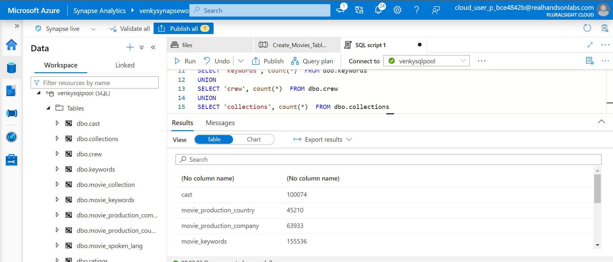

* The two files genre and movie_genre are created as JSON files with each row being a row in the table. Synapse can't parse this type of JSON because it considers it as invalid JSON format. That is the reason I have a small notebook that can actually convert the JSON to Parquet and we can bulk load the parquet files similar to the other ones. The notebook is <a href="./movies/JSON_TO_PARQUET.ipynb">here</a>

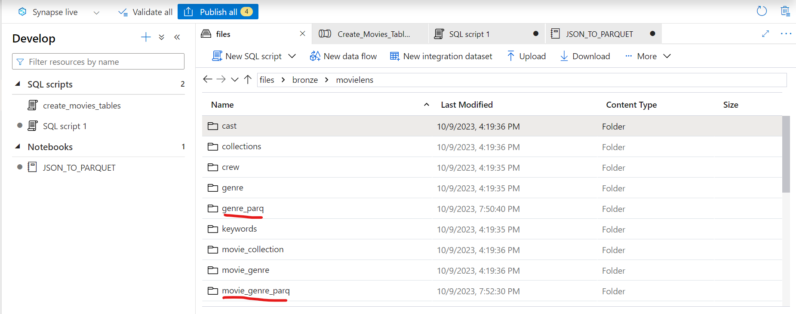

* Once the parquet files are created they can be seen in Synapse. The row counts for all the 17 tables are shown.

<pre>
SELECT 'cast', count(*)  FROM dbo.cast
UNION 
SELECT 'movie_production_country', count(*)  FROM dbo.movie_production_country
UNION
SELECT 'movie_production_company', count(*)  FROM dbo.movie_production_company
UNION
SELECT 'movie_keywords', count(*)  FROM dbo.movie_keywords
UNION
SELECT 'movie_collection', count(*)  FROM dbo.movie_collection
UNION
SELECT 'keywords', count(*)  FROM dbo.keywords
UNION
SELECT 'crew', count(*)  FROM dbo.crew
UNION
SELECT 'collections', count(*)  FROM dbo.collections
UNION
SELECT 'spoken_lang', count(*)  FROM dbo.movie_spoken_lang
UNION
SELECT 'ratings', count(*) FROM [dbo].[ratings]
UNION
SELECT 'users', count(*) FROM [dbo].[users]
UNION
SELECT 'movies', count(*) FROM [dbo].[movies]
UNION
SELECT 'production_company', count(*) from dbo.production_company
UNION
SELECT 'production_country', count(*) from dbo.production_country
UNION
SELECT 'spoken_language', count(*) from dbo.spoken_language
UNION
SELECT 'genre', count(*) from dbo.genre
UNION
SELECT 'movie_genre', count(*) from dbo.movie_genre
</pre>

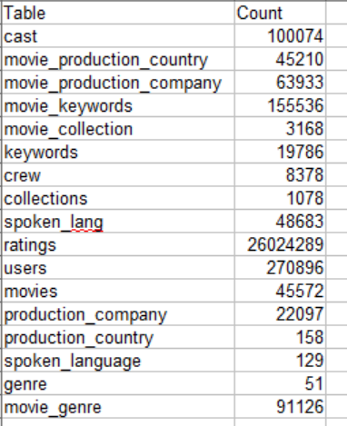

## Important Observation when using Stored Procs via Pipeline.

* I had to struggle with this a little bit to get it to work. When the UI generates the stored procedures required for the bulk load, it refers to the parquet files via https and uses dfs.core. Even if I set the access level of the container to public, it does not find the parquet files and throws an error. The moment I switched the path to .blob.core, it was able to find the parquet files and successfully execute the stored proc. This is still not secure, but demonstrates how stored procs can be called internally. 

* One of the patterns that MSFT recommends is to call all the stored procs inside one mega stored proc and that way we do not have to keep messing with the pipelines. 

* Here is the code for one stored proc to perform the bulk load. See that the .blob.core is used, not .dfs.core. That will make it fail even if public access is granted to the container. 
<pre>

AS
BEGIN
COPY INTO [dbo].[ratings]
(user_id 1, movie_id 2, rating 3)
FROM 'https://venkydatalake1001.blob.core.windows.net/files/bronze/movielens/ratings'
WITH
(
	FILE_TYPE = 'PARQUET'
	,MAXERRORS = 0
)
END
GO
</pre>

* As we can see the stored procedures can be added to the pipeline and in our case, there are no success criteria definined for each step. Since there is no connection between the steps, it will run as many tasks as it can in parallel, and that is evidenced in the success check marks appearing in parallel. 

* It took barely 59 sec to load all the 17 tables from the parquet files to the dedicated pool. Note that most of the tables are setup with a round-robin distribution that is perfect for the fastest load possible. If we were to change to hash based distributions, things can get a little slower. The biggest table has 26M rows, so it is not bad performance wise.

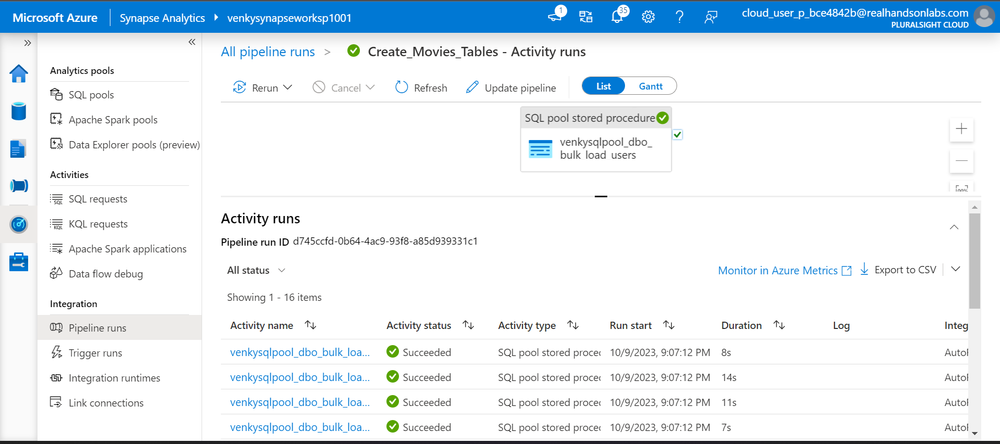

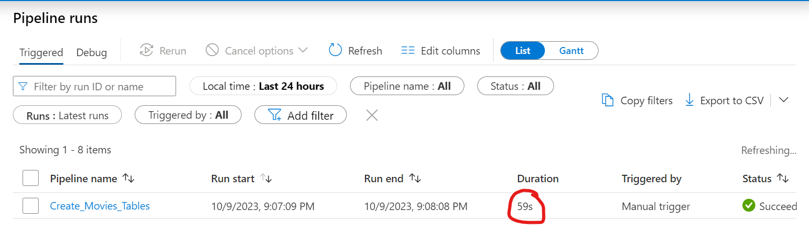

* The pipeline we created can be exported as a template and that will download a zip file. In the next session, we can go to the integrate tab on the left panel, and import from template to get the pipeline installed and run for a second time. 

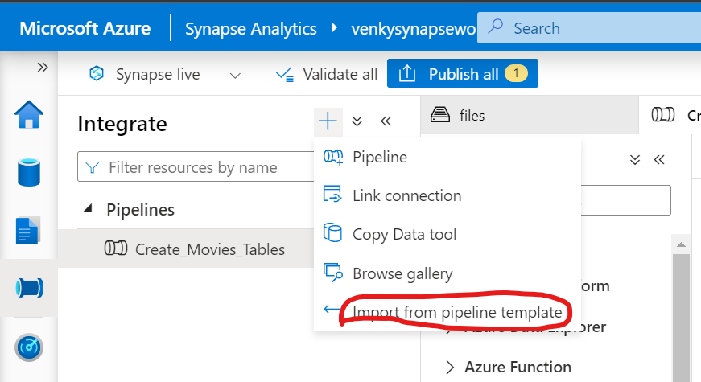

