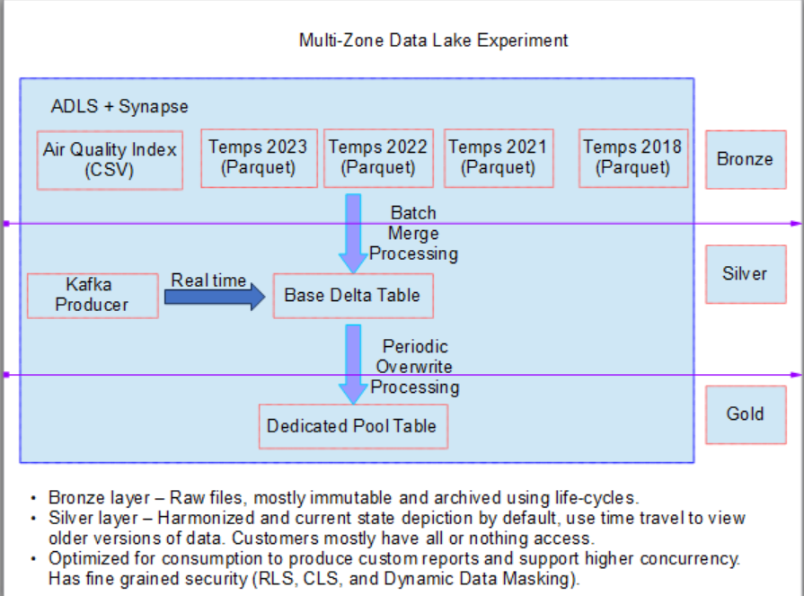

## Azure Synapse Dedicated Pool Experiments.

* The idea of these experiments is to use prepare the data and explore the features of the Azure Synapse dedicated pool. For the dedicated pool to make sense, we will need some good amount of data and a good amount of relationships between them so that we can do joins and try out different distribution strategies. 

* We got a list of cities with lat and lng information, and we will download the weather for multiple years and join that data to see what insights we can derive.

<pre>
set JAVA_HOME=c:\Venky\jdk-11.0.15.10-hotspot
set PATH=%PATH%;c:\Venky\spark\bin;c:\Venky\apache-maven-3.8.6\bin
set SPARK_HOME=c:\Venky\spark
SET HADOOP_HOME=C:\Venky\AzureSynapseExperiments\SparkExamples

cd C:\Venky\AzureSynapseExperiments\SparkExamples
mvn clean package

spark-submit --master local[4] --class com.gssystems.spark.AirQualityIndexProcessor target\SparkExamples-1.0-SNAPSHOT.jar file:///C:/Venky/DP-203/AzureSynapseExperiments/datafiles/AirQualityIndex/ file:///C:/Venky/DP-203/AzureSynapseExperiments/datafiles/AirQualityIndexWithTemperatures/ 2023-01-01 2023-08-31

spark-submit --master local[4] --class com.gssystems.spark.AirQualityIndexProcessor target\SparkExamples-1.0-SNAPSHOT.jar file:///C:/Venky/DP-203/AzureSynapseExperiments/datafiles/AirQualityIndex/ file:///C:/Venky/DP-203/AzureSynapseExperiments/datafiles/AirQualityIndexWithTemperatures_1/ 2022-01-01 2022-12-31

spark-submit --master local[4] --class com.gssystems.spark.AirQualityIndexProcessor target\SparkExamples-1.0-SNAPSHOT.jar file:///C:/Venky/DP-203/AzureSynapseExperiments/datafiles/AirQualityIndex/ file:///C:/Venky/DP-203/AzureSynapseExperiments/datafiles/AirQualityIndexWithTemperatures_2/ 2021-01-01 2021-08-31

spark-submit --master local[4] --class com.gssystems.spark.AirQualityIndexProcessor target\SparkExamples-1.0-SNAPSHOT.jar file:///C:/Venky/DP-203/AzureSynapseExperiments/datafiles/AirQualityIndex/ file:///C:/Venky/DP-203/AzureSynapseExperiments/datafiles/AirQualityIndexWithTemperatures_3/ 2019-01-01 2019-08-31

spark-submit --master local[4] --class com.gssystems.spark.AirQualityIndexProcessor target\SparkExamples-1.0-SNAPSHOT.jar file:///C:/Venky/DP-203/AzureSynapseExperiments/datafiles/AirQualityIndex/ file:///C:/Venky/DP-203/AzureSynapseExperiments/datafiles/AirQualityIndexWithTemperatures_2/ 2018-01-01 2018-08-31

</pre>