## Azure Synapse Dedicated Pool Experiments.

* The idea of these experiments is to use prepare the data and explore the features of the Azure Synapse dedicated pool. For the dedicated pool to make sense, we will need some good amount of data and a good amount of relationships between them so that we can do joins and try out different distribution strategies. 

* We got a list of cities with lat and lng information, and we will download the weather for multiple years and join that data to see what insights we can derive.

<pre>
set JAVA_HOME=c:\Venky\jdk-11.0.15.10-hotspot
set PATH=%PATH%;c:\Venky\spark\bin;c:\Venky\apache-maven-3.8.6\bin
set SPARK_HOME=c:\Venky\spark
SET HADOOP_HOME=C:\Venky\AzureSynapseExperiments\SparkExamples

cd C:\Venky\AzureSynapseExperiments\SparkExamples
mvn clean package

spark-submit --master local[4] --class com.gssystems.spark.AirQualityIndexProcessor target\SparkExamples-1.0-SNAPSHOT.jar file:///C:/Venky/DP-203/AzureSynapseExperiments/datafiles/AirQualityIndex/ file:///C:/Venky/DP-203/AzureSynapseExperiments/datafiles/AirQualityIndexWithTemperatures_0/ 2023-01-01 2023-08-31

spark-submit --master local[4] --class com.gssystems.spark.AirQualityIndexProcessor target\SparkExamples-1.0-SNAPSHOT.jar file:///C:/Venky/DP-203/AzureSynapseExperiments/datafiles/AirQualityIndex/ file:///C:/Venky/DP-203/AzureSynapseExperiments/datafiles/AirQualityIndexWithTemperatures_1/ 2022-01-01 2022-12-31

spark-submit --master local[4] --class com.gssystems.spark.AirQualityIndexProcessor target\SparkExamples-1.0-SNAPSHOT.jar file:///C:/Venky/DP-203/AzureSynapseExperiments/datafiles/AirQualityIndex/ file:///C:/Venky/DP-203/AzureSynapseExperiments/datafiles/AirQualityIndexWithTemperatures_2/ 2021-01-01 2021-12-31

spark-submit --master local[4] --class com.gssystems.spark.AirQualityIndexProcessor target\SparkExamples-1.0-SNAPSHOT.jar file:///C:/Venky/DP-203/AzureSynapseExperiments/datafiles/AirQualityIndex/ file:///C:/Venky/DP-203/AzureSynapseExperiments/datafiles/AirQualityIndexWithTemperatures_3/ 2020-01-01 2020-12-31

spark-submit --master local[4] --class com.gssystems.spark.AirQualityIndexProcessor target\SparkExamples-1.0-SNAPSHOT.jar file:///C:/Venky/DP-203/AzureSynapseExperiments/datafiles/AirQualityIndex/ file:///C:/Venky/DP-203/AzureSynapseExperiments/datafiles/AirQualityIndexWithTemperatures_4/ 2019-01-01 2019-12-31

spark-submit --master local[4] --class com.gssystems.spark.AirQualityIndexProcessor target\SparkExamples-1.0-SNAPSHOT.jar file:///C:/Venky/DP-203/AzureSynapseExperiments/datafiles/AirQualityIndex/ file:///C:/Venky/DP-203/AzureSynapseExperiments/datafiles/AirQualityIndexWithTemperatures_5/ 2018-01-01 2018-12-31

</pre>

* After all these jobs run, the top 100 rows from the air quality csv file are used to pull temperatures for multiple years. These are stored in the parquet format. They can be considered as raw zone immutable files that can be archived using life-cycle policies. This spark job can be directly run from a synapse spark pool if needed. 

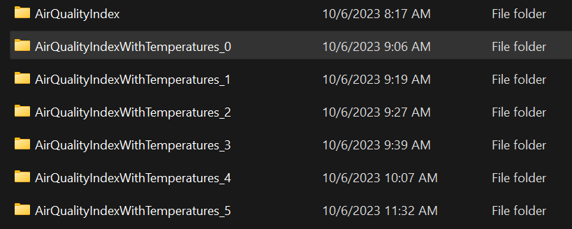

* Next we can create a single storage account with ADLS storage enabled, and upload these files to the raw zone. These can be used for downstream data lake processing.

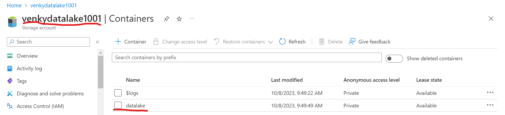

* We will create folders for each type of dataset. The air quality master file will be placed in its own container, and the temperature files are going to be stored in another container, and multiple folders to store data one for each year.

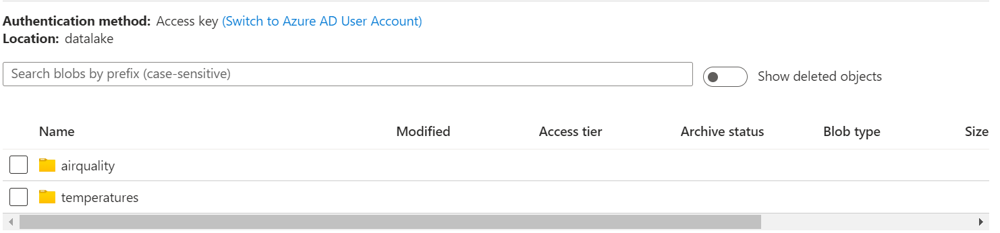

* Upload the files to each folder as shown. We can use this power shell script to list the contents. <a href="./list_adls_files.ps">list_adls_files.ps</a>

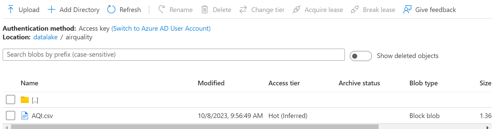

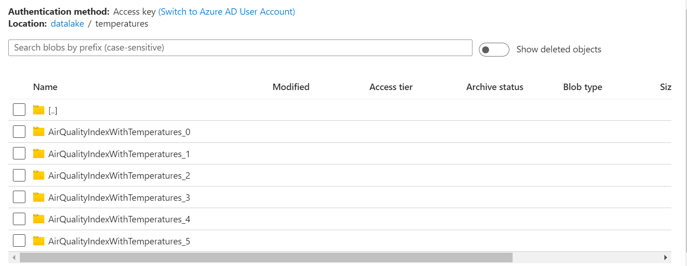

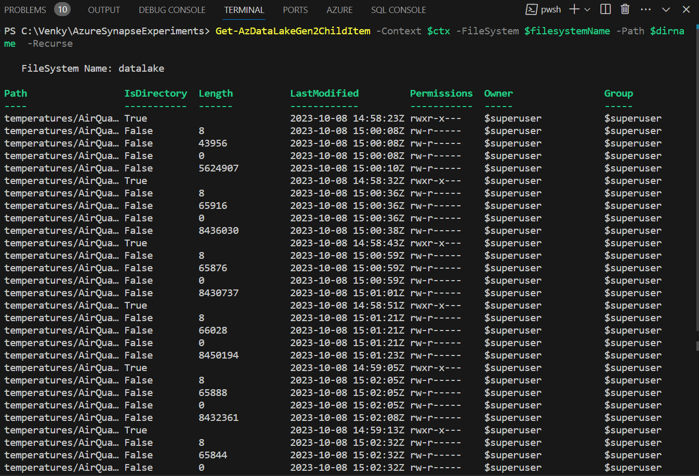

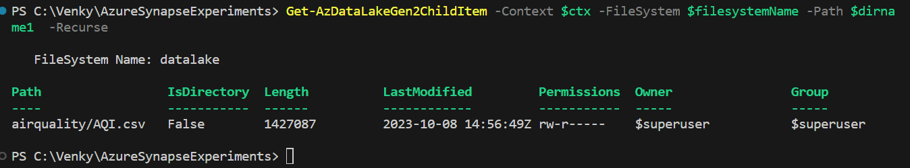

* Next we can create a synapse workspace. The workspace will be used to connect to the ADLS storage we have created, and use it to process the data present in the data lake. As processing happens, the data will move from one zone to another and finally get exposed inside a dedicated pool. 

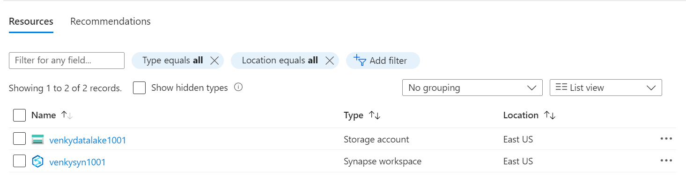

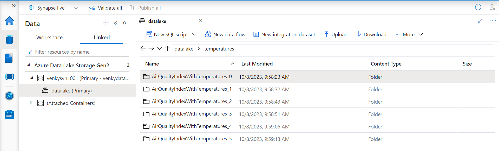

* After the dedicated pool gets provisioned, we can see that the synapse workspace shows it on the left panel as a SQL database. The datalake files we saw are also visible in the right panel. Since these are parquet files, we can easily create EXTERNAL tables and query/process them. First we will do most of the processing with the serverless pools and delta lake and see how much of the same we can do with the dedicated pools. Not everything supported with serverless is supported with dedicated pools.

<pre>
SELECT substring([time], 1, 4) as [yyyy], count(*) as [rowcnt]
FROM ( 
SELECT * FROM [dbo].[temperatures_2023] UNION
SELECT * FROM [dbo].[temperatures_2022] UNION
SELECT * FROM [dbo].[temperatures_2021] UNION
SELECT * FROM [dbo].[temperatures_2020] UNION
SELECT * FROM [dbo].[temperatures_2019] UNION
SELECT * FROM [dbo].[temperatures_2018]
) XX
GROUP BY substring([time], 1, 4) 
ORDER BY [yyyy]
</pre>

* Executing this query will show the data from the external tables all unioned and counted. Instead of showing as a table, we can see as a bar chart natively in Synapse. 

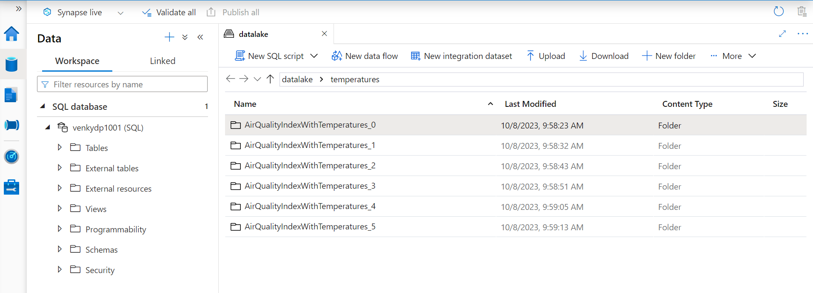

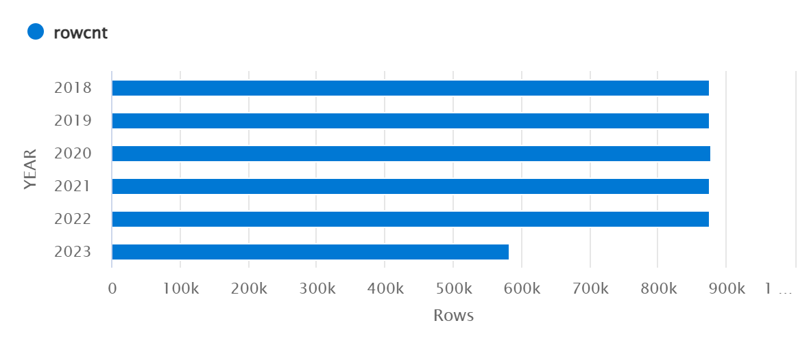

* Overall, we have about 5M rows to experiment with. If we want to increase the scale, we just need to change the constant in the AirQualityIndexProcessor.java to increase the number of cities from 100 to a higher number and run the scripts to download the data for more citites. 

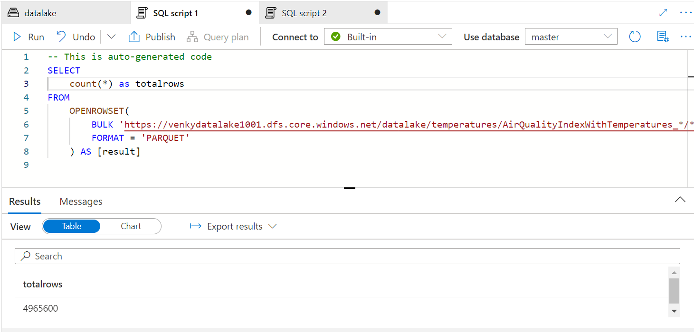

* Next we will start off by creating an external delta table, and then use the merge command to take these rows and merge into the delta table one table at a time. After the end of this, the silver zone delta table should have these 5M rows very similar to the parquet files. The first step is to create the external datasource and the delta lake format. 

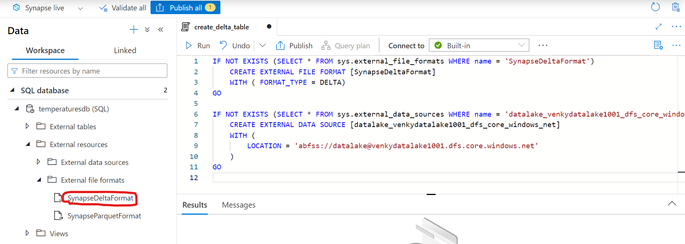

* The next step is to create the delta table making sure the schema is exactly the same as what we have on the parquet files. 

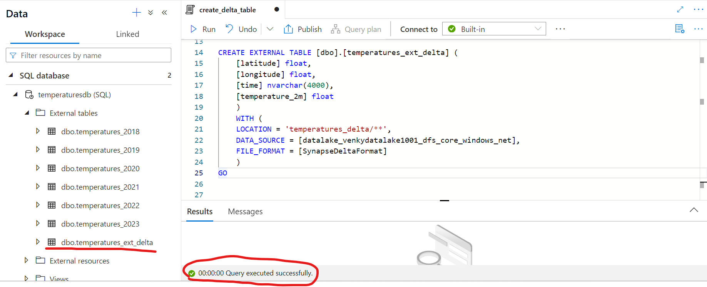

* Note that the delta folder should not have any wildcards. Next if you try to query the delta table without a log, it will give an error saying it can't list the _delta_log folder. Next if we try any DML operations on the delta table via the SERVERLESS POOL, IT WILL THROW AN ERROR! This means no ETL can be done on a delta lake table using an external table approach!!! 

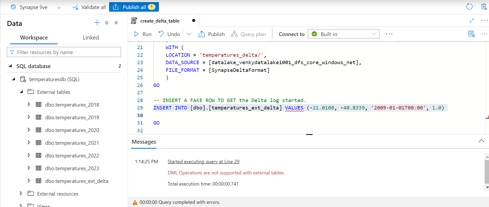

* Let us create a spark pool and try to insert data into this delta table via spark. Then we can come back to the serverless pool and query it. We need to create a new notebook, and get the spark pool running as shown by putting in a simple print(spark)

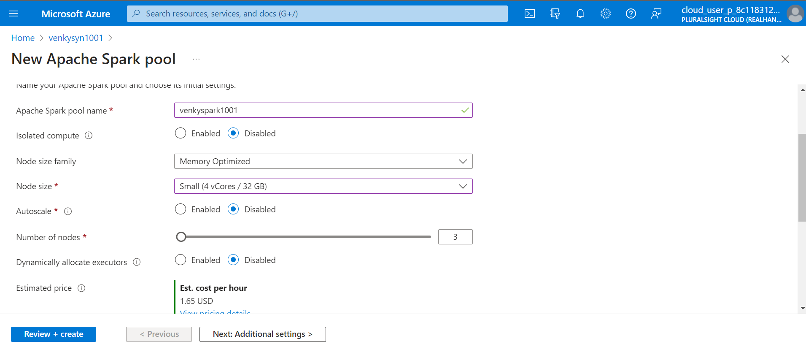

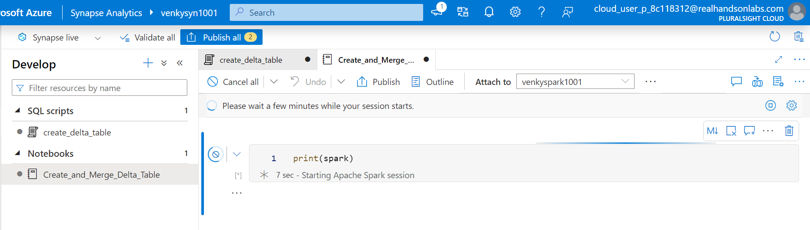

* We can go through and see how we can use a notebook to define a warehouse, create a managed delta table, and merge the data from the external tables created by noting the location of the files in ADLS. See the step by step executions <a href="./Create_and_Merge_Delta_Table_ManagedTable.ipynb">here</a>

* We can also define the delta lake inside the spark pool to point to the location we had created the table from the serverless pool and push the data to the location. We can check the step-by-step execution <a href="./Merge_Into_Delta_Table_External.ipynb">here</a>

* As we can see there are some rounding things happening in the synapse table. All the 5M rows were merged into the delta table. 

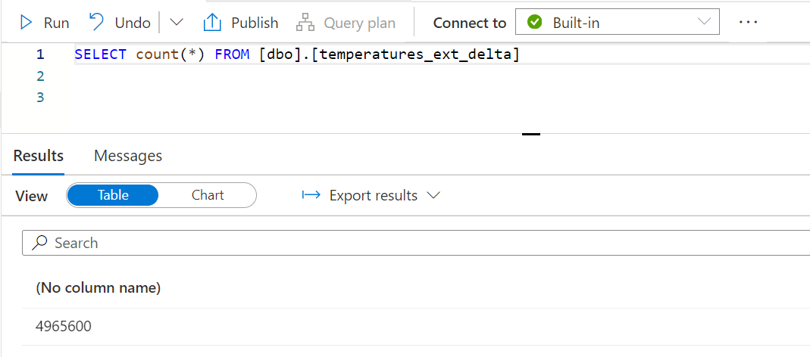

