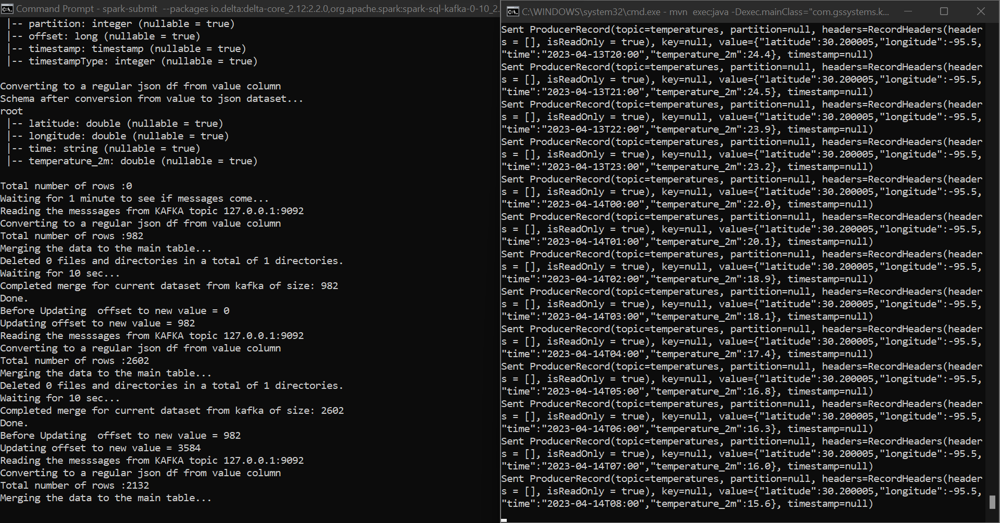

## Delta Lake Streaming Merge Experiment

* Assume we have a data lake that stores the data in the delta format. Let us assume that we get events on an event hub / Kafka that need to be used to merge with the delta lake. This would in essence create a near real-time data lake that can be queried to get the latest datasets as opposed to waiting for an end of day batch cycle. Spark reads the Kafka topic in batch mode (using read vs readStream) and adjusts offsets as reads progress creating in essence a micro-batching kind of application. Each batch is merged with the delta lake to keep the data current.

* Let us start with the base parquet files like before and create a base delta table. Delete the C:\Venky\DP-203\AzureSynapseExperiments\datafiles\spring_tx_temps_delta folder before we start.

<pre>
set JAVA_HOME=c:\Venky\jdk-11.0.15.10-hotspot
set PATH=%PATH%;c:\Venky\spark\bin;c:\Venky\apache-maven-3.8.4\bin
set SPARK_HOME=c:\Venky\spark
SET HADOOP_HOME=C:\Venky\DP-203\AzureSynapseExperiments\SparkExamples

cd C:\Venky\DP-203\AzureSynapseExperiments\SparkExamples
mvn clean package 

## Note output folder, it is outside of the git path to prevent wasteful files in repo

spark-submit --master local[4] --packages io.delta:delta-core_2.12:2.2.0 --conf "spark.sql.extensions=io.delta.sql.DeltaSparkSessionExtension" --conf "spark.sql.catalog.spark_catalog=org.apache.spark.sql.delta.catalog.DeltaCatalog" --class com.gssystems.delta.TemperaturesDeltaProcessing target\SparkExamples-1.0-SNAPSHOT.jar file:///C:/Venky/DP-203/AzureSynapseExperiments/datafiles/spring_tx_temps_formatted/ file:///C:/Venky/spring_tx_temps_delta/
</pre>

* Note the count of records present in the base delta file
<pre>
spark-submit --master local[4] --packages io.delta:delta-core_2.12:2.2.0 --conf "spark.sql.extensions=io.delta.sql.DeltaSparkSessionExtension" --conf "spark.sql.catalog.spark_catalog=org.apache.spark.sql.delta.catalog.DeltaCatalog" --class com.gssystems.delta.TemperaturesDeltaReader target\SparkExamples-1.0-SNAPSHOT.jar file:///C:/Venky/spring_tx_temps_delta/

Total number of rows in the delta table...210384
+---------+------------+-----+
| latitude|   longitude|count|
+---------+------------+-----+
|61.199997|      -149.9|35064|
|     51.5|-0.099990845|35064|
| 41.90001|        12.5|35064|
|     13.0|   77.600006|35064|
|30.200005|       -95.5|35064|
| 48.90001|    2.300003|35064|
+---------+------------+-----+

</pre>

* We need to first start KAFKA on docker to start streaming data. 
<pre>
cd C:\Venky\DP-203\AzureSynapseExperiments\kafka_docker
docker-compose up -d 

Once this starts up, we can start our producer to push the data to the KAFKA topic. 

cd C:\Venky\DP-203\AzureSynapseExperiments\SparkExamples
mvn clean package 

mvn exec:java -Dexec.mainClass="com.gssystems.kafka.WeatherDataStreamingProducer" -Dexec.args="C:\Venky\DP-203\AzureSynapseExperiments\datafiles\streaming\output\part-00000-dd3eed31-5521-456d-9fcd-3d66c266f6fc-c000.json C:\Venky\DP-203\AzureSynapseExperiments\datafiles\streaming\location_master\part-00000-a3a34469-0ef8-496f-be3f-826ef3d55233-c000.json"
</pre>

* This starts the producer and it streams messages to KAFKA. Now we start the consumer that pulls messages from KAFKA and merges that into the delta table we have. Note the use of read() vs readStream() function to get a dataframe that I could use to merge the contents. Instead I used used the read() to start the dataset in a batch mode, get the messages till that point and then merge with the delta table. More research is needed on how to make this work with a streaming ingest. Maybe the way to do it is to download the stream into a set of parquet files and periodically do a merge?

* CHANGE PUBLIC IP OF machine if running from local to azure, else 127.0.0.1 
<pre>
spark-submit --packages io.delta:delta-core_2.12:2.2.0,org.apache.spark:spark-sql-kafka-0-10_2.12:3.0.0 --conf "spark.sql.extensions=io.delta.sql.DeltaSparkSessionExtension" --conf "spark.sql.catalog.spark_catalog=org.apache.spark.sql.delta.catalog.DeltaCatalog" --master local[4] --class com.gssystems.delta.TemperaturesStreamingMerge target/SparkExamples-1.0-SNAPSHOT.jar file:///C:/Venky/spring_tx_temps_delta/ 127.0.0.1 temperatures

## Output from program when there are no messages in KAFKA.
Reading the delta table from disk...
Reading the messsages from KAFKA topic 127.0.0.1:9092
Raw schema from kafka read...
root
 |-- key: binary (nullable = true)
 |-- value: binary (nullable = true)
 |-- topic: string (nullable = true)
 |-- partition: integer (nullable = true)
 |-- offset: long (nullable = true)
 |-- timestamp: timestamp (nullable = true)
 |-- timestampType: integer (nullable = true)

Converting to a regular json df from value column
Schema after conversion from value to json dataset...
root
 |-- latitude: double (nullable = true)
 |-- longitude: double (nullable = true)
 |-- time: string (nullable = true)
 |-- temperature_2m: double (nullable = true)

Total number of rows :0
Waiting for 1 minute to see if messages come...
Total number of rows :0
Waiting for 1 minute to see if messages come...
Waiting for 3 min for messages, aborting...
</pre>

* As the program runs, we can see that the kafka offsets are moving, and the records that are processing are read and merged. 

* Let us compare the dataset after the merge has happened. 
<pre>
spark-submit --master local[4] --packages io.delta:delta-core_2.12:2.2.0 --conf "spark.sql.extensions=io.delta.sql.DeltaSparkSessionExtension" --conf "spark.sql.catalog.spark_catalog=org.apache.spark.sql.delta.catalog.DeltaCatalog" --class com.gssystems.delta.TemperaturesDeltaReader target\SparkExamples-1.0-SNAPSHOT.jar file:///C:/Venky/spring_tx_temps_delta/

</pre>

* As we can see the number of rows have updated.

<pre>
Total number of rows in the delta table...210384
+---------+------------+-----+
| latitude|   longitude|count|
+---------+------------+-----+
|61.199997|      -149.9|35064|
|     51.5|-0.099990845|35064|
| 41.90001|        12.5|35064|
|     13.0|   77.600006|35064|
|30.200005|       -95.5|35064|
| 48.90001|    2.300003|35064|
+---------+------------+-----+

Total number of rows in the delta table...236448
+---------+------------+-----+
| latitude|   longitude|count|
+---------+------------+-----+
|61.199997|      -149.9|39408|
|     51.5|-0.099990845|39408|
| 41.90001|        12.5|39408|
|     13.0|   77.600006|39408|
|30.200005|       -95.5|39408|
| 48.90001|    2.300003|39408|
+---------+------------+-----+
</pre>
