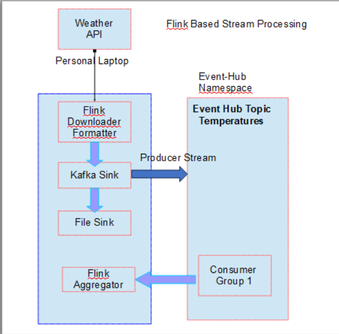
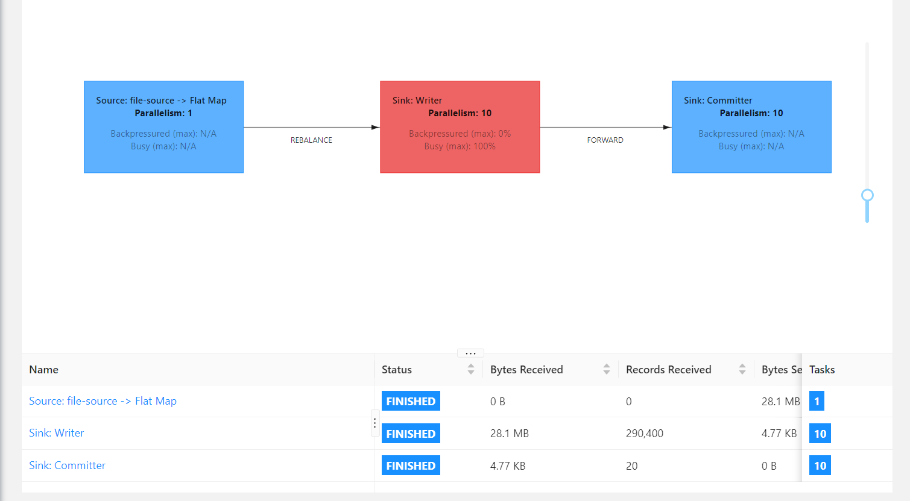
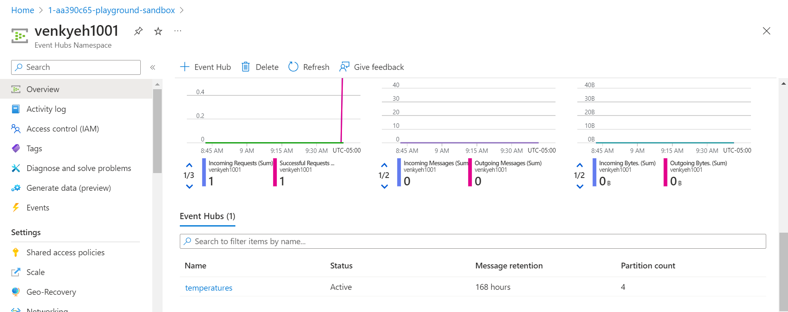
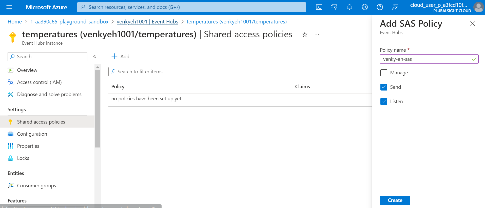
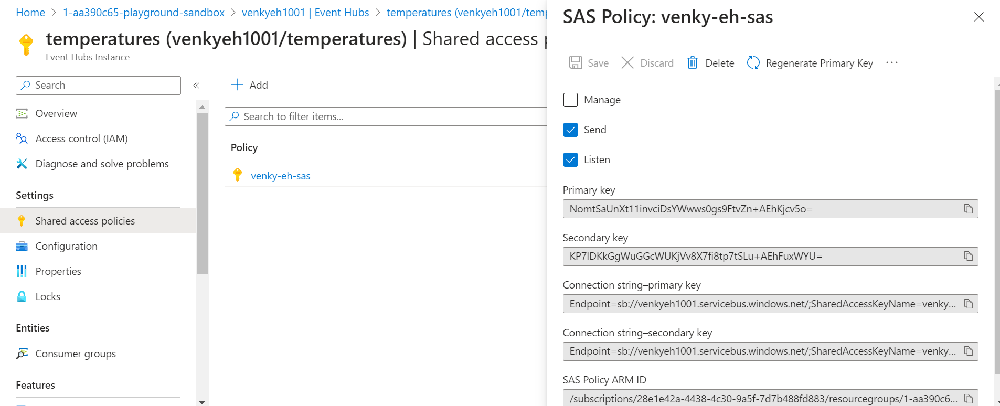
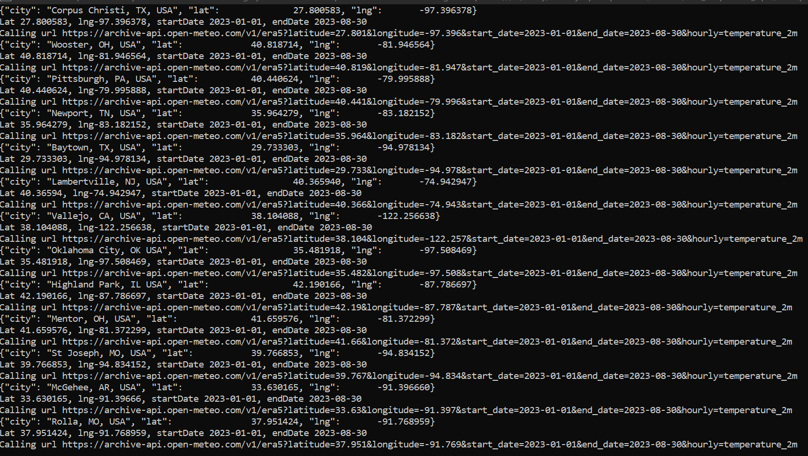
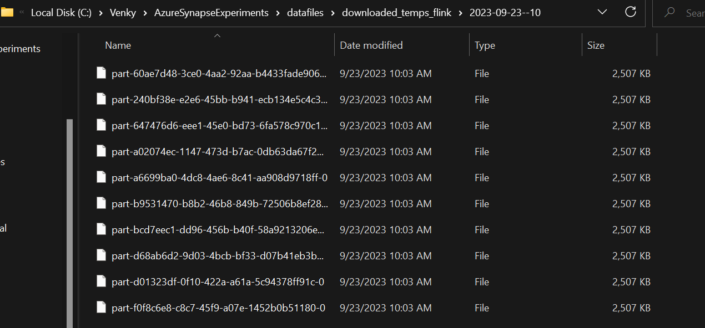

## Demonstrate Batch and Stream processing with Flink.
* Flink based streaming architecture

* Testing the same ETLs we have done in SPARK before with Flink and integrate it with various services on Azure to prove out viability. For a first step, configure flink locally using docker compose. 

<pre>
cd C:\Venky\DP-203\AzureSynapseExperiments\flink
docker-compose up -d 
C:\Venky\DP-203\AzureSynapseExperiments\flink>docker ps

CONTAINER ID   IMAGE          COMMAND                  CREATED         STATUS              PORTS                              NAMES
cdf57d97c60a   flink:latest   "/docker-entrypoint.…"   2 minutes ago   Up About a minute   6123/tcp, 8081/tcp                 flink_taskmanager_2
788e66135e29   flink:latest   "/docker-entrypoint.…"   2 minutes ago   Up About a minute   6123/tcp, 8081/tcp                 flink_taskmanager_1
e92189041c0f   flink:latest   "/docker-entrypoint.…"   2 minutes ago   Up 2 minutes        6123/tcp, 0.0.0.0:8081->8081/tcp   flink_jobmanager_1
</pre>

* As we can see the simple flink environment is setup and ready to test with. In the real world however it might be setup with many VMs on Azure. 

<pre>
set JAVA_HOME=c:\Venky\jdk-11.0.15.10-hotspot
set PATH=%PATH%;c:\Venky\spark\bin;c:\Venky\apache-maven-3.8.4\bin
set SPARK_HOME=c:\Venky\spark
SET HADOOP_HOME=C:\Venky\DP-203\AzureSynapseExperiments\SparkExamples

cd C:\Venky\DP-203\AzureSynapseExperiments\flink

mvn archetype:generate -DarchetypeGroupId=org.apache.flink -DarchetypeArtifactId=flink-quickstart-java -DarchetypeVersion=1.17.1 -DgroupId=com.gssystems.flink -DartifactId=FlinkETLTesting -DinteractiveMode=false

cd FlinkETLTesting

mvn clean package 

mvn exec:java -Dexec.mainClass="com.gssystems.flink.FlinkTemperatureProcessor" -Dexec.args="--input file:///C:/Venky/DP-203/AzureSynapseExperiments/datafiles/flink_temperature_input/ --output file:///C:/Venky/DP-203/AzureSynapseExperiments/datafiles/downloaded_temps_flink/ --st 2023-01-01 --end 2023-08-30"

# Submit the job to the flink job manager.
docker exec -it flink_jobmanager_1 flink run /home/FlinkETLTesting/target/FlinkETLTesting-1.0-SNAPSHOT.jar --input /home/flink_temperature_input/ --output /home/flink_temperature_output/ --st 2023-01-01 --end 2023-08-30 

Job has been submitted with JobID babcb2a3b6b367fb0bbad2cd95fd1b00
Program execution finished
Job with JobID babcb2a3b6b367fb0bbad2cd95fd1b00 has finished.
Job Runtime: 81077 ms
</pre>

* The flink module takes a file input. The file is in json format and gives the city name and latitude and longitude. We also pass the start date and end date to download the data from the weather API and persist that to the file output stream.

* We can visit the URL http://localhost:8081/ and see the status of the job.

## Connecting the flink processor to Azure Event Hubs via the Flink Kafka Connector.

* Create the required Azure event hub using the powershell script and the ARM template.
<pre>
.\1002-Create-Azure-Event-Hub.ps1
</pre>

* We have to create a SAS signature for the event hub to enable clients to talk to the hub and produce/consume messages. Then we can copy the required endpoint connection string to enable Flink to talk to the event hub.

* Submitting the maven job will pull the data from the weather API, and downloads it into the directory.

Endpoint=sb://venkyeh1001.servicebus.windows.net/;SharedAccessKeyName=venky-eh-sas;SharedAccessKey=NomtSaUnXt11invciDsYWwws0gs9FtvZn+AEhKjcv5o=;EntityPath=temperatures

