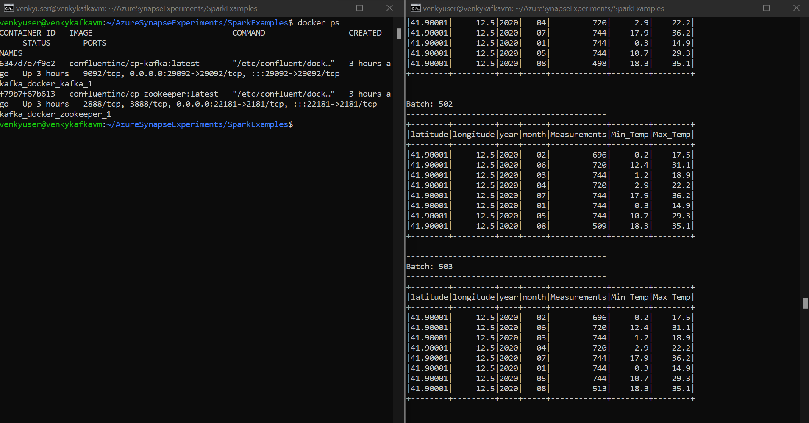
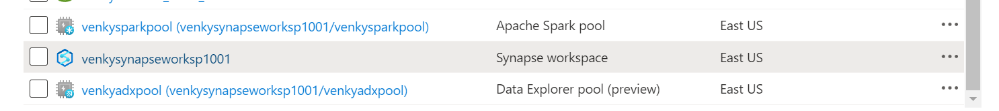
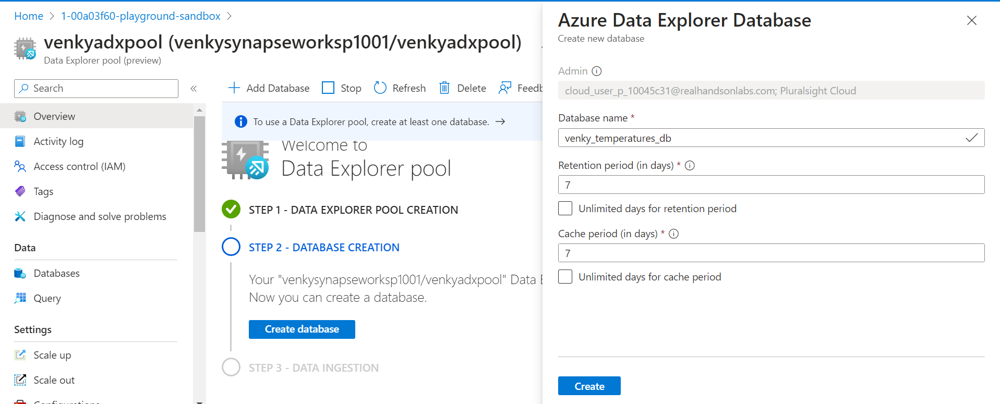
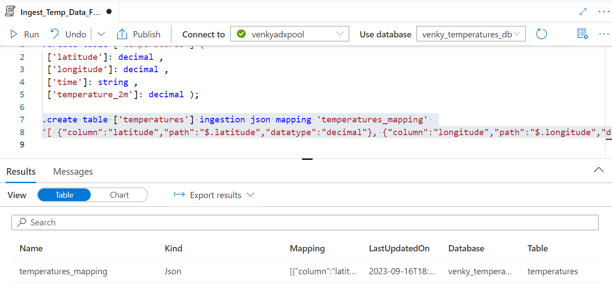

* Let us now experiment what we can do with Azure Synapse and Kafka integration. 
* Execute the Connect-AzAccount to login to Azure. Run the 1005-Create-Synapse-workspace.ps1
* This will provision a simple Synapse workspace without all the security needed in real life. Storage accounts are exposed to everyone, and a serverless, dedicated and spark pool. We will try various interactions with KAFKA from this Synapse workspace. 
* After following the instructions <a href="./Kafka_on_Azure_VM.md"> here </a>, we should have a docker based kafka setup with the temperatures topic. It will have quite a bit of temperature readings. The aggregated data via spark is also shown here.

* After the ARM template deployment is done, we should have the synapse artifacts deployed.

* We need to create a database in the ADX pool. For that go to the resource group, click on the adx pool that is created and the bottom wizard should guide us to create a database as shown below:

* After the database is created create a table to hold the data.
<pre>
.create table ['temperatures'] (
 ['latitude']: decimal ,
 ['longitude']: decimal , 
 ['time']: string ,
 ['temperature_2m']: decimal );
 </pre>

* After this we need to create the mapping for the json to columns.
<pre>
.create table ['temperatures'] ingestion json mapping 'temperatures_mapping' 
'[ {"column":"latitude","path":"$.latitude","datatype":"decimal"}, {"column":"longitude","path":"$.longitude","datatype":"decimal"}, {"column":"time","path":"$.time","datatype":"string"}, {"column":"temperature_2m","path":"$.temperature_2m","datatype":"decimal"}]';
</pre>

* Next we need to build a docker container using a special image to allow it to act as a data explorer sink. Then it can ingest data from kafka into the ADX pool/table we created.

<pre>
export KUSTO_KAFKA_SINK_VERSION=1.0.1
mkdir connector && cd connector
curl -L -O https://github.com/Azure/kafka-sink-azure-kusto/releases/download/v$KUSTO_KAFKA_SINK_VERSION/kafka-sink-azure-kusto-$KUSTO_KAFKA_SINK_VERSION-jar-with-dependencies.jar
</pre>

* Next run the docker image.
* TODO - Was not successful with this approach. Will try later.

