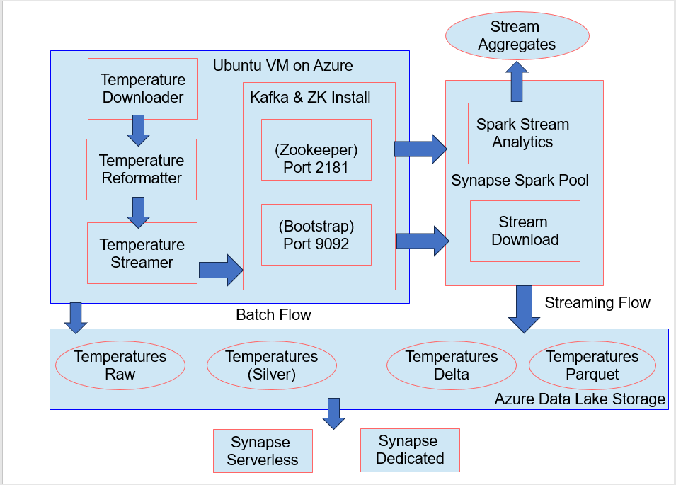
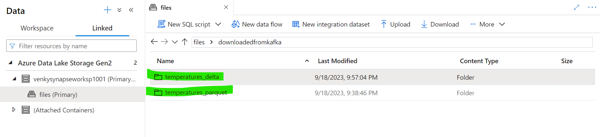

## Synapse Spark Pools and Delta Lake / Lambda Architecture 

* This experiment will start using the Azure Synapse Spark pools to do most of the ETLs. 

* Execute the Connect-AzAccount to login to Azure. Run the 1005-Create-Synapse-workspace.ps1
* This will provision a simple Synapse workspace without all the security needed in real life. Storage accounts are exposed to everyone, and a serverless, dedicated and spark pool. We will try various interactions with KAFKA from this Synapse workspace. 
* After following the instructions <a href="./Kafka_on_Azure_VM.md"> here </a>, we should have a kafka setup with the temperatures topic. It will have quite a bit of temperature readings. The aggregated data via spark is also shown here.

* After the ARM template deployment is done, we should have the synapse artifacts deployed.

## Spark Pools based testing

* After the synapse spark pool is provisioned, we need to open a notebook, and just add a cell like print(spark). Once we attach this notebook to the provisioned venkysparkpool, and run it, it will start the required spark cluster and we will be ready to define set jobs on Synapse and run them on the spark pool. If we do not do this we get weird Livy errors. Need to research on that later. 

* Once we get the Spark pool warmed up, kill the session for the notebook, and define the spark jobs to allow pulling the streaming data from KAFKA and download it to ADLS in both delta and parquet formats. 

* We need to run our spark streaming jobs by setting the checkpoint location as a config parameter. When we run in the personal laptop, or in the Ubuntu VM we are having physical hard drives/directories and we can provide it. When we run it in Synapse however, we need to point to a location in ADLS for it to checkpoint and store its state as it pulls from KAFKA. Also see here the configurations on how many executors we want, and whether we need to have autoscaling in place.

* See the checkpoint location setup as a custom config - called VenkyConfig. We need to run the jobs pointing to this config rather than the default one. If we don't do this, it will fail saying a checkpoint location is not given for the spark structured streaming job. 

* Once we define all the jobs required (one for parquet and one for delta), we can publish all the definitions into Synapse Live. Once that is done, we can submit the jobs. I had to do one job at a time, because I do not have the power to spawn a large cluster. Also these streaming jobs await termination, so the second job will be sitting in the queued state till we kill the first one. Maybe we can spawn more than one spark pool and run these jobs in parallel. 

* Once the job runs, we can actually go to the Spark UI from inside Synapse itself. 

* Once we start the streaming producer from inside the Ubuntu VM, the messages are pushed to the Kafka cluster running on the Ubuntu VM. Now the Spark streaming job running on the Synapse spark cluster will connect to the Kafka cluster running in the VM, and start pulling down the data to ADLS either in delta or parquet format. 

* This is the delta format download. If we observe the data sizes between parquet and delta are almost the same (as expected), and it does have the delta.log directory to point to the parquet files in play with the current dataset.

* Here is the spark UI to see more details about the Spark execution. Also NOTE THE VERSION OF SPARK THAT RUNS IN SYNAPSE. It is set to 3.1.3. That means that it is way back compared to the current version of 3.5.X. It is important to note this because when it comes to delta formats, the version of spark and the version of delta and scala all matter. It will throw the weirdest class not found errors if the versions do not match. 

* Both folders shown here in ADLS when data pulls are done. 

* Now that the files are sitting in ADLS, we can easily point our synapse serverless pool to query the delta and parquet based formats. Note that we can make the program write the files to a folder for streaming, and another for batch and in-essence create a lambda architecture based model where there is a speed layer from KAFKA, and a batch layer as shown in the diagram at the start of this page.

* Here is the screen shot of connecting to the KAFKA cluster running on the VM from local and we can see the public IP of the VM and the offsets to see 118K records were pushed to the KAKFA cluster from the streaming producer. The producer runs on the VM itself and connects to KAFKA locally.

## ADX pool testing
* We need to create a database in the ADX pool. For that go to the resource group, click on the adx pool that is created and the bottom wizard should guide us to create a database as shown below:

* After the database is created create a table to hold the data.
<pre>
.create table ['temperatures'] (
 ['latitude']: decimal ,
 ['longitude']: decimal , 
 ['time']: string ,
 ['temperature_2m']: decimal );
 </pre>

* After this we need to create the mapping for the json to columns.
<pre>
.create table ['temperatures'] ingestion json mapping 'temperatures_mapping' 
'[ {"column":"latitude","path":"$.latitude","datatype":"decimal"}, {"column":"longitude","path":"$.longitude","datatype":"decimal"}, {"column":"time","path":"$.time","datatype":"string"}, {"column":"temperature_2m","path":"$.temperature_2m","datatype":"decimal"}]';
</pre>

* Next we need to build a docker container using a special image to allow it to act as a data explorer sink. Then it can ingest data from kafka into the ADX pool/table we created.

<pre>
export KUSTO_KAFKA_SINK_VERSION=1.0.1
mkdir connector && cd connector
curl -L -O https://github.com/Azure/kafka-sink-azure-kusto/releases/download/v$KUSTO_KAFKA_SINK_VERSION/kafka-sink-azure-kusto-$KUSTO_KAFKA_SINK_VERSION-jar-with-dependencies.jar
</pre>

* Next run the docker image.
* TODO - Was not successful with this approach. Will try later.

abfss://files@venkydatalake1001.dfs.core.windows.net/synapse/workspaces/venkysynapseworksp1001/batchjobs/Spark%20job%20definition%201/SparkExamples-1.0-SNAPSHOT.jar

abfss://files@venkydatalake1001.dfs.core.windows.net/downloadedfromkafka/temperatures_delta
abfss://files@venkydatalake1001.dfs.core.windows.net/downloadedfromkafka/temperatures_parquet

--conf spark.sql.streaming.checkpointLocation=abfss://files@venkydatalake1001.dfs.core.windows.net/synapse/workspaces/venkysynapseworksp1001/checkpointdir/