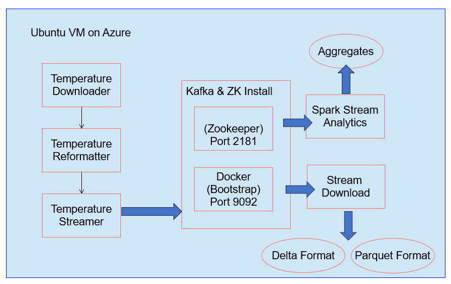
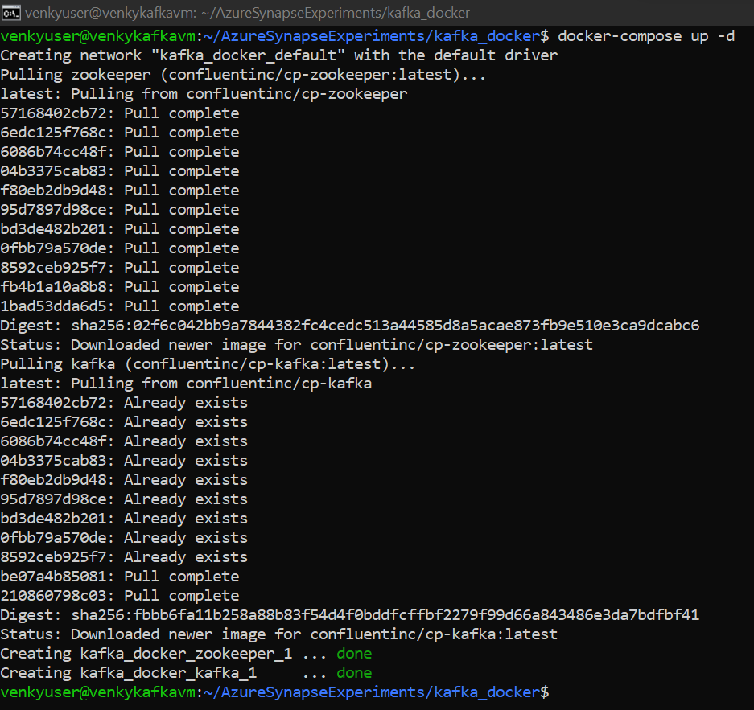
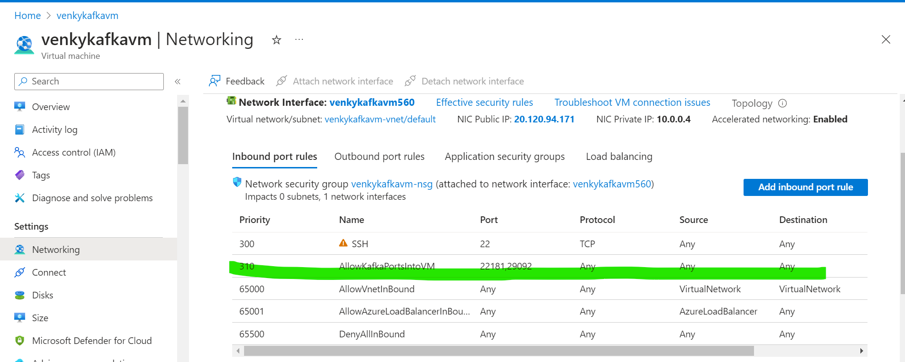
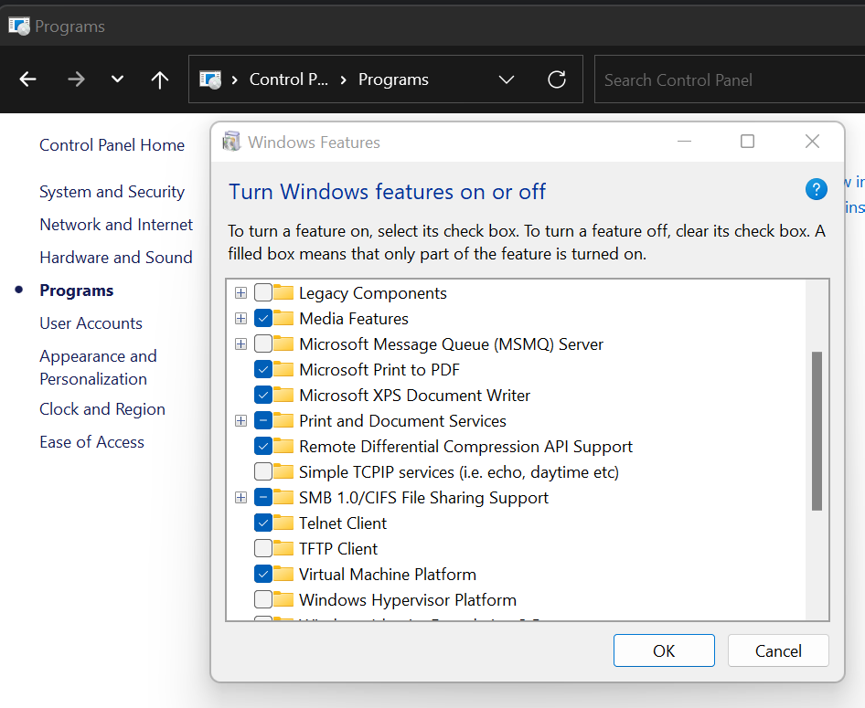
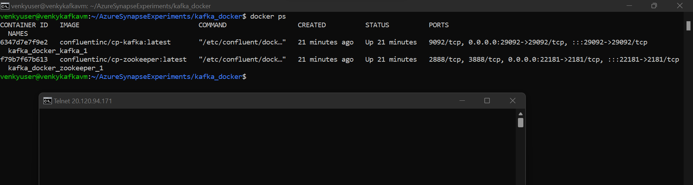
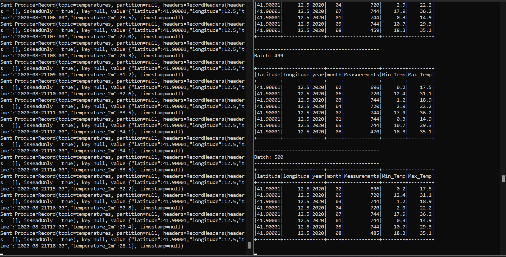
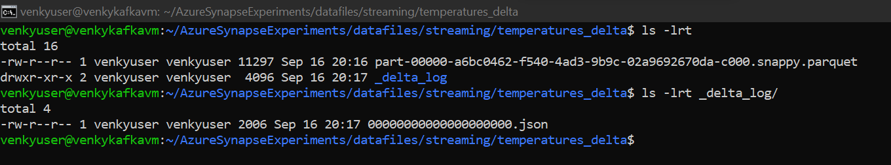
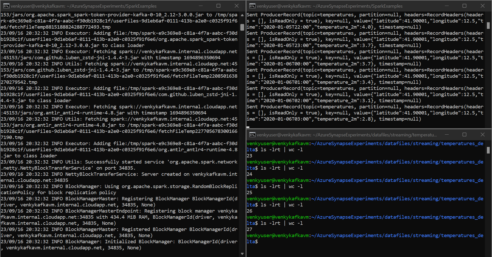
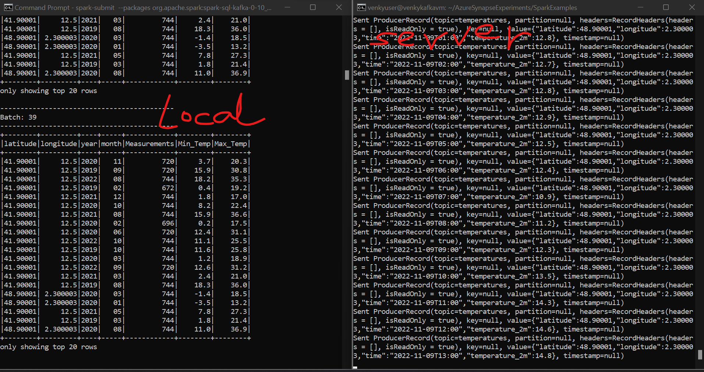

* This experiment will first create an ubuntu VM on Azure and then install the required components (docker, docker-compose, and kafka installs).

<pre>
sudo apt update
sudo apt install -y apt-transport-https ca-certificates curl software-properties-common
curl -fsSL https://download.docker.com/linux/ubuntu/gpg | sudo apt-key add -
sudo add-apt-repository "deb [arch=amd64] https://download.docker.com/linux/ubuntu focal stable"
apt-cache policy docker-ce
sudo apt -y install docker-ce
sudo systemctl status docker
sudo usermod -aG docker ${USER}

## Once this is done, disconnect from SSH and re-login for the groups to take effect.
## Note docker is added to the group of current user.
venkyuser@venkykafkavm:~$ groups
venkyuser adm dialout cdrom floppy sudo audio dip video plugdev netdev lxd docker

## Check docker ps to make sure
venkyuser@venkykafkavm:~$ docker ps
CONTAINER ID   IMAGE     COMMAND   CREATED   STATUS    PORTS     NAMES

## install docker-compose
sudo apt install -y docker-compose

## Clone repo and start the kafka container.
venkyuser@venkykafkavm:~$ git clone https://github.com/SowmyaVenky/AzureSynapseExperiments.git

cd /home/venkyuser/AzureSynapseExperiments/kafka_docker
docker-compose up -d 
</pre>

* Make sure that the docker containers for KAFKA have started. 

* Enable the ports required (22181, 29092) on the network security group of the VM. This will ensure that external apps can connect to the VM via both the public IP and Private IP. Ofcourse this will never be allowed in real world scenarios. 

* The telnet features are not enabled in windows, and we need to go to control panel, windows features and enable telnet client. Once done, we can test telnet connectivity to kafka running inside the Azure VM.

* Next we need to install spark and java to start the producers on Ubuntu. The messages will stream into Kafka and we can use various techniques to consume the data and experiment with it.

<pre>
sudo apt-get install default-jdk -y
sudo apt-get install scala -y
wget https://archive.apache.org/dist/spark/spark-3.3.1/spark-3.3.1-bin-hadoop3.tgz
tar -xvzf spark-3.3.1-bin-hadoop3.tgz
sudo mv spark-3.3.1-bin-hadoop3 /mnt/spark

## Set paths.
nano ~/.bashrc

## Add paths 
export SPARK_HOME=/mnt/spark
export PATH=$PATH:$SPARK_HOME/bin:$SPARK_HOME/sbin

source ~/.bashrc

sudo apt install -y maven
cd /home/venkyuser/AzureSynapseExperiments/SparkExamples
mvn clean package

## Now we need to create two terminals and test spark sender and receiver
# Receiver
spark-submit --packages org.apache.spark:spark-sql-kafka-0-10_2.12:3.0.0 --master local[4] --class com.gssystems.kafka.WeatherSparkStreaming target/SparkExamples-1.0-SNAPSHOT.jar temperatures

# Sender
mvn exec:java -Dexec.mainClass="com.gssystems.kafka.WeatherDataStreamingProducer" -Dexec.args="/home/venkyuser/AzureSynapseExperiments/datafiles/streaming/output/part-00000-dd3eed31-5521-456d-9fcd-3d66c266f6fc-c000.json /home/venkyuser/AzureSynapseExperiments/datafiles/streaming/location_master/part-00000-a3a34469-0ef8-496f-be3f-826ef3d55233-c000.json"

</pre>

* After running the setup for more than 1 hr, we will have a lot of messages sitting in the KAFKA topic that we can experiment consuming from other tools like Synapse and Azure Streaming Analytics.

* Once we have enough messages sitting, we can try to unload that data into a delta lake format.
 <pre>
 spark-submit --packages org.apache.spark:spark-sql-kafka-0-10_2.12:3.0.0,io.delta:delta-core_2.12:2.2.0 --conf spark.sql.streaming.checkpointLocation=/tmp --master local[4] --class com.gssystems.kafka.KafkaStreamToDeltaLakeDownloader target/SparkExamples-1.0-SNAPSHOT.jar 127.0.0.1 temperatures /home/venkyuser/AzureSynapseExperiments/datafiles/streaming/temperatures_delta

 ## This will download as a parquet file.
spark-submit --packages org.apache.spark:spark-sql-kafka-0-10_2.12:3.0.0 --conf spark.sql.streaming.checkpointLocation=/tmp --master local[4] --class com.gssystems.kafka.KafkaStreamToParquetDownloader target/SparkExamples-1.0-SNAPSHOT.jar 127.0.0.1 temperatures /home/venkyuser/AzureSynapseExperiments/datafiles/streaming/temperatures_parquet

## This will download as a json file, for easier debugging.

spark-submit --packages org.apache.spark:spark-sql-kafka-0-10_2.12:3.0.0 --conf spark.sql.streaming.checkpointLocation=/tmp --master local[4] --class com.gssystems.kafka.KafkaStreamToJSONDownloader target/SparkExamples-1.0-SNAPSHOT.jar 127.0.0.1 temperatures /home/venkyuser/AzureSynapseExperiments/datafiles/streaming/temperatures_json

</pre>

* Note that the delta libraries used and the spark core versions in play are very critical. Any variation in this will cause weird errors that are hard to understand. For instance, if I try to run the same thing with spark 3.4.1 I get a weird parquet method error, while it runs fine with spark 3.3.1. Here is the unloaded file. We can try to unload now via synapse to ADLS and see if that works fine...

* After running the streaming producer again, we can see that the data gets appended with frequent checkpoints..

## Install kafka on ubuntu VM
* I was not able to expose the docker-compose version to expose outside the VM, trying to install locally instead.
* Refer to this https://hevodata.com/blog/how-to-install-kafka-on-ubuntu/

<pre>
sudo apt-get install zookeeperd
sudo adduser kafka
sudo adduser kafka sudo
su -l kafka
mkdir ~/Downloads
curl "https://downloads.apache.org/kafka/3.5.1/kafka_2.13-3.5.1.tgz" -o ~/Downloads/kafka.tgz
mkdir ~/kafka && cd ~/kafka
tar -xvzf ~/Downloads/kafka.tgz --strip 1

nano ~/kafka/config/server.properties
# Copy the server.properties under the root folder. 
# Make sure these lines are there
delete.topic.enable = true
listeners=PLAINTEXT://:9092
advertised.listeners=PLAINTEXT://20.119.34.211:9092
# This will allow it to connect from external servers.

sudo nano /etc/systemd/system/zookeeper.service

#paste this 
[Unit]
Requires=network.target remote-fs.target
After=network.target remote-fs.target

[Service]
Type=simple
User=kafka
ExecStart=/home/kafka/kafka/bin/zookeeper-server-start.sh /home/kafka/kafka/config/zookeeper.properties
ExecStop=/home/kafka/kafka/bin/zookeeper-server-stop.sh
Restart=on-abnormal

[Install]
WantedBy=multi-user.target

sudo nano /etc/systemd/system/kafka.service
[Unit]
Requires=zookeeper.service
After=zookeeper.service

[Service]
Type=simple
User=kafka
ExecStart=/bin/sh -c '/home/kafka/kafka/bin/kafka-server-start.sh /home/kafka/kafka/config/server.properties > /home/kafka/kafka/kafka.log 2>&1'
ExecStop=/home/kafka/kafka/bin/kafka-server-stop.sh
Restart=on-abnormal

[Install]
WantedBy=multi-user.target

sudo systemctl start kafka
sudo systemctl status kafka

sudo systemctl enable zookeeper
sudo systemctl enable kafka
</pre>

* As we can see we pull data down from local connecting to the KAFKA on the remote server.
