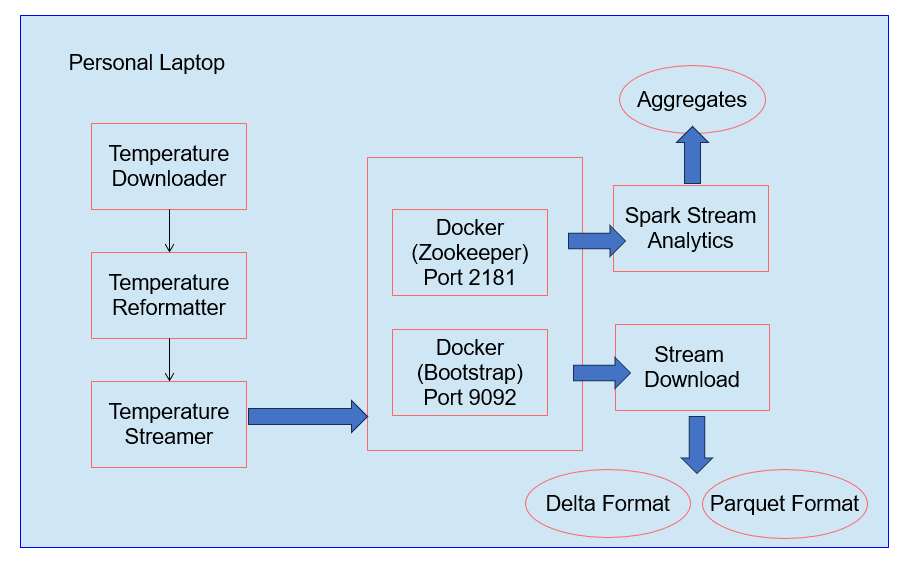
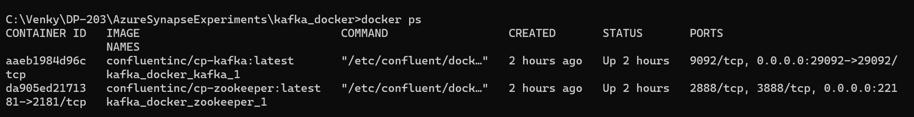
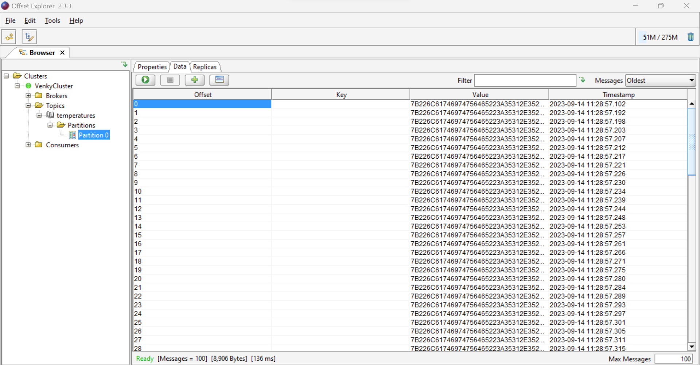
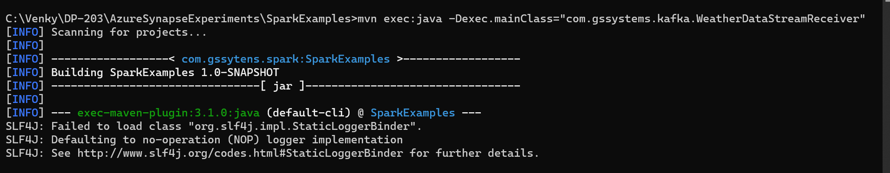
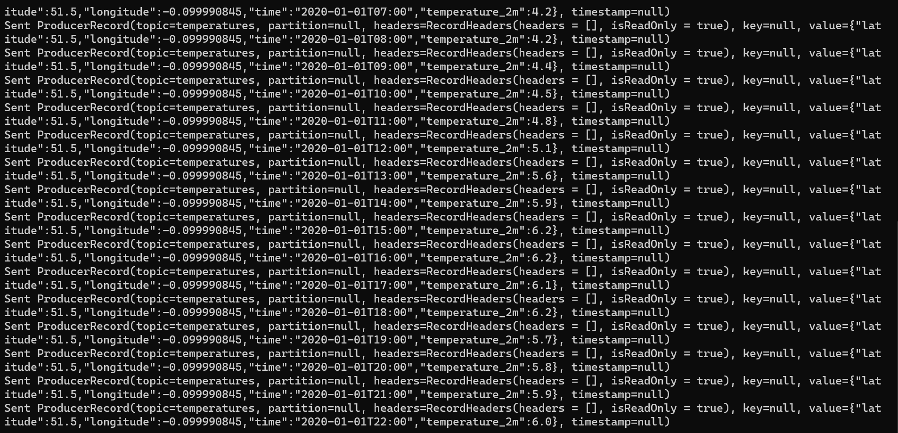
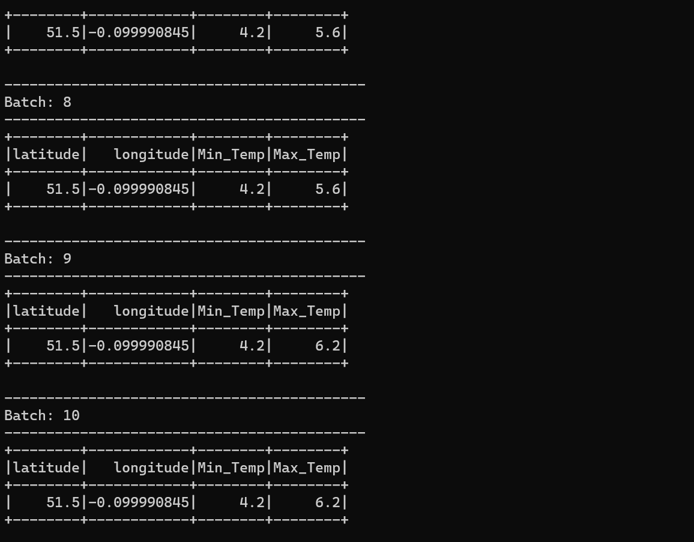
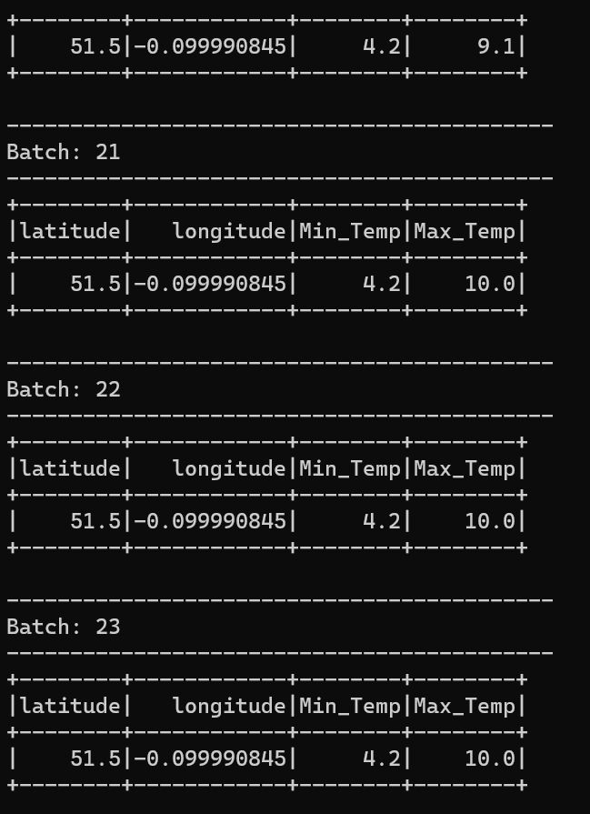
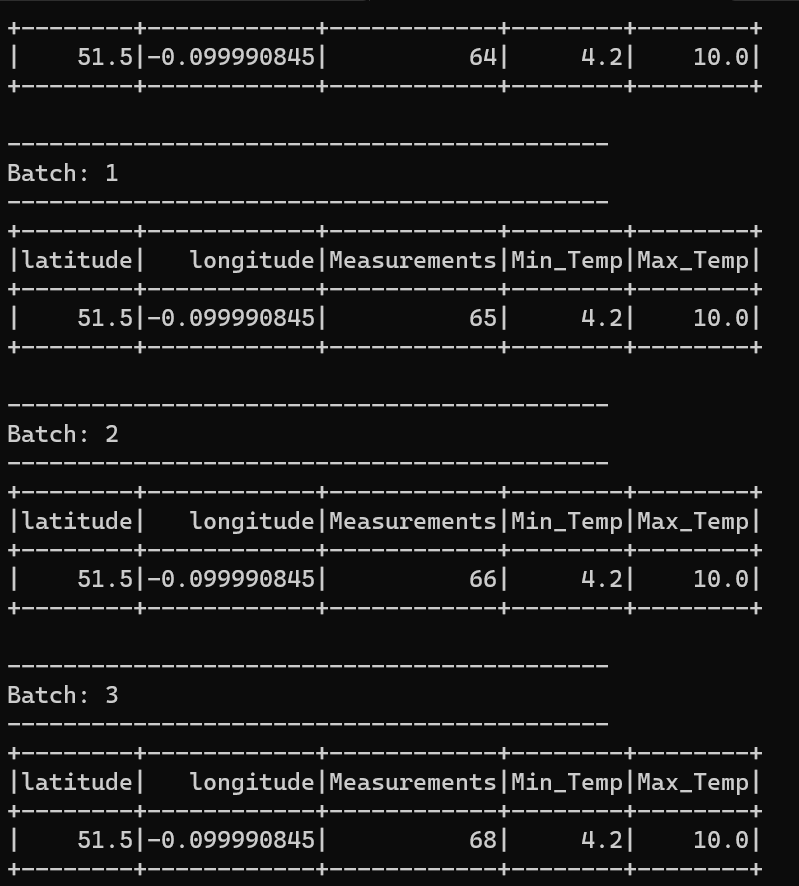
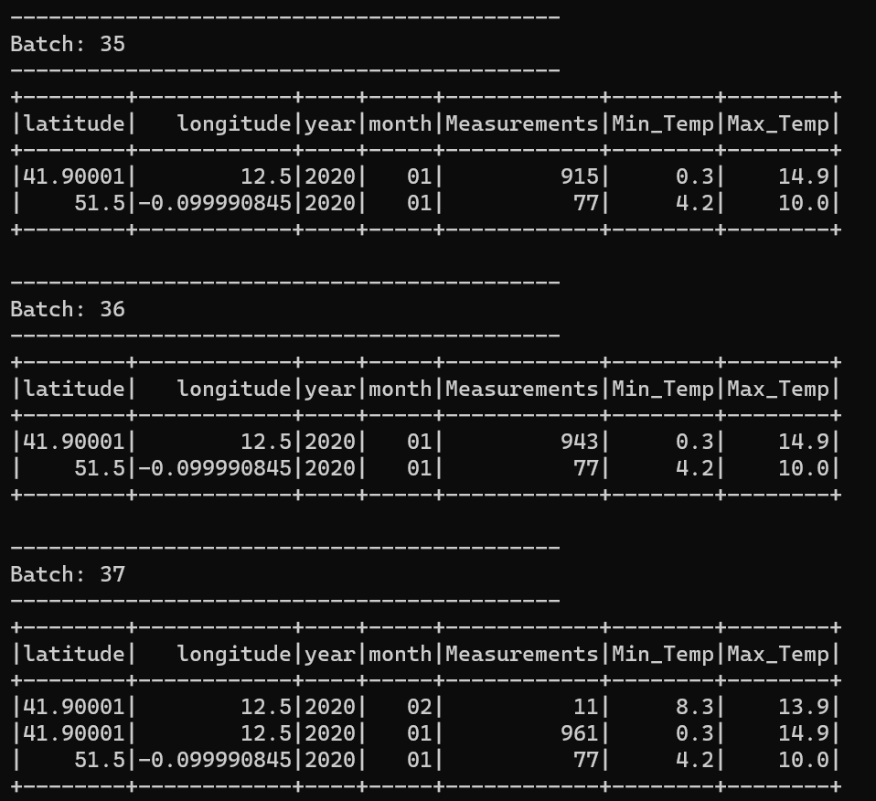
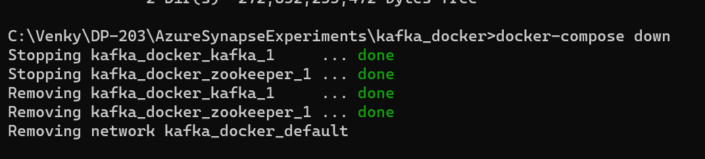

## Message Streaming via KAFKA.
* This experiment will setup a single node KAFKA cluster for testing purposes via the docker-compose utility. 

* Make sure that docker is up and running inside the machine this is getting tested on. 
<pre>
    cd C:\Venky\DP-203\AzureSynapseExperiments\kafka_docker
    docker-compose up -d  
    docker ps 
</pre>

* Download the kafka tool from https://kafkatool.com/download.html
* After install, connect it to the kafka cluster running locally pointing to ports 22181 (ZK), and 29092 (bootstrap server)
* Let us start the producer to take new weather files we have downloaded and stream that to KAFKA for consumption.

<pre>
set JAVA_HOME=c:\Venky\jdk-11.0.15.10-hotspot
set PATH=%PATH%;c:\Venky\spark\bin;c:\Venky\apache-maven-3.8.6\bin
set SPARK_HOME=c:\Venky\spark
SET HADOOP_HOME=C:\Venky\AzureSynapseExperiments\SparkExamples

cd C:\Venky\AzureSynapseExperiments\SparkExamples
mvn clean package

mvn exec:java -Dexec.mainClass="com.gssystems.spark.DownloadWeatherDataHistorical" -Dexec.args="51.508530 -0.076132 2019-01-01 2019-12-31 ../datafiles/streaming/input/2019_London_Temps.json"

mvn exec:java -Dexec.mainClass="com.gssystems.spark.DownloadWeatherDataHistorical" -Dexec.args="51.508530 -0.076132 2020-01-01 2020-12-31 ../datafiles/streaming/input/2020_London_Temps.json"

mvn exec:java -Dexec.mainClass="com.gssystems.spark.DownloadWeatherDataHistorical" -Dexec.args="51.508530 -0.076132 2021-01-01 2021-12-31 ../datafiles/streaming/input/2021_London_Temps.json"

mvn exec:java -Dexec.mainClass="com.gssystems.spark.DownloadWeatherDataHistorical" -Dexec.args="51.508530 -0.076132 2022-01-01 2022-12-31 ../datafiles/streaming/input/2022_London_Temps.json"

mvn exec:java -Dexec.mainClass="com.gssystems.spark.DownloadWeatherDataHistorical" -Dexec.args="51.508530 -0.076132 2023-01-01 2023-06-30 ../datafiles/streaming/input/2023_London_Temps.json"

mvn exec:java -Dexec.mainClass="com.gssystems.spark.DownloadWeatherDataHistorical" -Dexec.args="41.902782 12.496366 2019-01-01 2019-12-31 ../datafiles/streaming/input/2019_Rome_Temps.json"

mvn exec:java -Dexec.mainClass="com.gssystems.spark.DownloadWeatherDataHistorical" -Dexec.args="41.902782 12.496366 2020-01-01 2020-12-31 ../datafiles/streaming/input/2020_Rome_Temps.json"

mvn exec:java -Dexec.mainClass="com.gssystems.spark.DownloadWeatherDataHistorical" -Dexec.args="41.902782 12.496366 2021-01-01 2021-12-31 ../datafiles/streaming/input/2021_Rome_Temps.json"

mvn exec:java -Dexec.mainClass="com.gssystems.spark.DownloadWeatherDataHistorical" -Dexec.args="41.902782 12.496366 2022-01-01 2022-12-31 ../datafiles/streaming/input/2022_Rome_Temps.json"

mvn exec:java -Dexec.mainClass="com.gssystems.spark.DownloadWeatherDataHistorical" -Dexec.args="41.902782 12.496366 2023-01-01 2023-06-30 ../datafiles/streaming/input/2023_Rome_Temps.json"

mvn exec:java -Dexec.mainClass="com.gssystems.spark.DownloadWeatherDataHistorical" -Dexec.args="48.864716 2.349014 2019-01-01 2019-12-31 ../datafiles/streaming/input/2019_Paris_Temps.json"

mvn exec:java -Dexec.mainClass="com.gssystems.spark.DownloadWeatherDataHistorical" -Dexec.args="48.864716 2.349014 2020-01-01 2020-12-31 ../datafiles/streaming/input/2020_Paris_Temps.json"

mvn exec:java -Dexec.mainClass="com.gssystems.spark.DownloadWeatherDataHistorical" -Dexec.args="48.864716 2.349014 2021-01-01 2021-12-31 ../datafiles/streaming/input/2021_Paris_Temps.json"

mvn exec:java -Dexec.mainClass="com.gssystems.spark.DownloadWeatherDataHistorical" -Dexec.args="48.864716 2.349014 2022-01-01 2022-12-31 ../datafiles/streaming/input/2022_Paris_Temps.json"

mvn exec:java -Dexec.mainClass="com.gssystems.spark.DownloadWeatherDataHistorical" -Dexec.args="48.864716 2.349014 2023-01-01 2023-06-30 ../datafiles/streaming/input/2023_Paris_Temps.json"

spark-submit --master local[4] --class com.gssystems.spark.TemperaturesReformatterJSON target\SparkExamples-1.0-SNAPSHOT.jar file:///C:/Venky/DP-203/AzureSynapseExperiments/datafiles/streaming/input file:///C:/Venky/DP-203/AzureSynapseExperiments/datafiles/streaming/output/ file:///C:/Venky/DP-203/AzureSynapseExperiments/datafiles/streaming/location_master/

## Note - the JSON file names are created by spark and will change with each run. 

mvn exec:java -Dexec.mainClass="com.gssystems.kafka.WeatherDataStreamingProducer" -Dexec.args="C:\Venky\DP-203\AzureSynapseExperiments\datafiles\streaming\output\part-00000-ed31cf36-6e94-4463-918e-b69689d6f8cf-c000.json C:\Venky\DP-203\AzureSynapseExperiments\datafiles\streaming\location_master\part-00000-0c100159-41cd-4d73-a20c-6f1fd4acc873-c000.json"

## Read consumer
mvn exec:java -Dexec.mainClass="com.gssystems.kafka.WeatherDataStreamReceiver" 
</pre>

* Now we can start a spark streaming job that can read from the KAFKA stream and do some queries on it. 

* Note the versions of the kafka clients and the streaming jars. They are sensitive and we need to update the pom xml to make them complaint.

<pre>
spark-submit --packages org.apache.spark:spark-sql-kafka-0-10_2.12:3.0.0 --master local[4] --class com.gssystems.kafka.WeatherSparkStreaming target/SparkExamples-1.0-SNAPSHOT.jar temperatures
</pre>

* As we can see the producer is slowly pushing messages to KAFKA, the structured streaming job is aggregating over the stream and computing the max and min tempertures for each latitude and longitude.

* After some time we can see the temperatures are changing (esp the max temp.)

* Added a count field to show that the entire dataset is taken into consideration with the offset starting from the earliest as asked for in the code. 

* Added more aggregations at the year and month level to show how the aggregates are calculated on the stream

* After the experiment is done, bring down the kafka setup.

* Now we will try to pull from the kafka stream and push that to a folder in local machine to write in delta format. 

<pre>
spark-submit --packages org.apache.spark:spark-sql-kafka-0-10_2.12:3.0.0,io.delta:delta-core_2.12:2.4.0 --master local[4] --class com.gssystems.kafka.KafkaStreamToDeltaLakeDownloader target/SparkExamples-1.0-SNAPSHOT.jar 20.120.94.171 temperatures file:///C:\Venky\DP-203\AzureSynapseExperiments\datafiles\temperatures_delta
</pre>

* For some reason running this on spark 3.4.1 causes a weird failure. Needs further research.

<pre>
Exception in thread "main" java.lang.NoSuchMethodError: 'org.apache.spark.internal.config.ConfigEntry org.apache.spark.sql.internal.SQLConf$.PARQUET_FIELD_ID_READ_ENABLED()'
</pre>

